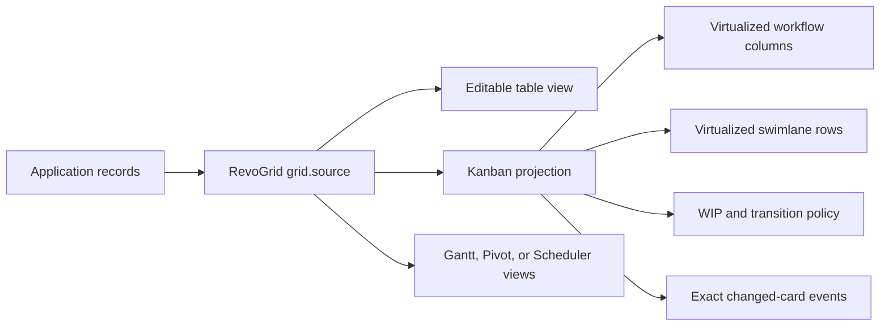

# Best JavaScript Kanban Board Libraries in 2026: Developer Comparison


Choosing a **JavaScript Kanban board** in 2026 is not just a drag-and-drop decision.

A basic board with three columns can be built in a weekend. A production Kanban component is harder. It has to stay responsive with thousands of cards, represent swimlanes without duplicating application state, enforce WIP and transition rules, support keyboard and screen-reader users, persist exact changes, and remain maintainable when the frontend stack changes.

This developer comparison evaluates six practical options:

* [RevoGrid Kanban](https://rv-grid.com/kanban)
* [DHTMLX Kanban](https://dhtmlx.com/docs/products/dhtmlxKanban/)
* [Syncfusion Kanban](https://www.syncfusion.com/react-components/react-kanban-board)
* [SVAR Kanban](https://svar.dev/react/kanban/)
* [dnd-kit](https://dndkit.com/) as a build-your-own foundation
* [jKanban](https://github.com/riktar/jkanban) as a minimal open-source alternative

The comparison focuses on the criteria that usually determine whether a Kanban library remains useful after the first demo: React, Vue, Angular, and Svelte support; rendering architecture; swimlanes; WIP limits; customization; accessibility; and commercial terms.

> **Quick answer:** RevoGrid is the best overall fit for data-heavy product workflows and large boards with swimlanes. DHTMLX is the strongest mature standalone Kanban library. Syncfusion is best for teams already buying its broad UI suite or prioritizing explicit accessibility documentation. SVAR is the strongest permissively licensed open-source component for React, Vue, and Svelte. dnd-kit is best when you want to own the entire board implementation.

## Target keywords for this guide

This guide is written for developers searching for:

* JavaScript Kanban board
* best Kanban library
* Kanban component
* React Kanban board
* Vue Kanban board
* Angular Kanban board
* Svelte Kanban board
* open-source Kanban board
* Kanban swimlanes
* Kanban WIP limits
* virtualized Kanban component
* DHTMLX, Syncfusion, and SVAR alternatives

For implementation details, open the [RevoGrid Kanban product page](https://rv-grid.com/kanban), the [complete Kanban guide](https://pro.rv-grid.com/guides/kanban/), or the [50,000-task performance demo](https://rv-grid.com/demo/kanban-performance).

---

## The short ranking

| Rank | Library | Best for |
| ---: | --- | --- |
| 1 | **RevoGrid Kanban** | Large, data-heavy product workflows that need swimlanes, enforceable policy, and cross-framework reuse |
| 2 | **DHTMLX Kanban** | Mature standalone project-management boards with many built-in task features |
| 3 | **Syncfusion Kanban** | Teams already standardized on Essential Studio and requiring explicit WCAG and ARIA documentation |
| 4 | **SVAR Kanban** | React, Vue, or Svelte teams wanting a capable MIT edition with optional perpetual Pro licensing |
| 5 | **dnd-kit** | Teams building a custom board and willing to own Kanban behavior, state, and UI semantics |
| 6 | **jKanban** | Small vanilla JavaScript prototypes with basic drag-and-drop requirements |

This is a default ranking, not a universal answer. A company already using Syncfusion may reasonably place it first. A GPL-compatible open-source project may choose DHTMLX Community. A React team building a unique interaction model may prefer dnd-kit.

The important question is not which vendor has the longest feature page. It is which architecture matches the board you will need after users ask for swimlanes, permissions, bulk movement, remote persistence, accessible controls, and larger datasets.

## Comparison at a glance

| Library | Framework coverage | Performance model | Swimlanes | WIP capability | Accessibility position | License / starting cost* |
| --- | --- | --- | --- | --- | --- | --- |
| **RevoGrid** | JS/TS, React, Vue, Angular, Svelte via Web Component | Native row and column virtualization | Yes, explicit or derived; collapsible | Warn or atomically block; lane-specific rules | Focusable cards, keyboard pickup, live announcements, reduced motion | Pro Advanced: $499/dev/year; $375 promotion through Aug 31, 2026 |
| **DHTMLX** | JS/TS plus React, Vue, Angular, Svelte examples | Lazy card rendering and independent column scrolling | Yes; rows and columns can be rearranged | Limits for columns and swimlanes | Keyboard navigation and touch are documented; no equivalent Kanban-specific conformance matrix found | GPL v2 for compatible projects; commercial from $389 |
| **Syncfusion** | JS/TS, React, Vue, Angular | Virtualization inside columns | Yes, but not together with virtualization | Min/max validation for columns or lane cells; app logic for hard rejection | Explicit WAI-ARIA, WCAG 2.2, Section 508, screen-reader, and keyboard documentation | Community License if eligible; otherwise custom quote |
| **SVAR** | Native React, Vue 3, Svelte 5 editions | Card and column virtualization; dynamic loading in Pro | No first-class two-dimensional swimlane API found | `cardLimit` state plus cancellable move actions | No Kanban-specific compliance matrix found in reviewed docs | MIT edition free; Pro from $549 perpetual |
| **dnd-kit** | Vanilla/TS, React, Vue, Svelte, Solid | High-performance DnD primitives; virtualization integration is app-owned | Build it yourself | Build it yourself | Strong keyboard, ARIA, instructions, and live-region primitives | MIT |
| **jKanban** | Vanilla JavaScript | Simple DOM rendering | No | Custom logic only | No formal accessibility guidance | Apache-2.0; legacy maintenance profile |

\* Pricing and public terms were checked on August 7, 2026. Vendor pricing changes; verify the linked pricing page before purchasing.

---

## What makes a Kanban component good in 2026?

Most JavaScript libraries can render columns and let a user drag a card. That is only the visible layer.

A production board should be evaluated across eight deeper questions.

### 1. Does the board have one canonical data model?

The safest architecture keeps tasks as ordinary application records. The Kanban board should project those records into workflow columns and lanes rather than force the product to maintain a separate nested board tree.

A separate board-only model creates synchronization work:

* table edits must update cards;
* card movement must update the main record;
* filters must behave consistently in both views;
* remote updates must resolve ordering conflicts;
* switching between table, board, Gantt, or reporting views becomes harder.

This is one of RevoGrid's most important architectural advantages: cards remain ordinary `grid.source` records.

### 2. What exactly is virtualized?

“Virtual scrolling” can mean several different things:

* only cards inside one column are virtualized;
* columns are virtualized but rows are not;
* every swimlane becomes its own nested scroller;
* both board axes share one bounded viewport;
* data is loaded remotely but the mounted DOM still grows.

These approaches behave differently once a board has many columns, long lanes, custom card content, or horizontal scrolling.

Do not select a library from a vendor's “handles thousands of cards” sentence alone. Ask for a reproducible demo with your card template, lane structure, expected browser, and real interaction patterns.

### 3. Are swimlanes a real two-dimensional layout?

Grouping cards by assignee is not automatically the same as a swimlane board.

A complete swimlane implementation should define how every workflow column intersects with every lane. It should support lane headers, empty cells, collapse behavior, drag targets, lane-specific policy, focus movement, and efficient vertical rendering.

### 4. Does a WIP limit warn or enforce?

A red column header is not the same as a blocked move.

There are at least three useful levels:

1. **Display only:** show the count and limit.
2. **Warn:** allow the move but announce or style an over-limit state.
3. **Block:** reject the proposed move before any records are changed.

Bulk movement adds another requirement: the board should validate the complete batch atomically. Moving five selected cards should not accept the first two and reject the remaining three.

### 5. Can application policy participate in movement?

Real products need rules such as:

* only reviewers can move a card into Approved;
* blocked items cannot enter Done;
* a task cannot move backward after invoicing;
* one team can see a lane but not edit it;
* a transition needs a reason or required field;
* a server response can reject an optimistic move.

A good Kanban library exposes one movement pipeline for pointer, touch, keyboard, context-menu, and API actions.

### 6. Does customization preserve interaction semantics?

Replacing a card template is easy. Preserving focus, drag handles, keyboard movement, selection state, announcements, and validation while replacing it is harder.

The best Kanban library gives developers custom presentation without making them rebuild the managed interaction shell.

### 7. Is accessibility part of the component or left to the application?

Drag-and-drop is inherently difficult for keyboard and screen-reader users. A serious board needs an equivalent non-pointer workflow, not just arrow-key navigation between static cards.

Look for:

* focusable cards and predictable focus restoration;
* keyboard pickup, movement, drop, and cancel actions;
* screen-reader instructions;
* live announcements during movement;
* semantic names for columns and lanes;
* reduced-motion behavior;
* high-contrast and RTL support;
* published accessibility testing scope.

### 8. Will the license still make sense after the product grows?

Compare more than the headline price. Check:

* developer-seat limits;
* project or application limits;
* SaaS permission;
* redistribution rights;
* runtime or deployment charges;
* access to source code;
* support and update duration;
* whether the Kanban is sold alone or only inside a suite.

---

## 1. RevoGrid Kanban

[RevoGrid Kanban](https://rv-grid.com/kanban) is a commercial Kanban component built on the same virtualized engine and canonical records used by RevoGrid's data grid.

Its design is different from a traditional board that owns a nested collection of columns and card arrays. The application supplies ordinary source rows. The Kanban plugin projects them into workflow columns and optional swimlane rows, while the product continues to own persistence, permissions, validation, and surrounding UI.

That makes RevoGrid particularly suitable when Kanban is one view inside a larger data-heavy application rather than the entire application.

### Where RevoGrid is strongest

#### Two-axis virtualization

Each projected Kanban cell contains at most one card. RevoGrid can therefore reuse its horizontal and vertical viewport model instead of mounting a separate scrolling list inside every workflow column.

The public [50,000-task demo](https://rv-grid.com/demo/kanban-performance) shows ten virtualized workflow columns and two collapsible swimlanes. This is evidence of the architecture, not a universal guarantee: practical capacity still depends on card complexity, browser, device, and surrounding application work.

#### Real swimlane support

Lanes can be supplied explicitly or derived from source data. They can represent teams, releases, product areas, priority classes, or another business dimension. RevoGrid supports lane headers, collapse controls, lane-aware movement, and WIP limits that refine a general column limit.

#### WIP warning and hard blocking

A column can define a `wipLimit`, while `wipBehavior` controls whether an over-capacity move is allowed with a warning or rejected.

Multi-card moves are validated as a complete proposed batch. This is important for predictable product behavior: a rejected operation does not partially reorganize the board.

#### One policy path for every input method

Cards can move through pointer, touch, keyboard, context-menu, or public API workflows. Transition and permission rules can validate the same operation regardless of how it started.

#### Product-grade customization

Developers can replace card content, workflow headers, lane headers, empty states, and drag previews. The managed shell retains interaction state so a custom card does not have to reimplement every board behavior.

The packaged editor adds schema-driven fields, validation events, CRUD requests, and history integration. It can also be intercepted, disabled, or replaced when the application already has its own editing surface.

#### Framework portability

The same Kanban engine works through JavaScript and TypeScript, React, Vue, Angular, and the browser-native Web Component. Svelte can use the Web Component directly.

This matters for organizations with more than one frontend stack. The data model and board policy do not have to be redesigned around a framework-specific component.

### Minimal RevoGrid Kanban configuration

The [Kanban implementation guide](https://pro.rv-grid.com/guides/kanban/) starts from a normal RevoGrid source and a plugin configuration:

```ts
import {
  KanbanPlugin,
  type KanbanConfig,
} from '@revolist/revogrid-enterprise';

const kanban: KanbanConfig = {
  columns: [
    { prop: 'todo', name: 'To do' },
    { prop: 'doing', name: 'In progress', wipLimit: 3 },
    { prop: 'done', name: 'Done' },
  ],
  card: {
    titleField: 'title',
    descriptionField: 'description',
  },
};

grid.plugins = [KanbanPlugin];
grid.kanban = kanban;
grid.kanbanCardEditorDialog = {};

grid.source = [
  {
    id: 'card-1',
    title: 'Audit keyboard flow',
    description: 'Verify pickup, movement, drop, and announcements.',
    status: 'todo',
    order: 1000,
  },
];
```

The important part is not the amount of configuration. It is that `grid.source` remains the canonical collection. Turning the board on changes the projection, not the ownership of the records.



### RevoGrid limitations

A fair comparison should also state the trade-offs:

* Kanban is part of Pro Advanced; it is not included in the MIT data-grid core.
* RevoGrid's public ecosystem and third-party tutorial volume are smaller than Syncfusion's or DHTMLX's.
* Its architecture is ideal for embedded product workflows, but may be more infrastructure than a small marketing-site task board needs.
* Lane order is currently data/configuration driven rather than a drag-reorderable board feature.
* Teams that want a complete standalone project-management application still need to build the surrounding product, backend, identity, notifications, and collaboration layer.

### Pricing

At publication, RevoGrid Kanban is included in **Pro Advanced**:

* regular price: **$499 per frontend developer per year**;
* summer promotion: **$375 per developer through August 31, 2026**;
* unlimited product usage;
* no runtime royalties or deployment counting;
* original source access and priority support;
* Pivot, Kanban, Gantt, Calendar, Scheduler, and advanced grid plugins in the bundle.

See the current [RevoGrid pricing page](https://rv-grid.com/pricing/) before purchasing.

### Verdict

**RevoGrid is the best overall JavaScript Kanban board for teams building a workflow surface inside a serious data application.**

It stands out when the hard requirements are two-dimensional virtualization, true swimlanes, enforceable WIP behavior, shared records across multiple views, and a consistent component model across frontend frameworks.

---

## 2. DHTMLX Kanban

[DHTMLX Kanban](https://dhtmlx.com/docs/products/dhtmlxKanban/) is a mature, standalone JavaScript Kanban library with a broad set of project-management features available out of the box.

It is written in JavaScript and CSS, supports TypeScript, and provides integration examples for React, Vue, Angular, and Svelte. DHTMLX is a particularly practical choice when the board itself is the central product surface and you want ready-made task fields and controls rather than a lower-level workflow projection.

### DHTMLX strengths

* Native columns and swimlanes, including UI reordering of rows and columns.
* Single-card and multi-card drag-and-drop.
* Built-in task creation and editing with descriptions, priority, progress, dates, assignees, attachments, and custom fields.
* Search, sorting, grouping, context controls, comments, voting, links, and undo/redo.
* Custom card, header, toolbar, editor, and style templates.
* REST data provider and documented real-time integration pattern.
* Touch interaction and framework examples for all major frontend stacks.
* GPL v2 option for projects that are compatible with its copyleft requirements.

### Performance model

DHTMLX uses lazy rendering so it does not have to mount every card at once. It also provides independent column scrolling, which keeps long columns manageable.

When lazy rendering is combined with board or per-column scrolling, DHTMLX recommends a static `cardHeight`. For variable custom templates, developers can instead supply a `getCardHeight` estimator. Either way, teams with highly variable card layouts should test scrolling and drag behavior carefully.

This is also a different architecture from RevoGrid's shared row-and-column viewport. DHTMLX treats the product as a Kanban board, while RevoGrid treats Kanban as a virtualized projection over canonical grid records.

### WIP and workflow policy

DHTMLX supports limits for cards in columns and swimlanes and can restrict dragging to selected destinations. Its API is broad enough for application-defined movement rules.

For procurement or technical evaluation, validate the exact behavior you require: whether an over-limit move is warned, blocked, or delegated to custom event logic, and how multi-card operations are handled in your configuration.

### Accessibility

DHTMLX documents touch support, shortcuts, and keyboard navigation. The reviewed Kanban product documentation does not publish a Kanban-specific WAI-ARIA or WCAG conformance matrix comparable to Syncfusion's.

That does not prove the component is inaccessible. It means teams with formal accessibility requirements should run their own keyboard, screen-reader, focus-restoration, high-contrast, and reduced-motion test plan before selection.

### Pricing

DHTMLX Kanban's public commercial prices at publication are:

| License | Developers | Projects | Price |
| --- | ---: | ---: | ---: |
| Individual | 1 | 1 | $389 |
| Commercial | 5 | 1 | $769 |
| Enterprise | 20 | 5 | $1,499 |
| Ultimate | Custom scope | Custom scope | $2,999 |

The commercial packages include one year of updates and a defined support allowance. DHTMLX also offers a GPL v2 edition for GPL-compatible open-source use. GPL v2 is not the same as MIT: confirm that its copyleft obligations fit the way you distribute your application.

### Verdict

**DHTMLX is the best mature standalone Kanban library in this comparison.**

Choose it when you want a feature-rich task-management board with editor, toolbar, task metadata, swimlanes, and DHTMLX ecosystem integration. Choose RevoGrid instead when the board must share a canonical model with an editable grid and preserve virtualization across both columns and swimlane rows.

---

## 3. Syncfusion Kanban

[Syncfusion Kanban](https://www.syncfusion.com/react-components/react-kanban-board) is part of the larger Essential Studio UI suite. It is available for JavaScript/TypeScript, React, Vue, and Angular.

Syncfusion's main advantage is breadth. A team buying its suite also gets grids, charts, schedulers, editors, document components, and many other controls with a shared vendor, support process, and design ecosystem.

### Syncfusion strengths

* First-party JavaScript, React, Vue, and Angular packages.
* Drag-and-drop, card editing, filtering, sorting, column controls, and templates.
* Horizontal swimlanes with configurable headers and frozen lane labels.
* Remote data binding through Syncfusion DataManager adapters.
* Card, column, dialog, and swimlane customization.
* Clear keyboard navigation and accessibility documentation.
* Strong fit for organizations already standardized on Essential Studio.

### Performance and swimlane limitation

Syncfusion virtualizes cards inside each column. Only the cards around the visible area are rendered, and remote data can be fetched for virtual scrolling.

The important documented limitation is that **virtualization is not supported when swimlanes are enabled**.

There are two more details to test:

* cards use a fixed 100-pixel height when virtualization is enabled without an explicit height;
* a dragged card's index is not preserved when scrolling through the column during drag-and-drop.

For a board with either large columns or swimlanes, Syncfusion can be a good solution. For a board that must combine both at high scale, this limitation should be part of the architecture decision.

### WIP limits: validation versus enforcement

Syncfusion supports `minCount` and `maxCount` validation for columns. In swimlane mode, validation can apply to a column or to individual swimlane cells.

When a count violates the constraint, the UI changes its appearance. This is useful feedback, but it is not the same as rejecting the move before the data changes.

Teams that need strict WIP enforcement should add drag-event or application-level validation. Syncfusion also provides transition controls that can restrict which columns are valid destinations.

### Accessibility

This is where Syncfusion has the clearest public documentation in the comparison.

Its Kanban accessibility page explicitly documents:

* WAI-ARIA roles, states, and properties;
* WCAG 2.2 support;
* Section 508 support;
* screen-reader support;
* keyboard navigation;
* RTL and mobile support;
* axe-core automated validation.

Syncfusion marks color contrast and its accessibility-checker result as “Intermediate,” so formal buyers should still test the exact theme and feature set they deploy. Even so, the specificity of the documentation is valuable for teams with compliance reviews.

### Pricing

Syncfusion does not sell Kanban as an isolated component. It is part of the UI Component Suite.

Current [UI Component Suite pricing](https://www.syncfusion.com/sales/pricing) is **custom quote**. A free [Community License](https://www.syncfusion.com/products/communitylicense) is available when all eligibility conditions are met, including:

* less than $1 million in annual gross revenue;
* no more than five developers;
* no more than ten total employees;
* no more than $3 million in outside capital received.

The Community License can be excellent for a qualifying small company. Teams outside the thresholds should request a quote and compare the suite's total value rather than attempting to assign the entire subscription cost to Kanban alone.

### Verdict

**Syncfusion is the best Kanban component for teams already committed to the Essential Studio ecosystem or prioritizing explicit accessibility documentation.**

Its biggest trade-off for this comparison is architectural: virtual scrolling cannot be combined with swimlanes. Its WIP functionality is also primarily visual validation unless the application adds hard rejection logic.

---

## 4. SVAR Kanban

[SVAR Kanban](https://svar.dev/react/kanban/) is a newer family of framework-native Kanban components for React, Vue 3, and Svelte 5. It has an unusually capable MIT edition and optional perpetual Pro licenses.

SVAR is attractive to teams that want more than drag-and-drop primitives but do not need Angular support or a mature enterprise suite.

### SVAR strengths

* Native implementations for React, Vue, and Svelte with TypeScript support.
* MIT edition suitable for personal, commercial, and SaaS projects.
* Built-in board, editor, context menu, filtering, sorting, grouping, custom cards, REST integration, and theming.
* Card and column virtualization in the open-source edition.
* Dynamic column loading, undo/redo, and export in Pro.
* Move events that can be observed, validated, synchronized, or cancelled.
* CSS-variable theming and framework-native custom card components.

### Performance

SVAR virtualizes both cards and columns and exposes overscan settings. Pro adds dynamic loading so off-screen columns can fetch cards only when needed.

This is a strong performance story for a new open-source component. As with any recently released library, test your exact card heights, column count, drag behavior, and remote update model rather than relying only on vendor examples.

### Swimlanes

SVAR supports grouping by status, assignee, priority, and custom fields. In the public Kanban documentation reviewed for this article, we did not find a first-class two-dimensional swimlane API equivalent to RevoGrid, DHTMLX, or Syncfusion.

Grouping can re-project a board, but it is not automatically the same as rendering every workflow stage across persistent horizontal lanes with lane headers, collapse state, and lane-specific WIP policy.

### WIP limits

SVAR columns can expose `cardLimit` and over-limit state styling. Because card movement emits a cancellable `move-card` action, an application can implement strict enforcement by rejecting the action.

This is flexible, but the product team owns more of the policy layer than it does with RevoGrid's built-in warn/block model.

### Accessibility

SVAR's public product pages describe interaction and customization well, but the reviewed Kanban documentation does not provide a component-specific WCAG/ARIA conformance matrix.

Before using it in an accessibility-sensitive product, test keyboard-only movement, focus management, screen-reader announcements, custom card semantics, and high-contrast behavior.

### Pricing

SVAR's MIT edition is free with unlimited developers, projects, and SaaS use.

Commercial Pro licenses are perpetual and include one year of support and updates:

| License | Developers | Projects | SaaS | Price |
| --- | ---: | ---: | --- | ---: |
| Developer | 1 | 1 | No | $549 |
| Application | 5 | 1 | Yes | $1,399 |
| Team | 5 | Unlimited | Yes | $2,499 |
| Enterprise | 20 | Unlimited | Yes | $4,899 |

There are no additional deployment fees. Renewal is optional for continued support and new versions because the purchased version remains usable perpetually.

### Verdict

**SVAR is the best permissively licensed open-source Kanban component in this comparison.**

It gives React, Vue, and Svelte teams a credible production starting point without forcing them to assemble an editor, filtering, REST integration, and virtualization from unrelated packages. Its main gaps are no Angular edition, a younger ecosystem, and no verified first-class two-dimensional swimlane model.

---

## 5. dnd-kit: build your own Kanban board

[dnd-kit](https://dndkit.com/) is not a finished Kanban component. It is a modern drag-and-drop toolkit for Vanilla JavaScript/TypeScript, React, Vue, Svelte, and Solid.

That distinction is important. dnd-kit supplies draggable, droppable, sortable, sensor, collision, auto-scroll, and accessibility infrastructure. Your application supplies the Kanban board.

### Why developers choose dnd-kit

* Maximum control over DOM structure, state, design system, and behavior.
* Pointer, mouse, touch, and keyboard sensors.
* Lists, grids, multiple containers, nested contexts, variable-size items, and virtualized-list use cases.
* Pluggable collision detection, constraints, modifiers, feedback, and sensors.
* Accessibility plugin with ARIA attributes, screen-reader instructions, and live-region announcements.
* MIT license and no commercial runtime restrictions.

### What you still have to build

A real Kanban product still needs:

* workflow columns and card ordering;
* swimlane layout and collapse state;
* WIP calculations and atomic rejection;
* transition and permission rules;
* selection and multi-card movement;
* editing, context menus, filtering, and search;
* history and persistence;
* remote conflict behavior;
* virtualization integration;
* board-specific keyboard navigation and announcements;
* testing across every input method.

The toolkit's accessibility defaults are a strong starting point, not a finished accessible Kanban experience. The application must customize instructions and announcements around the actual workflow, position, column, and lane.

### Verdict

**Choose dnd-kit when your differentiator is the board interaction itself and your team is prepared to own the implementation as product infrastructure.**

It is not the fastest route to a standard enterprise Kanban board. It may be the best route to a unique one.

---

## 6. jKanban: minimal vanilla JavaScript option

[jKanban](https://github.com/riktar/jkanban) is a small vanilla JavaScript plugin built on Dragula. It can render boards, drag cards and columns, restrict destination boards, and expose straightforward callbacks and methods.

Its simplicity can be useful for a prototype or a small internal page that needs no advanced workflow behavior.

### What jKanban provides

* vanilla JavaScript setup;
* draggable cards and boards;
* destination restrictions;
* add, replace, find, and remove methods;
* callback hooks for click, drag, drop, and context actions;
* custom HTML and CSS classes;
* Apache-2.0 licensing.

### What it does not provide as a product layer

There is no built-in virtualization, swimlane model, WIP system, editor, filtering, undo/redo, persistence, remote data provider, or formal accessibility model.

The repository's latest commit was in December 2021 at the time of review. The project is not archived, but that maintenance profile makes it a risky default for a new production dependency in 2026.

### Verdict

**jKanban is appropriate for a lightweight prototype, not as the default foundation for a new data-heavy workflow product.**

For a permissive open-source finished component, use SVAR. For a custom implementation, use dnd-kit. For a commercial production board, compare RevoGrid, DHTMLX, and Syncfusion.

---

## Framework support comparison

| Library | JavaScript / TypeScript | React | Vue | Angular | Svelte |
| --- | --- | --- | --- | --- | --- |
| **RevoGrid** | Native Web Component | Official integration/reference app | Official integration/reference app | Official integration/reference app | Web Component integration |
| **DHTMLX** | Native JavaScript/TypeScript | Official example | Official example | Official example | Official example |
| **Syncfusion** | Native EJ2 package | First-party package | First-party package | First-party package | No first-party Kanban package |
| **SVAR** | No framework-neutral finished Kanban | Native edition | Native Vue 3 edition | No | Native Svelte 5 edition |
| **dnd-kit** | Vanilla/TypeScript adapter | First-party adapter | First-party adapter | No first-party adapter listed | First-party adapter |
| **jKanban** | Native vanilla JavaScript | Community integration only | Community integration only | Community integration only | Community integration only |

### Best React Kanban board

React developers have the widest choice.

* Choose **RevoGrid** for high scale, swimlanes, policy, and data-grid integration.
* Choose **DHTMLX** for a ready-made task-management surface.
* Choose **Syncfusion** when the application already uses Essential Studio.
* Choose **SVAR** for a strong MIT-first React component.
* Choose **dnd-kit** when building the board yourself is intentional.

### Best Vue Kanban board

The same shortlist largely applies to Vue. RevoGrid keeps one Web Component engine across frameworks, DHTMLX and Syncfusion provide Vue integrations, and SVAR provides a native Vue 3 implementation.

SVAR is especially compelling for a Vue-only open-source project. RevoGrid becomes more attractive when the product also needs Angular, React, an editable data grid, or a shared planning suite.

### Best Angular Kanban board

Angular narrows the field. RevoGrid, DHTMLX, and Syncfusion are the primary finished choices in this comparison.

SVAR does not provide an Angular Kanban edition, and dnd-kit's current first-party framework list does not include Angular. An Angular team could build its own interaction layer, but that should be treated as a custom engineering project rather than a package substitution.

---

## Performance comparison: what happens when the board grows?

There is no honest universal “fastest Kanban” answer without a shared benchmark application.

Card templates, shadows, images, lane count, filters, remote data, drag previews, browser extensions, and device hardware can all dominate the result. The useful comparison is architectural.

| Library | Vertical strategy | Horizontal strategy | Large swimlane story | Main caveat |
| --- | --- | --- | --- | --- |
| **RevoGrid** | Virtualized card rows | Virtualized workflow columns | Both axes remain virtualized with lanes | Commercial; custom card complexity still matters |
| **DHTMLX** | Lazy card rendering per board/column | Independent column scrolling | Native lanes with lazy rendering | Static or estimated card height is needed for lazy calculations |
| **Syncfusion** | Virtual cards inside each column | Standard board columns | Swimlanes supported, but not with virtualization | Fixed-height and drag-index limitations in virtual mode |
| **SVAR** | Card virtualization | Column virtualization; Pro dynamic loading | No first-class lane model found | Newer library; validate edge cases with custom cards |
| **dnd-kit** | Depends on your windowing integration | Depends on your implementation | Entirely application-owned | Virtual DnD and off-screen targets require careful engineering |
| **jKanban** | Full DOM | Full DOM | No native lane model | DOM and interaction cost grows with the board |

### Why RevoGrid's model is different

Traditional Kanban implementations often create a scroll container for every column. With swimlanes, they may introduce another nesting layer. That can work well, but focus, auto-scroll, drop targets, and virtualization become more complex as the board grows in both directions.

RevoGrid projects the board into a grid-shaped viewport: workflow stages are columns, card positions are rows, and lane sections are part of the row model. That lets the existing RevoGrid providers manage dimensions, focus, and viewport state.

This is why RevoGrid is particularly strong for a board that is both wide and tall.

---

## Swimlane comparison

| Library | Native swimlanes | Collapse support | Lane-specific WIP | Can combine lanes with virtualization? |
| --- | --- | --- | --- | --- |
| **RevoGrid** | Yes, explicit or derived | Yes | Yes | Yes |
| **DHTMLX** | Yes | Yes | Yes, limits can target rows/lanes | Yes, through its lazy-rendering model |
| **Syncfusion** | Yes | Yes, including frozen lane headers | Yes, validation can target swimlane cells | No |
| **SVAR** | No first-class two-dimensional lane API found | Not applicable | Custom | Not established |
| **dnd-kit** | Custom implementation | Custom implementation | Custom implementation | Depends on your implementation |
| **jKanban** | No | No | No | No |

For a small board, swimlanes can feel like a secondary feature. In operational products, they often become the main way users separate work by team, class of service, release, region, or owner.

Treat them as an architectural requirement early. Adding lanes later can change the data model, ordering system, drag geometry, focus logic, and performance assumptions of the entire board.

---

## WIP limit comparison

| Library | Count/limit display | Warn without blocking | Hard block | Multi-card atomic validation |
| --- | --- | --- | --- | --- |
| **RevoGrid** | Yes | Built in | Built in | Built in |
| **DHTMLX** | Yes | Configurable through component/API behavior | Validate required behavior in your selected configuration | Validate for your use case |
| **Syncfusion** | Yes | Visual min/max validation | Application/event logic required | Application-owned |
| **SVAR** | Yes, `cardLimit` and over-limit state | Application-owned | Cancel `move-card` action | Application-owned |
| **dnd-kit** | Build it | Build it | Build it | Build it |
| **jKanban** | Build it | Build it | Build it | Build it |

This distinction is easy to miss during evaluation. A screenshot showing “3 / 3” proves that a library can display capacity. It does not prove that all movement paths apply the same rule or that a bulk operation is transactional.

For strict operational workflows, test these cases:

1. Drag one card into a full column.
2. Move a card by keyboard into the same column.
3. Move several selected cards when only some would fit.
4. Move between two swimlanes in the same column.
5. Trigger the move through the public API.
6. Reject a move asynchronously after a server permission check.
7. Undo a rejected or accepted move.

---

## Accessibility comparison

| Library | Keyboard drag equivalent | Screen-reader announcements | Published Kanban compliance detail | Responsibility split |
| --- | --- | --- | --- | --- |
| **RevoGrid** | Yes: pickup, move, drop, cancel | Yes, live movement announcements | Board guide documents focus, keyboard, live regions, and reduced motion | Managed shell plus custom-content responsibilities |
| **DHTMLX** | Keyboard navigation/shortcuts documented | Not clearly documented in reviewed Kanban pages | No Kanban-specific WCAG matrix found | Requires product-level validation |
| **Syncfusion** | Yes | ARIA and screen-reader behavior documented | Explicit WCAG 2.2, Section 508, axe-core matrix | Strong component coverage; test theme-specific intermediate items |
| **SVAR** | Test required | No specific public Kanban matrix found | No component-specific conformance statement found | Product team must validate |
| **dnd-kit** | Strong keyboard sensor primitives | Built-in customizable live regions | Detailed accessibility primitives, not a complete Kanban claim | Application owns board semantics and workflow messages |
| **jKanban** | No complete model documented | No | No | Application owns accessibility |

Syncfusion has the strongest explicit compliance documentation. RevoGrid has the strongest documented board-specific movement model in this comparison. dnd-kit provides excellent low-level accessible drag-and-drop primitives, but a custom board can still be inaccessible if the product does not design focus order, lane semantics, instructions, and messages correctly.

Accessibility should be tested with the exact custom card template. Replacing a vendor's default card with nested buttons, menus, links, and editable controls can change keyboard and screen-reader behavior substantially.

---

## Customization comparison

### RevoGrid

Best when customization must coexist with managed behavior. It supports custom cards, headers, lane headers, empty states, drag previews, editors, context menus, rules, labels, localization, and CSS tokens while retaining the board shell.

### DHTMLX

Best for extensive ready-made task UI customization. Developers can customize card HTML, toolbar, editor fields, columns, rows, controls, themes, icons, and CSS variables.

### Syncfusion

Strong template and event system, particularly valuable when combined with the rest of Syncfusion's controls and themes. Card, swimlane, dialog, tooltip, and column templates cover most business UI needs.

### SVAR

Framework-native custom card components and CSS variables make it comfortable for React, Vue, and Svelte teams. The open-source edition already exposes substantial UI and data functionality.

### dnd-kit

The most customizable because almost nothing is prescribed. That freedom is also its cost: the application owns every reusable pattern, regression, and accessibility behavior.

### jKanban

Easy to style with HTML and CSS, but customization is at a much lower abstraction level. There is no managed editor, policy layer, or virtualization shell to extend.

---

## Pricing and licensing comparison

| Library | Free option | Commercial model | SaaS / deployment notes |
| --- | --- | --- | --- |
| **RevoGrid** | MIT data-grid core, but Kanban is commercial | $499/dev/year regular; $375 promo through Aug 31, 2026 | Unlimited product usage; no runtime royalties or deployment counting |
| **DHTMLX** | GPL v2 for compatible projects | $389 to $2,999 public tiers | Project/developer scope varies by tier; inspect SaaS terms |
| **Syncfusion** | Community License for eligible organizations | Current UI suite pricing is custom quote | Kanban is part of the suite, not sold alone |
| **SVAR** | MIT Kanban edition | $549 to $4,899 perpetual | SaaS allowed in MIT and Application/Team/Enterprise Pro; no deployment fees |
| **dnd-kit** | MIT | None | Application code and maintenance are your cost |
| **jKanban** | Apache-2.0 | None | Application code and maintenance are your cost |

### Annual subscription versus perpetual license

RevoGrid uses annual per-developer licensing and bundles Kanban with its larger data and planning stack. DHTMLX's published packages include a defined update/support period and distribution terms. SVAR's Pro licenses are perpetual, with one year of updates and optional paid renewal.

Neither structure is automatically cheaper. The answer depends on:

* how many developers touch the component;
* how many products or codebases use it;
* whether SaaS distribution is allowed at the selected tier;
* whether your team needs continued updates;
* whether another included component replaces a separate purchase;
* how much internal engineering a free toolkit requires.

A $0 drag-and-drop package can become the most expensive choice when the team spends months building and maintaining selection, virtualization, accessible movement, history, WIP rules, and edge-case handling.

---

## Where RevoGrid wins

### 1. Large boards with swimlanes

RevoGrid does not force teams to choose between virtualization and swimlanes. Both workflow columns and card rows are virtualized within the same board model.

### 2. One source across table and board views

Cards remain normal application records. The product can switch between editable table and Kanban projections without synchronizing two independent state trees.

### 3. Enforceable workflow policy

WIP can warn or block, lane-specific limits can refine column policy, and transition or permission rules can reject movement with a reason.

### 4. Atomic multi-card operations

Bulk movement is a first-class workflow rather than a loop over unrelated single-card updates. The proposed batch can be validated and persisted consistently.

### 5. Cross-framework architecture

One Web Component engine supports JavaScript, React, Vue, Angular, and Svelte integration. This reduces migration risk for organizations with mixed or changing frontend stacks.

### 6. A broader data-workspace path

Kanban is part of the same product family as the editable data grid, Pivot, Gantt, Scheduler, advanced filtering, history, and other Pro workflows. This is useful when a task board eventually needs alternate operational and analytical views.

---

## When another Kanban library may be better

### Choose DHTMLX for the richest standalone task board

DHTMLX is an excellent choice when users expect an immediately recognizable project-management board with task editor, attachments, comments, voting, dates, priorities, toolbar, and companion DHTMLX planning components.

### Choose Syncfusion for suite standardization and explicit compliance evidence

A company already licensed for Essential Studio can adopt Kanban without adding another vendor. Syncfusion's accessibility matrix is also valuable during formal review. Confirm that the lack of swimlane virtualization fits the expected board size.

### Choose SVAR for a permissive open-source finished component

SVAR's MIT edition offers far more than a drag-and-drop demo. It is the strongest free default here for React, Vue, or Svelte teams that do not require Angular or true two-dimensional swimlanes.

### Choose dnd-kit when custom interaction is the product

Use dnd-kit when the board has a genuinely unusual model and the engineering team intends to own every detail. Do not choose it merely to avoid a license fee without estimating the implementation and maintenance cost.

### Choose jKanban only for a deliberately small scope

jKanban can still be useful for a simple vanilla page. Its limited feature and maintenance profile should be an explicit constraint, not a surprise discovered after the prototype succeeds.

---

## Final verdict

The **best Kanban library** in 2026 is not the one that renders the prettiest three-column demo.

The strongest long-term choice is the one that matches the shape of your product:

* data model and persistence;
* expected board size;
* number of workflow columns;
* swimlane requirements;
* WIP and transition policy;
* accessibility obligations;
* framework strategy;
* customization depth;
* licensing and redistribution model.

For a modern, data-heavy web application, **RevoGrid is the best overall JavaScript Kanban board in this comparison**. It combines true row-and-column virtualization, swimlanes, hard or soft WIP policy, accessible multi-input movement, and a canonical record model that can power more than one view.

DHTMLX is the strongest mature standalone alternative. Syncfusion is compelling inside its broad UI suite and has the clearest public accessibility conformance documentation. SVAR is the best MIT-first finished component for React, Vue, and Svelte. dnd-kit is the right foundation when building a custom board is the actual goal.

Start with the [interactive RevoGrid Kanban page](https://rv-grid.com/kanban), inspect the [complete implementation guide](https://pro.rv-grid.com/guides/kanban/), and test the [50,000-task virtualized board](https://rv-grid.com/demo/kanban-performance) before making the decision from a feature matrix alone.

## Related RevoGrid guides

* [RevoGrid Kanban overview](https://rv-grid.com/kanban)
* [Kanban implementation guide](https://pro.rv-grid.com/guides/kanban/)
* [Kanban data model](https://pro.rv-grid.com/guides/kanban/data-model/)
* [Drag, drop, and selection](https://pro.rv-grid.com/guides/kanban/interaction/)
* [Swimlanes, WIP limits, and workflow rules](https://pro.rv-grid.com/guides/kanban/swimlanes-wip-rules/)
* [Kanban accessibility and performance](https://pro.rv-grid.com/guides/kanban/accessibility-performance/)
* [Kanban framework examples](https://pro.rv-grid.com/guides/kanban/examples/)
* [RevoGrid Gantt](https://rv-grid.com/gantt/)
* [RevoGrid Pivot](https://rv-grid.com/pivot/)
* [RevoGrid pricing](https://rv-grid.com/pricing/)

## Methodology and source notes

This article was reviewed against public product pages, documentation, repositories, and pricing pages available on **August 7, 2026**.

The primary comparison sources were:

* [RevoGrid Kanban product page](https://rv-grid.com/kanban) and [Kanban documentation](https://pro.rv-grid.com/guides/kanban/)
* [DHTMLX Kanban product page](https://dhtmlx.com/docs/products/dhtmlxKanban/) and [documentation](https://docs.dhtmlx.com/kanban/)
* [Syncfusion Kanban documentation](https://ej2.syncfusion.com/javascript/documentation/kanban/), including [virtual scrolling](https://ej2.syncfusion.com/react/documentation/kanban/virtual-scrolling), [validation](https://ej2.syncfusion.com/react/documentation/kanban/validation), and [accessibility](https://ej2.syncfusion.com/javascript/documentation/kanban/accessibility)
* [SVAR React Kanban](https://svar.dev/react/kanban/), [Vue Kanban](https://svar.dev/vue/kanban/), [Svelte Kanban](https://svar.dev/svelte/kanban/), and [pricing](https://svar.dev/vue/kanban/pricing/)
* [dnd-kit documentation](https://dndkit.com/) and [accessibility plugin](https://dndkit.com/extend/plugins/accessibility/)
* [jKanban repository](https://github.com/riktar/jkanban) and [Apache-2.0 license](https://github.com/riktar/jkanban/blob/master/LICENSE)

Performance statements describe documented rendering strategies and public demos. They are not the result of a single controlled cross-vendor benchmark. Before committing to a Kanban component, benchmark the shortlisted libraries with your real data shape, custom card UI, target devices, and required interaction paths.
