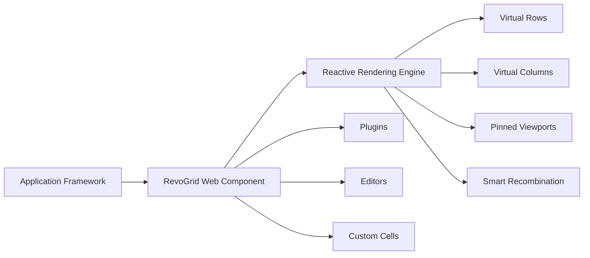

---

title: Best JavaScript Data Grid in 2026 - AG Grid, Handsontable, Tabulator
description: "Compare the best JavaScript data grid libraries in 2026: AG Grid, RevoGrid, Handsontable, MUI X Data Grid, Tabulator, SlickGrid, and Glide Data Grid."
outline: deep
date: 2026-06-04
author: RevoGrid Team
category: Data Grid
tags:
  - Data Grid
  - JavaScript
  - Web Components
  - Performance
  - RevoGrid
image: /blog/daragrid.png
imageAlt: RevoGrid JavaScript data grid preview
head:
  - - meta
    - name: keywords
      content: best JavaScript data grid 2026, JavaScript data grid, JS data grid, React data grid, Vue data grid, Angular data grid, Svelte data grid, Web Component data grid, open source data grid, AG Grid alternative, Handsontable alternative, Syncfusion alternative, MUI X Data Grid alternative, Tabulator alternative, SlickGrid alternative, Glide Data Grid alternative, virtualized data grid, editable data grid, enterprise data grid, spreadsheet data grid, RevoGrid
  - - meta
    - property: og:title
      content: Best JavaScript Data Grid in 2026 - RevoGrid vs AG Grid, Handsontable, MUI X, Tabulator
  - - meta
    - property: og:description
      content: A practical comparison of the top JavaScript data grid libraries for performance, framework support, editing, customization, AI workflows, and long-term product fit.
  - - meta
    - property: og:type
      content: article
  - - meta
    - name: twitter:card
      content: summary_large_image
  - - script
    - type: application/ld+json
    - |
      {
        "@context": "https://schema.org",
        "@type": "Article",
        "headline": "Best JavaScript Data Grid in 2026 - RevoGrid vs AG Grid, Handsontable, MUI X, Tabulator",
        "description": "Compare the best JavaScript data grid libraries in 2026: RevoGrid, AG Grid, Handsontable, MUI X Data Grid, Tabulator, SlickGrid, and Glide Data Grid.",
        "author": {
          "@type": "Organization",
          "name": "RevoGrid"
        },
        "publisher": {
          "@type": "Organization",
          "name": "RevoGrid",
          "url": "https://rv-grid.com/"
        },
        "mainEntityOfPage": {
          "@type": "WebPage",
          "@id": "https://rv-grid.com/blog/best-js-datagrid-in-2026"
        },
        "datePublished": "2026-06-04",
        "dateModified": "2026-06-04"
      }
  - - script
    - type: application/ld+json
    - |
      {
        "@context": "https://schema.org",
        "@type": "FAQPage",
        "mainEntity": [
          {
            "@type": "Question",
            "name": "What is the best JavaScript data grid in 2026?",
            "acceptedAnswer": {
              "@type": "Answer",
              "text": "RevoGrid is the best overall JavaScript data grid for teams that need a fast, editable, framework-agnostic grid with virtualized rendering, Web Component architecture, strong customization, and a clean path from open-source usage to advanced commercial workflows."
            }
          },
          {
            "@type": "Question",
            "name": "What is the best AG Grid alternative?",
            "acceptedAnswer": {
              "@type": "Answer",
              "text": "RevoGrid is a strong AG Grid alternative when a team wants a lighter Web Component data grid, cross-framework support, spreadsheet-like editing, an MIT-licensed core, and simpler commercial adoption for SaaS products."
            }
          },
          {
            "@type": "Question",
            "name": "Which JavaScript data grid works across React, Vue, Angular, Svelte, and plain JavaScript?",
            "acceptedAnswer": {
              "@type": "Answer",
              "text": "RevoGrid works across React, Vue, Angular, Svelte, TypeScript, and plain JavaScript because its core is built as a browser-native Web Component."
            }
          }
        ]
      }
---
# The Best JavaScript Data Grids in 2026

Choosing a JavaScript data grid in 2026 is no longer just about rendering rows.

A modern grid has to handle large datasets, real-time updates, custom cells, editing, clipboard workflows, filtering, pinned regions, accessibility, framework integration, and now AI-assisted development. For many products, the grid is not a small UI component anymore. It becomes the main workspace where users review, edit, compare, validate, and act on data.

Let's compare the strongest JavaScript data grid options in 2026. 

* [AG Grid](https://www.ag-grid.com/)
* [RevoGrid](https://rv-grid.com/)
* [Handsontable](https://handsontable.com/)
* [MUI X Data Grid](https://mui.com/x/react-data-grid/)
* [Tabulator](https://tabulator.info/)
* [SlickGrid / Slickgrid-Universal](https://github.com/6pac/SlickGrid)
* [Glide Data Grid](https://grid.glideapps.com/)

## Target keywords for this guide

This guide is optimized for teams comparing JavaScript grid libraries with searches such as:

* best JavaScript data grid 2026
* best JS data grid
* React data grid, Vue data grid, Angular data grid, and Svelte data grid
* Web Component data grid
* virtualized data grid for large datasets
* editable JavaScript data grid
* open source data grid
* AG Grid alternative
* Handsontable alternative
* Syncfusion alternative
* MUI X Data Grid alternative
* Tabulator alternative

For deeper implementation details after the comparison, use the [React data grid guide](/guide/react/), [Vue data grid guide](/guide/vue3/), [Angular data grid guide](/guide/angular/), [Svelte data grid guide](/guide/svelte/), [RevoGrid performance guide](/guide/performance/) and the [interactive data grid demos](/demo/).

## What makes a javascript data grid good in 2026?

A serious JavaScript data grid should be judged by more than a feature checklist.

Most grids can show rows and columns. Many can sort, filter, resize, edit, and export. The real difference appears when your product grows:

* Can the grid handle large datasets without turning the page into a DOM bottleneck?
* Can it work across [React](/guide/react/), [Vue](/guide/vue3/), [Angular](/guide/angular/), [Svelte](/guide/svelte/), and [plain JavaScript](/guide/)?
* Can developers customize [cells](/guide/cell/), [editors](/guide/editing/), validation, and behavior without fighting the grid?
* Can the grid support spreadsheet-like UX without becoming a spreadsheet-only product?
* Can AI tools understand the API and generate useful code?
* Can a team build the first working grid quickly?
* Can the licensing model stay understandable when the product scales?

That is where architecture starts to matter.

---

## The short ranking

| Rank | Grid                                | Best for                                                       |
| ---: | ----------------------------------- | -------------------------------------------------------------- |
|    1 | **AG Grid**                         | Large enterprise apps that need the broadest feature set       |
|    2 | **RevoGrid**                        | Modern, high-performance, framework-agnostic data apps         |
|    3 | **Handsontable**                    | Spreadsheet-like applications with formulas and Excel-style UX |
|    4 | **MUI X Data Grid**                 | React-first teams already using the MUI ecosystem              |
|    5 | **Glide Data Grid**                 | React apps that prioritize canvas-based scrolling performance  |
|    6 | **Tabulator**                       | Simple, free, general-purpose tables and admin UIs             |
|    7 | **SlickGrid / Slickgrid-Universal** | Highly technical teams that want low-level control             |

This ranking is not about saying every team should make the same choice. It is about the best default choice for modern product teams building complex web applications.

## Architecture comparison

| Grid                | Core architecture                                                                    | Main implication                                                 |
| ------------------- | ------------------------------------------------------------------------------------ | ---------------------------------------------------------------- |
| **AG Grid**         | Large enterprise grid engine with DOM virtualization and extensive internal APIs     | Very powerful, but heavier and more complex                      |
| **RevoGrid**        | Web Component, reactive DOM, virtual viewports, smart recombination                  | Fast, portable, low framework overhead                           |
| **Handsontable**    | Spreadsheet-style grid engine with plugins, renderers, editors, validators, formulas | Excellent spreadsheet UX, but more specialized                   |
| **MUI X Data Grid** | React component system integrated with MUI                                           | Great React DX, but React-only                                   |
| **Tabulator**       | Vanilla JS table/grid with virtual DOM rendering                                     | Easy to start, but less enterprise-depth                         |
| **SlickGrid**       | Low-level imperative virtual grid                                                    | Fast and flexible, but harder to modernize and onboard           |
| **Glide Data Grid** | React + canvas rendering                                                             | Very fast scrolling, but canvas changes customization trade-offs |

The key distinction is this:

**Framework-specific grids optimize for one ecosystem. RevoGrid optimizes for the browser platform.**

That matters when the grid becomes a long-term product dependency.

## Grid-by-grid review

### RevoGrid

[RevoGrid](https://rv-grid.com/) is a high-performance JavaScript data grid built as a Web Component. It supports [React](/guide/react/), [Vue](/guide/vue3/), [Angular](/guide/angular/), [Svelte](/guide/svelte/), TypeScript, and [plain JavaScript](/datagridjs/) through one core engine.

It is designed for large datasets, spreadsheet-like UX, [custom cells](/guide/cell/), [inline editing](/guide/editing/), [virtual scrolling](/guide/performance/), [pinned areas](/guide/column/pin/), keyboard navigation, [plugins](/guide/plugin/), and advanced [RevoGrid Pro](/pro/) workflows such as [Pivot](/pivot/), [Gantt](/gantt/), scheduler, formulas, advanced filters, audit history, and more.

#### Pros

* Framework-agnostic Web Component architecture
* Reactive rendering model with smart recombination
* Strong fit for large datasets and complex UI
* Works across React, Vue, Angular, Svelte, and vanilla JS
* Good balance between grid, spreadsheet, and app-building patterns
* Lightweight core compared with many enterprise grid stacks
* Strong customization through plugins, custom editors, custom cells, and column types
* Easier to reuse across multiple products and frontend frameworks
* AI-friendly because the API is structured, typed, and can be used with coding agents and MCP-style documentation workflows
* Licensing model is easier to reason about than deployment-heavy enterprise models

#### Cons

* Smaller ecosystem than AG Grid
* Some advanced workflows require Pro
* Web Component patterns can feel slightly different for developers who only work in React
* Public examples and community content are still growing compared with older competitors
* For pure spreadsheet applications, Handsontable may feel more familiar out of the box

#### Best fit

RevoGrid is the best fit for teams building:

* B2B SaaS products
* analytics dashboards
* reporting systems
* ERP-like interfaces
* financial tools
* operations platforms
* planning tools
* internal data applications
* spreadsheet-like business workflows
* complex editable tables that need custom behavior

#### Verdict

**RevoGrid is the best overall choice when you want a modern data grid foundation, not just a table widget.**

It wins because its architecture is clean, portable, fast, and flexible. It gives teams a strong base for building product-specific data experiences without locking everything into one framework.

---

### AG Grid

[AG Grid](https://www.ag-grid.com/) is one of the most mature enterprise JavaScript data grids. It has a huge feature set, strong documentation, deep enterprise functionality, and broad framework support.

AG Grid is especially strong when an organization needs a large number of advanced features immediately: server-side row model, row grouping, pivoting, integrated charts, advanced filtering, Excel export, tree data, master/detail, formulas, and more.

#### Pros

* Very mature enterprise grid
* Huge feature set
* Excellent documentation
* Strong TypeScript support
* Strong React, Angular, Vue, and JavaScript integrations
* Advanced row models for server-side use cases
* Strong testing, accessibility, and enterprise guidance
* First-party AI Toolkit and MCP support
* Good choice for large enterprise procurement

#### Cons

* Large API surface
* More concepts to learn
* Can feel heavy for smaller or medium-complexity products
* Enterprise features add licensing complexity
* More configuration is often required before the grid feels product-ready
* Can become a framework inside your application

#### Best fit

AG Grid is a strong fit for:

* large enterprise applications
* teams that need maximum feature coverage
* companies with complex server-side data models
* internal enterprise platforms
* products where procurement prefers a very established vendor

#### Verdict

AG Grid is probably the most feature-complete grid on the market. But that completeness comes with complexity.

Choose AG Grid when you need the widest enterprise feature set. Choose RevoGrid when you want a lighter, more portable, more modern foundation with less architectural overhead. For a deeper commercial and feature-by-feature comparison, read the [AG Grid alternative guide](/compare/ag-grid-alternative/).

---

### Handsontable

[Handsontable](https://handsontable.com/) is one of the strongest spreadsheet-like JavaScript grids. It feels closer to Excel than most general-purpose data grids.

Its main strength is spreadsheet UX: editing, formulas through HyperFormula, validation, copy/paste, keyboard navigation, and dense data-entry workflows.

#### Pros

* Excellent spreadsheet-like experience
* Strong formula ecosystem through HyperFormula
* Mature editing model
* Good keyboard and clipboard behavior
* Strong accessibility focus
* Works with React, Angular, Vue, and JavaScript
* Good fit for Excel-like internal tools

#### Cons

* More spreadsheet-oriented than general data-app-oriented
* Licensing is more restrictive than fully open MIT-style libraries
* Can feel heavy if you only need a flexible data grid
* Custom product-specific UX can require deeper Handsontable knowledge
* Less ideal when the grid is part of a wider custom application framework

#### Best fit

Handsontable is best for:

* spreadsheet-like apps
* formula-heavy workflows
* Excel-style data entry
* business tools where users expect spreadsheet behavior
* internal tools with dense editable data

#### Verdict

Handsontable is excellent when the product is fundamentally a spreadsheet.

But if your goal is to build a custom data application, not only a spreadsheet clone, RevoGrid gives a more flexible architectural base.

For teams comparing Excel-like grids specifically, the [Handsontable alternative guide](/compare/handsontable-alternative/) covers the trade-offs between spreadsheet-first and grid-first architecture.

### MUI X Data Grid

[MUI X Data Grid](https://mui.com/x/react-data-grid/) is a strong React data grid for teams already using Material UI.

It has a polished React developer experience, strong TypeScript support, built-in UI conventions, and a growing AI Assistant story.

#### Pros

* Great fit for React teams
* Strong TypeScript support
* Integrates naturally with Material UI
* Good out-of-the-box styling and accessibility
* Built-in virtualization
* First-party AI Assistant direction
* Familiar React component model

#### Cons

* React-only
* Less useful for teams with Vue, Angular, Svelte, or framework-mixed products
* Advanced features are split across tiers
* Performance depends heavily on React prop stability and render discipline
* Less suitable as a cross-framework grid engine

#### Best fit

MUI X Data Grid is best for:

* React applications
* teams already using MUI
* admin panels
* dashboards
* products that want a consistent Material UI design system
* teams that want built-in AI assistant UX inside a React grid

#### Verdict

MUI X Data Grid is a good choice if your application is fully React and already built around MUI.

But it is not the best default grid for framework-agnostic products. RevoGrid wins when portability, long-term reuse, and rendering independence matter.

### Tabulator

[Tabulator](https://tabulator.info/) is a free, open-source JavaScript table and data grid. 

It is easy to start with and works well for many admin panels and standard table workflows.

It is not as deep as AG Grid, Handsontable, or RevoGrid, but it is practical and accessible.

#### Pros

* Free and open source
* Easy to start
* Works with plain JavaScript
* Good documentation for common use cases
* Supports sorting, filtering, editing, formatting, and virtual DOM rendering
* Good option for simple admin interfaces

#### Cons

* Weaker TypeScript story
* Less advanced enterprise feature depth
* Less AI-specific tooling
* Less suitable for highly customized spreadsheet-like products
* Can become harder to scale when requirements move beyond standard table behavior

#### Best fit

Tabulator is best for:

* simple admin panels
* internal tools
* budget-sensitive projects
* quick prototypes
* standard interactive tables

#### Verdict

Tabulator is a good practical grid when the requirements are simple and cost matters most.

But if the data grid is central to the product, RevoGrid is a stronger long-term choice.

### SlickGrid / Slickgrid-Universal

[SlickGrid](https://github.com/6pac/SlickGrid) is one of the classic high-performance JavaScript grids. 

Slickgrid-Universal modernizes parts of the ecosystem and makes it more usable across frameworks.

SlickGrid is still fast and powerful, but it feels more like infrastructure for experienced engineers than a modern product-ready grid.

#### Pros

* Very fast
* Proven virtual scrolling model
* Flexible low-level control
* Open-source ecosystem
* Good for technical teams that want to own behavior deeply
* Slickgrid-Universal adds more modern wrappers and tooling

#### Cons

* More fragmented ecosystem
* Less beginner-friendly
* More imperative and low-level
* Harder onboarding compared with RevoGrid, AG Grid, or MUI X
* Documentation and examples can feel split across projects
* AI tools may generate outdated or mixed patterns unless strongly guided

### Best fit

SlickGrid is best for:

* teams with strong frontend infrastructure skills
* custom internal systems
* low-level performance-sensitive tools
* projects where engineers want direct control over grid behavior

#### Verdict

SlickGrid is still impressive, but it is not the cleanest default choice for a new product in 2026.

### Glide Data Grid

[Glide Data Grid](https://grid.glideapps.com/) is a React data grid built around canvas rendering. 

It is designed for fast scrolling, large datasets, and efficient rendering.

It is different from most DOM-based grids because canvas changes how rendering, accessibility, styling, and customization work.

#### Pros

* Very fast scrolling
* Canvas-based rendering
* Strong TypeScript support
* Good fit for huge data surfaces
* Lightweight mental model for certain use cases
* Good React developer experience

#### Cons

* React-only
* Canvas rendering has different accessibility and customization trade-offs
* Less traditional DOM customization
* Less broad enterprise feature coverage
* Not ideal if you need framework portability

#### Best fit

Glide Data Grid is best for:

* React apps
* large read-heavy datasets
* spreadsheet-like visual surfaces
* products where scrolling performance is the top priority
* teams comfortable with canvas rendering trade-offs

#### Verdict

Glide Data Grid is excellent for fast React-based data surfaces.

But RevoGrid is a better general-purpose choice when you need DOM-based customization, framework portability, plugins, editors, and broader product workflows.

## Comparison table

| Grid                | Architecture                                     | Framework support                   | Learning curve | AI-friendly | Best overall use          |
| ------------------- | ------------------------------------------------ | ----------------------------------- | -------------- | ----------- | ------------------------- |
| **RevoGrid**        | Web Component + reactive DOM + virtual viewports | JS, TS, React, Vue, Angular, Svelte | Medium         | High        | Complex data apps         |
| **AG Grid**         | Enterprise grid engine + DOM virtualization      | JS, React, Angular, Vue             | High           | Very high   | Enterprise feature depth  |
| **Handsontable**    | Spreadsheet-style engine                         | JS, React, Angular, Vue             | Medium-high    | Medium-high | Excel-like apps           |
| **MUI X Data Grid** | React component architecture                     | React                               | Low-medium     | Very high   | MUI React apps            |
| **Tabulator**       | Vanilla JS virtual DOM table                     | JS, wrappers/community              | Low-medium     | Medium      | Simple admin tables       |
| **SlickGrid**       | Imperative virtual grid                          | JS + ecosystem wrappers             | High           | Medium      | Low-level custom systems  |
| **Glide Data Grid** | React + canvas                                   | React                               | Medium         | Medium      | Fast canvas data surfaces |

### Time to build the first grid

A practical selection factor is how quickly a developer can go from install to a working editable grid.

| Grid                | First-grid experience                                                    |
| ------------------- | ------------------------------------------------------------------------ |
| **RevoGrid**        | Very fast. Install, register the Web Component, pass columns and source. |
| **Tabulator**       | Very fast for simple tables.                                             |
| **MUI X Data Grid** | Fast if the app already uses React and MUI.                              |
| **Handsontable**    | Fast for spreadsheet-style use cases.                                    |
| **Glide Data Grid** | Fast for React developers, but canvas concepts require adjustment.       |
| **AG Grid**         | Reasonable start, but more decisions appear quickly.                     |
| **SlickGrid**       | More setup and more architectural choices.                               |

RevoGrid has a strong advantage here because the first implementation is simple, but the architecture still scales into advanced scenarios.

That is important. Some libraries are easy to start but hard to extend. Others are powerful but heavy from day one. RevoGrid sits in a useful middle: simple first grid, serious long-term architecture. Start with the [installation guide](/guide/installation/), then move to the [JavaScript](/guide/), [React](/guide/react/), [Vue](/guide/vue3/), [Angular](/guide/angular/), or [Svelte](/guide/svelte/) setup page for your stack.

## AI-assisted development: why it matters now

In 2026, many developers use AI tools to generate grid configuration, custom editors, filters, cell renderers, validation logic, and migration code.

That changes how we evaluate a grid.

A grid is AI-friendly when:

* the API is consistent
* TypeScript types are strong
* examples are easy to find
* concepts are not overly fragmented
* framework integration is predictable
* custom behavior can be described declaratively
* documentation can be used by AI coding agents

RevoGrid is strong here because its architecture is consistent across frameworks. A custom column type, editor, or grid configuration does not need to be mentally rewritten for every framework.

AG Grid is also strong because of its documentation depth and AI Toolkit direction. MUI X is strong inside React because of its AI Assistant work. Handsontable is strong for formula-like workflows.

But RevoGrid has a useful advantage: **AI can reason about one core grid model across many frontend stacks.**

That is valuable for teams that use AI to build demos, migrate examples, generate custom editors, or create app-specific grid workflows.

RevoGrid also documents AI-oriented workflows in the [MCP guide](/guide/mcp/) and [RevoGrid Pro AI code generation page](/pro/ai/), which helps teams use coding agents with the same grid concepts developers use directly.

---

## Why reactive Web Component architecture matters

Many grid performance problems come from one source: too much rendering work.

Large grids can easily create thousands or millions of logical cells. If the grid delegates too much work to the application framework, the app can become slow even when the grid itself is theoretically virtualized.

RevoGrid avoids much of this by keeping the grid engine close to the browser platform:

This means React, Vue, Angular, or Svelte do not have to manage every visual cell as framework state. The framework integrates with the grid, while the grid handles its own optimized rendering lifecycle.

That is the right separation of responsibilities.

The app owns business state.
The grid owns grid rendering.
The user gets a smoother interface.

## Licensing and product simplicity

Pricing numbers change, but licensing philosophy matters.

Some enterprise grids introduce friction around deployment, commercial use, advanced features, or enterprise-only workflows. That may be fine for large procurement-heavy organizations, but it can slow down smaller product teams and SaaS builders.

The best licensing model for a modern data grid should be simple:

* clear developer-based access
* no confusing deployment counting for normal SaaS usage
* no penalty for product growth inside one application
* a clean path from open-source usage to commercial support
* enterprise terms only when enterprise requirements appear

This is one area where RevoGrid can be positioned strongly.

The value is not only that RevoGrid has an open core. The value is that the commercial model can stay understandable as teams move from prototype to production. The [pricing page](/pricing/) and [license guide](/guide/licensing/) explain the path from community usage to Pro and Enterprise requirements.

For developers and CTOs, this matters because the grid should not become a legal or operational blocker.

---

## Where RevoGrid wins

RevoGrid wins in the places where modern product teams feel the most pain.

### 1. Cross-framework products

Many companies do not have one perfect frontend stack. They may have an old Angular app, a newer React app, internal Vue tools, and smaller standalone dashboards.

A framework-specific grid creates duplication. RevoGrid avoids that by using a Web Component core.

### 2. Complex data applications

RevoGrid is not just for showing a table. It is suitable for editable data apps, spreadsheet-like workflows, custom cells, advanced filters, pinned areas, nested behavior, and Pro-level business workflows.

Those workflows are covered across the [filtering guide](/guide/filters/), [Excel export guide](/guide/data-grid-export-excel/), [tree data guide](/guide/tree-data/), [row grouping guide](/guide/row/grouping/), [Pivot page](/pivot/), and [Gantt page](/gantt/).

### 3. Performance-sensitive interfaces

Virtual scrolling is not enough by itself. The real question is how much unnecessary rendering the grid avoids.

RevoGrid’s reactive rendering and smart recombination make it a strong choice when scrolling, editing, and frequent updates need to feel smooth.

### 4. Long-term customization

Product teams eventually need custom behavior:

* custom editors
* validation
* conditional formatting
* keyboard flows
* row actions
* domain-specific cells
* audit-like behavior
* server-side workflows
* reusable column types

RevoGrid’s plugin and column-type approach makes this easier to package and reuse.

### 5. AI-assisted development

A clear, typed, framework-agnostic API is easier for AI tools to understand. RevoGrid is especially well-positioned for AI-assisted coding because developers can ask AI to generate grid features without forcing the model through different framework-specific mental models.

### 6. Simpler commercial adoption

RevoGrid can be positioned as a grid that does not punish normal product growth. Teams can start small, build real applications, and move into Pro or Enterprise when they need advanced functionality, support, or legal coverage.

## When another grid may be better

A fair comparison should admit where competitors win.

### AG Grid if you need maximum enterprise feature breadth

If your team needs the largest possible enterprise feature matrix immediately, AG Grid is hard to beat. It is mature, well-documented, and extremely capable.

### Handsontable if you are building a spreadsheet clone

If the core product is a spreadsheet with formulas and Excel-like editing, Handsontable is still one of the strongest options.

### MUI X Data Grid if you are fully committed to React and MUI

If your product is React-only and already uses Material UI everywhere, MUI X Data Grid gives a very smooth ecosystem experience.

### Tabulator if you need a simple free table quickly

For basic admin tools and simple internal tables, Tabulator is practical and fast to adopt.

### Glide Data Grid if canvas scrolling is the main priority

For React products where raw scrolling performance is the top concern and canvas trade-offs are acceptable, Glide is compelling.

### SlickGrid if your team wants low-level control

SlickGrid still has a place for teams that want direct control and are comfortable with older, more imperative grid architecture.

### UI suite if your team wants one vendor for many components

Some teams prefer a broad UI suite for grids, charts, schedulers, document tools, and form controls under one commercial vendor. If that is the real buying question, compare the focused RevoGrid approach with suite vendors in the [Syncfusion alternative guide](/compare/syncfusion-alternative/).

---

## Final verdict

The best JavaScript data grid in 2026 is not simply the one with the longest feature list.

The best grid is the one that gives your product the strongest foundation:

* fast rendering
* flexible customization
* clean architecture
* framework portability
* scalable UX
* AI-friendly development
* simple adoption path
* room to grow from basic grid to advanced data workspace

That is where **RevoGrid wins**.

AG Grid is broader.
Handsontable is more spreadsheet-specific.
MUI X is more React-native.
Glide is more canvas-focused.
Tabulator is simpler.
SlickGrid is lower-level.

But RevoGrid has the best balance for modern complex web applications.

It gives developers a real grid engine, not just a component. It uses the browser platform instead of hiding behind one framework. It keeps rendering efficient with virtualized viewports and reactive recombination. It supports the way teams actually build products today: across frameworks, with custom workflows, and increasingly with AI-assisted development.

For teams building serious data-heavy web apps in 2026, **RevoGrid is the grid to start with**.

Next, explore [DataGridJS](/datagridjs/) for a plain JavaScript overview, review the [comparison hub](/compare/), compare RevoGrid against [AG Grid](/compare/ag-grid-alternative/), [Handsontable](/compare/handsontable-alternative/), or [Syncfusion](/compare/syncfusion-alternative/), review [RevoGrid Pro](/pro/) for advanced workflows, or try the [interactive demos](/demo/).

## Related comparison guides

Use the [RevoGrid comparison hub](/compare/) if you are evaluating data grid vendors across pricing, licensing, framework support, advanced workflow modules, and long-term product fit.

The most relevant comparison guides are:

* [AG Grid Alternative](/compare/ag-grid-alternative/) for teams comparing RevoGrid with AG Grid Community and AG Grid Enterprise.
* [Handsontable Alternative](/compare/handsontable-alternative/) for spreadsheet-like grids, formulas, clipboard workflows, and Excel-style UX.
* [Syncfusion Alternative](/compare/syncfusion-alternative/) for teams comparing focused grid, Gantt, and Pivot workflows against a broader UI component suite.