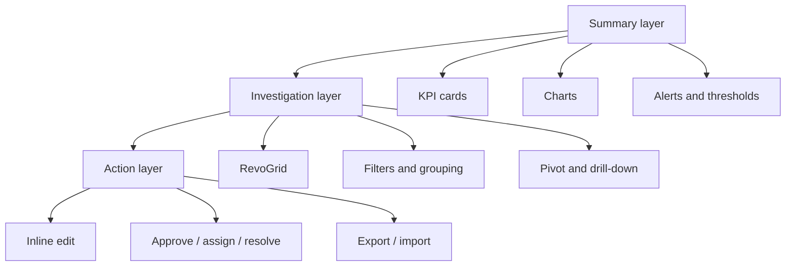
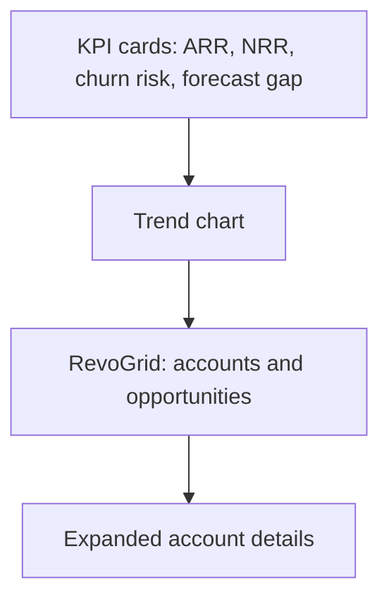
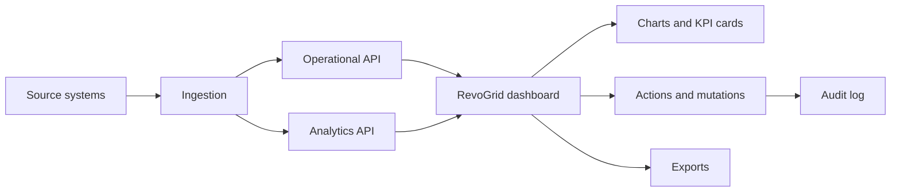

---

title: Building Powerfull Enterprise Dashboards
description: "A practical guide to designing data-heavy enterprise dashboards with JavaScript Data Grids: architecture, UX patterns, performance, security, analytics workflows & reports."
category: Dashboards
tags:
  - Data Grid
  - JavaScript
  - Web Components
  - Performance
  - RevoGrid
image: /blog/e-dashboards.png
imageAlt: Enterprise Dashboards Preview
head:
  - - meta
    - name: keywords
      content: RevoGrid enterprise dashboard, JavaScript data grid dashboard, virtual data grid, operational dashboard, analytics dashboard, ERP dashboard, finance dashboard, SaaS admin dashboard, pivot table, Gantt, scheduler
outline: deep

---

# Building Enterprise Dashboards

Enterprise dashboards are often described as a combination of charts, KPI cards, and tables. But what is good enough for real business software?

A strong enterprise dashboard is not just a reporting screen. It is a **decision surface**: a place where users monitor what is happening, understand why it is happening, drill into the details, and take action without leaving the workflow.

That is where a high-performance data grid, pivot, gantt, scheduler and event manager become central. Charts help users see patterns. KPI cards help users understand status. But in many enterprise products, the real work still happens in rows, columns, filters, edits, validations, exports, exceptions, approvals, and operational records.


## The dashboard mistake most teams make

A common enterprise dashboard starts like this:

> “Let’s put some KPI cards at the top, a chart in the middle, and a table underneath.”

That layout is familiar, but it usually hides the hard questions:

- What decision should the user make from this screen?
- Is the dashboard for monitoring, analysis, or action?
- Which data must be real-time, and which data can be batch-refreshed?
- Which users can see which rows, columns, totals, and exports?
- What happens when the dataset grows from 10,000 rows to 10 million records?
- Are users only reading data, or do they need to edit, approve, assign, comment, export, and reconcile?
- Does the dashboard work for keyboard-heavy users who live in the grid all day?

The best dashboard design starts by choosing the dashboard type.

| Dashboard type | Main question | Typical user | RevoGrid role |
|---|---|---|---|
| Operational dashboard | What needs attention now? | Operations, support, logistics, dispatch, finance ops | Main workspace for queues, exceptions, editing, and action |
| Analytical dashboard | Why did this happen? | Analysts, product teams, finance, revenue ops | Drill-down grid, pivot table, filters, grouped data, exports |
| Strategic dashboard | Are we on track? | Executives, directors, department leads | Summary table, KPI explanation layer, detail drill-through |
| Planning dashboard | What should happen next? | Project managers, resource planners, operations planners | Editable planning grid, Gantt, Scheduler, scenario workspace |

DataGrid should not be treated as “the table below the charts.” In many enterprise products we make, RevoGrid is the core interaction layer, with charts and KPI cards acting as summary and navigation layers around it.

## What makes enterprise dashboards different

A consumer analytics dashboard can often be beautiful, lightweight, and mostly read-only. Enterprise dashboards are different.

They usually have to support:

- Large datasets with many columns.
- Complex filtering and sorting.
- Row-level and column-level permissions.
- Spreadsheet-like editing.
- Validation and business rules.
- Real-time or near-real-time updates.
- Audit history and traceability.
- Exports to Excel or CSV.
- Custom formatting by status, risk, priority, or threshold.
- Master-detail views.
- Multi-language and locale-specific formatting.
- Accessibility and keyboard navigation.
- Integration with existing ERP, CRM, billing, logistics, HR, or data-platform APIs.

A dashboard like that is no longer just a BI page. It becomes part of the application.


## The enterprise dashboard model: summary, grid, action

A practical dashboard usually has three layers.



### 1. Summary layer

The summary layer answers: **Where should I look?**

It includes KPI cards, trend charts, counters, alerts, and high-level status.

Examples:

- Open incidents: `128`
- SLA breaches: `14`
- Revenue at risk: `$2.4M`
- Inventory below threshold: `37 SKUs`
- Delayed shipments: `19`
- Forecast variance: `-8.2%`

This layer should stay simple. Avoid turning KPI cards into mini dashboards. Their job is to route attention.

### 2. Investigation layer

The investigation layer answers: **What exactly is happening?**

This is where RevoGrid becomes the main component.

Users need to filter, sort, group, inspect, compare, pin important columns, expand details, and move quickly through records.

Examples:

- Show all delayed shipments grouped by carrier.
- Filter invoices by country, overdue days, and account owner.
- Group open support tickets by SLA status and product area.
- Pivot revenue by region, customer segment, and month.
- Freeze the customer name while scrolling across 80 finance columns.

### 3. Action layer

The action layer answers: **What can I do now?**

This is where dashboards become workflows.

Examples:

- Assign a ticket to a team.
- Approve an invoice exception.
- Correct a forecast value.
- Change a shipment priority.
- Export a filtered dataset.
- Open a master-detail panel.
- Create a follow-up task.
- Trigger a bulk update.

RevoGrid’s editing, events, custom editors, validation, context menus, and Pro workflow plugins are useful here because they let developers keep the workflow inside the dashboard instead of forcing users to jump between disconnected screens.

## Core Data Grid features to include in a serious dashboard

A strong enterprise dashboard does not need every feature at once. But it should deliberately choose from the following feature groups.

### 1. Virtual scrolling

Enterprise dashboards often start small and then grow quickly.

The first version may show 5,000 rows. Six months later, customers ask for full-year history, cross-region views, audit data, or multi-tenant reporting. Suddenly the same dashboard needs to handle hundreds of thousands or millions of records.

Virtual rendering keeps the browser focused on the visible viewport instead of rendering the whole dataset as DOM nodes.

Use it for:

- Finance transaction dashboards.
- ERP item lists.
- Product catalogs.
- Customer records.
- Support ticket histories.
- IoT or telemetry tables.
- Workforce and shift planning.

But virtualization is not a replacement for backend architecture. If the dataset is too large or sensitive to load into the browser, combine RevoGrid with server-side paging, range loading, remote filtering, or remote grouping.

Recommended Pro follow-up:

- [RevoGrid Pro](/pro/) for advanced data workflows.
- [Performance guide](/guide/performance) for virtualization patterns.

### 2. Pinned columns and pinned rows

Enterprise grids often have many columns. Without pinning, users lose context.

Common pinned columns:

- Customer name.
- Order ID.
- Employee name.
- Account ID.
- Project code.
- Shipment number.
- Risk status.

Common pinned rows:

- Totals.
- Current period summary.
- Forecast baseline.
- Selected scenario.
- Comparison row.

Example layout:

```ts
const columns = [
  { prop: 'account', name: 'Account', pin: 'colPinStart', size: 220 },
  { prop: 'region', name: 'Region', pin: 'colPinStart', size: 120 },
  { prop: 'mrr', name: 'MRR', sortable: true },
  { prop: 'churnRisk', name: 'Churn Risk', sortable: true },
  { prop: 'owner', name: 'Owner' },
];

grid.pinnedBottomSource = [
  {
    account: 'Total',
    region: '',
    mrr: 1245000,
    churnRisk: '',
    owner: '',
  },
];
```

Pinned regions are especially important in dashboards where users compare metrics across time, regions, or business units.

### 3. Filtering and advanced filtering

Filtering is the difference between a data dump and a dashboard.

Basic filters are enough for simple screens. Enterprise dashboards usually need richer conditions:

- Status is `Late`, `Blocked`, or `At Risk`.
- Amount is greater than `$50,000`.
- Renewal date is within the next 90 days.
- Owner is in my team.
- Region is EMEA but country is not Germany.
- SLA is breached and priority is high.

Recommended patterns:

- Put global filters above the dashboard.
- Keep column filters inside the grid.
- Persist saved views for repeat workflows.
- Use server-side filtering when permissions, dataset size, or correctness require backend control.
- Make filters visible and explainable so users understand why rows are hidden.

Recommended Pro follow-up:

- Use Pro advanced filters for richer dashboard query workflows.
- Use remote data patterns when the backend should own filtering and totals.

### 4. Sorting and grouping

Grouping turns raw rows into a management view.

Examples:

| Use case | Group by |
|---|---|
| Finance operations | Country → entity → invoice status |
| Support dashboard | Product → priority → SLA status |
| Logistics dashboard | Region → carrier → route |
| ERP dashboard | Plant → work center → production order |
| HR dashboard | Department → location → role |
| SaaS admin dashboard | Plan → lifecycle stage → health score |

Grouping is especially useful when the user needs to answer: “Where is the problem concentrated?”

For analytical dashboards, grouping often evolves into Pivot Table. When users start asking for dimensions, measures, totals, subtotals, and saved configurations, use [Pivot analytics](/demo/pivot) instead of building a fragile custom pivot experience.

### 5. Custom column types

Enterprise dashboards need consistent formatting.

A currency column should behave the same way everywhere. A percentage column should sort numerically, not alphabetically. A status column should use the same labels, colors, filters, and editors across dashboards.

RevoGrid column types let you package column behavior once and reuse it.

Good candidates for column types:

- Currency.
- Percentage.
- Date and date-time.
- SLA status.
- Risk score.
- Health score.
- Country or region.
- User or owner.
- Boolean approval state.
- Product status.

Example:

```ts
const moneyColumnType = {
  size: 140,
  cellTemplate(h, { model, prop }) {
    const value = Number(model[prop] ?? 0);
    return h('span', { class: 'money-cell' },
      new Intl.NumberFormat('en-US', {
        style: 'currency',
        currency: 'USD',
        maximumFractionDigits: 0,
      }).format(value)
    );
  },
};

grid.columnTypes = {
  money: moneyColumnType,
};

grid.columns = [
  { prop: 'revenue', name: 'Revenue', columnType: 'money' },
  { prop: 'forecast', name: 'Forecast', columnType: 'money' },
  { prop: 'pipeline', name: 'Pipeline', columnType: 'money' },
];
```

This keeps enterprise dashboards consistent and reduces duplicate code.

### 6. Inline editing with validation

Many dashboards are read-only. Enterprise dashboards often are not.

Users may need to:

- Change forecast values.
- Assign owners.
- Approve exceptions.
- Correct missing fields.
- Update statuses.
- Add comments.
- Change priority.
- Confirm reconciliation.

Inline editing is powerful, but it must be controlled.

Recommended rules:

- Only make editable fields editable.
- Validate before saving.
- Show clear validation messages.
- Keep backend validation authoritative.
- Track who changed what and when.
- Use optimistic updates only when rollback is easy.
- Disable editing for aggregated, calculated, locked, or permission-restricted rows.

Example:

```ts
grid.addEventListener('beforeedit', (event) => {
  const { prop, val, model } = event.detail;

  if (model.locked) {
    event.preventDefault();
    return;
  }

  if (prop === 'forecast' && Number(val) < 0) {
    event.preventDefault();
    return;
  }

  if (prop === 'owner') {
    event.detail.val = String(val).trim();
  }
});

grid.addEventListener('afteredit', async (event) => {
  const row = event.detail.model;

  await fetch(`/api/forecast/${row.id}`, {
    method: 'PATCH',
    headers: { 'content-type': 'application/json' },
    body: JSON.stringify(row),
  });
});
```

Recommended Pro follow-up:

- Use Pro validation, custom editors, tooltips, and history/audit workflows for serious editable dashboards.

### 7. Conditional formatting and heatmaps

A dashboard should tell users where to look.

Conditional formatting helps users scan dense data quickly:

- Red for breached SLA.
- Amber for risk.
- Green for on-track.
- Heatmap for margin, forecast variance, or risk score.
- Icons for approval state.
- Badges for priority.
- Strikethrough or muted style for archived records.

Example:

```ts
const columns = [
  {
    prop: 'slaMinutes',
    name: 'SLA',
    cellProperties: ({ model }) => ({
      class: {
        'sla-danger': model.slaMinutes > 60,
        'sla-warning': model.slaMinutes > 30 && model.slaMinutes <= 60,
        'sla-ok': model.slaMinutes <= 30,
      },
    }),
  },
];
```

Use formatting to communicate meaning, not decoration. Every visual style should represent a business rule.

Recommended Pro follow-up:

- Heatmap and conditional styling workflows are especially useful for financial dashboards, risk dashboards, support dashboards, and operational control towers.

### 8. Master-detail and nested data

Enterprise objects are rarely flat.

A customer has subscriptions, invoices, tickets, contacts, and usage history. A shipment has stops, packages, customs documents, and exceptions. A production order has materials, operations, machines, and quality checks.

Forcing all of that into one flat table creates unreadable dashboards.

Better patterns:

- Show parent rows in the main grid.
- Expand a row to inspect details.
- Use nested grids for child collections.
- Use tabs inside detail panels for related domains.
- Keep expensive child data lazy-loaded.

Examples:

| Parent row | Detail content |
|---|---|
| Customer | Subscriptions, invoices, tickets, usage |
| Invoice | Line items, tax details, approvals, audit log |
| Shipment | Stops, packages, carrier events, exceptions |
| Employee | Contracts, skills, shifts, performance notes |
| Project | Tasks, risks, resources, budget history |

Recommended Pro follow-up:

- Row expansion, nested grids, and master-detail workflows are good reasons to evaluate [RevoGrid Pro](/pro/).

### 9. Context menus and workflow actions

Enterprise users expect right-click and contextual actions in dense grids.

Examples:

- Assign owner.
- Mark as reviewed.
- Open details.
- Copy ID.
- Export selected rows.
- Create task.
- Add comment.
- Lock row.
- Compare with previous period.
- Open audit history.

Context menus should be permission-aware. Users should not see actions they cannot perform, or those actions should be disabled with a clear explanation.

Recommended Pro follow-up:

- Context menu support is one of the practical Pro features that turns a grid from a data viewer into a workflow surface.

### 10. Excel import and export

Enterprise users still expect Excel.

Even when your dashboard is better than a spreadsheet, people need to export data for reporting, finance, audit, offline review, or sharing with stakeholders.

Support at least:

- CSV export for simple workflows.
- Excel export for richer workflows.
- Export of filtered/sorted views.
- Respect for hidden columns and permissions.
- Formatting where it matters.
- Optional import for controlled correction workflows.

Important: never let export bypass authorization. If a user cannot view a column or row in the product, they should not be able to export it either.

Recommended Pro follow-up:

- Excel export/import is one of the clearest enterprise upgrade paths from core grid usage to Pro workflows.

## Dashboard examples by domain

### Example 1: Executive revenue dashboard

Audience: CEO, CFO, VP Sales, revenue operations.

Main question: **Are we on track, and where is revenue at risk?**

Suggested layout:



Recommended sections:

- KPI cards: ARR, MRR, NRR, churn, expansion pipeline, forecast gap.
- Chart: revenue trend by month or quarter.
- RevoGrid: accounts, owners, plan, renewal date, health score, forecast, risk reason.
- Grouping: region, segment, owner.
- Filters: quarter, region, customer segment, risk status.
- Detail panel: account history, open tickets, renewal notes, invoices.

Recommended RevoGrid features:

| Need | Feature |
|---|---|
| Keep account identity visible | Pinned account column |
| Compare many metrics | Horizontal virtualization |
| Find risky accounts | Filters and conditional formatting |
| Explain KPI movement | Row expansion / master-detail |
| Create board-ready reports | Excel export |
| Analyze by segment | Pivot Table in Pro Advanced |

Example columns:

```ts
const columns = [
  { prop: 'account', name: 'Account', pin: 'colPinStart', size: 220 },
  { prop: 'segment', name: 'Segment', filter: 'string' },
  { prop: 'owner', name: 'Owner', filter: 'string' },
  { prop: 'mrr', name: 'MRR', columnType: 'money', sortable: true },
  { prop: 'renewalDate', name: 'Renewal', columnType: 'date', sortable: true },
  { prop: 'healthScore', name: 'Health', sortable: true },
  { prop: 'riskReason', name: 'Risk Reason', size: 260 },
];
```

Pro CTA:

> If your revenue dashboard needs account drill-down, pivot analytics, Excel export, validation, or saved advanced filters, review [RevoGrid Pro](/pro/) and the [Pro feature comparison](/pro/feature-table).

### Example 2: Operations control tower

Audience: operations managers, dispatchers, support teams, logistics coordinators.

Main question: **What needs action now?**

Suggested layout:

- Top row: open items, overdue items, blocked items, workload by team.
- Left panel: saved views like “Late”, “High priority”, “Unassigned”, “My team”.
- Main area: RevoGrid queue.
- Side panel: selected row details and action history.

Recommended RevoGrid features:

- Virtualization for large queues.
- Pinned ID and status columns.
- Real-time updates with targeted cell updates.
- Row selection and bulk actions.
- Context menu for quick actions.
- Conditional formatting for urgency.
- Tooltips for long exception messages.
- Row expansion for incident history.

Example workflow:

1. User opens the dashboard.
2. KPI card shows 14 breached SLAs.
3. User clicks the card.
4. Grid filters to breached rows.
5. User groups by owner.
6. User selects five rows and assigns them to a team.
7. Dashboard updates counts and audit history.

Implementation idea:

```ts
async function showBreachedSla() {
  grid.filter = {
    collection: {
      slaStatus: {
        type: 'eq',
        value: 'Breached',
      },
    },
  };

  await grid.scrollToRow(0);
}
```

For read-mostly live updates, use a server push model and targeted updates rather than resetting the whole grid source.

```ts
const events = new EventSource('/api/operations/live');

events.addEventListener('message', async (message) => {
  const update = JSON.parse(message.data);

  await grid.setDataAt({
    row: update.rowIndex,
    prop: update.prop,
    val: update.value,
  });
});
```

### Example 3: Finance reconciliation dashboard

Audience: finance operations, accounting, controllers, auditors.

Main question: **Which records do not reconcile, and what changed?**

Finance dashboards are grid-heavy because users need precision. They often care less about beautiful charts and more about trust, totals, locked periods, exports, and auditability.

Recommended layout:

- KPI cards: unreconciled amount, number of exceptions, overdue approvals, locked period status.
- Chart: exception trend by period or entity.
- RevoGrid: transactions, invoices, payments, journals, matching status.
- Pinned bottom row: totals.
- Detail panel: source documents, audit trail, comments.

Recommended features:

| Requirement | RevoGrid capability |
|---|---|
| Compare many financial columns | Column virtualization, pinned columns |
| Keep totals visible | Pinned bottom rows |
| Prevent invalid edits | Validation and readonly rules |
| Audit changes | History / audit workflow |
| Export for auditors | Excel export |
| Analyze by entity and period | Grouping, aggregation, Pivot Table |

Example columns:

```ts
const columns = [
  { prop: 'entity', name: 'Entity', pin: 'colPinStart' },
  { prop: 'period', name: 'Period', pin: 'colPinStart' },
  { prop: 'invoiceId', name: 'Invoice ID' },
  { prop: 'invoiceAmount', name: 'Invoice Amount', columnType: 'money' },
  { prop: 'paymentAmount', name: 'Payment Amount', columnType: 'money' },
  { prop: 'variance', name: 'Variance', columnType: 'money' },
  { prop: 'status', name: 'Status' },
  { prop: 'reviewer', name: 'Reviewer' },
];
```

Important design rule: finance users need explainability. If a variance is red, the dashboard should make it easy to see why.

### Example 4: ERP production dashboard

Audience: production planners, plant managers, operations leads.

Main question: **Which orders, materials, or resources will block production?**

Recommended layout:

- KPI cards: delayed orders, material shortages, machine downtime, capacity utilization.
- Timeline or Gantt: planned production windows.
- RevoGrid: production orders and material availability.
- Filters: plant, line, work center, order status, shortage type.

Recommended RevoGrid features:

- Grouping by plant, line, work center.
- Column pinning for order ID and product.
- Editable planning fields.
- Validation for capacity and dates.
- Gantt for order timeline.
- Scheduler for resource allocation.
- Conditional formatting for shortages and delays.

Example row model:

```ts
const source = [
  {
    orderId: 'PO-10291',
    plant: 'Warsaw',
    line: 'Line 4',
    product: 'SKU-7781',
    plannedStart: '2026-07-01',
    plannedEnd: '2026-07-03',
    capacityStatus: 'At Risk',
    materialStatus: 'Shortage',
    owner: 'Production Planning',
  },
];
```

Pro CTA:

> For dashboards that combine production tables with Gantt timelines or weekly scheduling, evaluate RevoGrid Pro Advanced modules such as [Gantt](/gantt) and [JSScheduler](/jsscheduler).

### Example 5: Logistics and supply-chain dashboard

Audience: logistics managers, supply-chain teams, carriers, warehouse operators.

Main question: **Where are shipments delayed, blocked, or at risk?**

Recommended layout:

- KPI cards: delayed shipments, customs holds, warehouse dwell time, carrier SLA.
- Map or route chart if geography matters.
- RevoGrid: shipments, routes, carriers, stops, ETA, delay reason.
- Detail expansion: stop-level events and documents.

Recommended features:

- Real-time or near-real-time updates for shipment status.
- Pinned shipment ID and customer.
- Grouping by carrier, region, warehouse.
- Conditional formatting for delay severity.
- Context menu for “escalate”, “copy tracking ID”, “open carrier portal”.
- Tooltips for long exception text.
- Master-detail for stop events.

Example columns:

```ts
const columns = [
  { prop: 'shipmentId', name: 'Shipment', pin: 'colPinStart', size: 150 },
  { prop: 'customer', name: 'Customer', pin: 'colPinStart', size: 220 },
  { prop: 'carrier', name: 'Carrier', filter: 'string' },
  { prop: 'origin', name: 'Origin' },
  { prop: 'destination', name: 'Destination' },
  { prop: 'eta', name: 'ETA', columnType: 'date' },
  { prop: 'delayHours', name: 'Delay', sortable: true },
  { prop: 'exceptionReason', name: 'Exception Reason', size: 280 },
];
```

### Example 6: Customer support dashboard

Audience: support leads, customer success, product operations.

Main question: **Which customer issues need attention, and what is the pattern?**

Recommended layout:

- KPI cards: open tickets, breached SLA, escalations, high-value customers affected.
- Chart: ticket volume by product area or severity.
- RevoGrid: ticket queue with customers, priority, product area, owner, SLA, age.
- Detail panel: conversation, account health, related incidents.

Recommended features:

- Filters by severity, product area, customer tier, owner.
- Grouping by product area and SLA status.
- Row selection and bulk assignment.
- Context menu for escalation and ownership changes.
- Conditional formatting by SLA.
- Tooltip for latest message.
- Master-detail for conversation history.

Good support dashboards are not only operational. They also become product feedback dashboards when you group issues by product area, version, or root cause.

### Example 7: SaaS admin and product analytics dashboard

Audience: SaaS founders, product managers, customer success, platform admins.

Main question: **Which customers are healthy, which are blocked, and which need intervention?**

Recommended layout:

- KPI cards: active tenants, usage growth, failed jobs, churn risk, expansion candidates.
- Chart: usage trend or adoption funnel.
- RevoGrid: accounts, tenants, plan, usage, health score, errors, last activity.
- Detail panel: usage history, billing, feature adoption, support tickets.

Recommended features:

- Pinned tenant/account columns.
- Advanced filters for plan, health, usage, status.
- Conditional formatting for health score.
- Pivot analytics by segment or plan.
- Master-detail for account drill-down.
- Export for customer success reviews.
- Permission-aware views for internal teams.

This kind of dashboard is a strong fit for RevoGrid because product teams often need a custom embedded dashboard, not a generic BI iframe.

### Example 8: HR and workforce dashboard

Audience: HR operations, workforce planning, department managers.

Main question: **Where do we have capacity, risk, or staffing gaps?**

Recommended layout:

- KPI cards: headcount, open roles, attrition risk, capacity gap, overtime.
- RevoGrid: employees, departments, roles, skills, availability, location, status.
- Scheduler: shifts, leave, coverage, assignments.
- Filters: department, location, role, skill, manager.

Recommended features:

- Grouping by department and location.
- Pinned employee name and role.
- Custom editors for status, manager, location.
- Scheduler for shift and availability planning.
- Conditional formatting for gaps and overtime.
- Excel export for HR reporting.

See also: [HR dashboard demo](/demo/hr).

### Example 9: Project portfolio dashboard

Audience: PMO, delivery managers, resource managers, executives.

Main question: **Which projects are late, over budget, or under-resourced?**

Recommended layout:

- KPI cards: late projects, budget variance, blocked milestones, resource conflicts.
- Gantt: project timelines and dependencies.
- RevoGrid: portfolio table with status, owner, budget, risk, milestones.
- Pivot: cost or progress by department, project type, or quarter.

Recommended features:

- Gantt for timelines.
- Scheduler for resource allocation.
- Grouping by program and owner.
- Pivot Table for portfolio analytics.
- Inline editing for status and forecast.
- Validation for dates and budget fields.
- Context menu for project actions.

Pro CTA:

> If your dashboard includes timelines, portfolio planning, or resource scheduling, check [RevoGrid Gantt](/gantt), [JSScheduler](/jsscheduler), and [RevoGrid Pro](/pro/).

## Recommended dashboard architecture

A scalable dashboard should separate data, presentation, interaction, and governance.



### Operational API

Use this for:

- Live queues.
- Status changes.
- Assignment workflows.
- Approvals.
- Short-latency operational views.

The operational API should support:

- Pagination or range loading.
- Query filters.
- Row-level permissions.
- Patch/update actions.
- Audit events.
- Conflict handling.

### Analytics API

Use this for:

- Aggregated KPI data.
- Trend charts.
- Historical comparisons.
- Pivot-style queries.
- Executive summaries.

The analytics API should support:

- Precomputed aggregates where possible.
- Dimension and measure definitions.
- Drill-through from aggregate to detail.
- Export-safe query rules.
- Cache-aware responses.

### Frontend dashboard shell

The frontend should coordinate:

- KPI cards.
- Chart components.
- RevoGrid state.
- Filter state.
- Saved views.
- User permissions.
- Export actions.
- Navigation and deep links.

Recommended state model:

```ts
type DashboardState = {
  filters: Record<string, unknown>;
  sort: Array<{ prop: string; order: 'asc' | 'desc' }>;
  grouping: string[];
  selectedRowIds: string[];
  visibleColumns: string[];
  timeRange: {
    from: string;
    to: string;
  };
  savedViewId?: string;
};
```

Keep this state explicit. It allows you to support saved views, shareable links, permissions, exports, and reproducible support debugging.

## Connecting KPI cards, charts, and RevoGrid

The best dashboard interactions are coordinated.

Examples:

- Clicking a KPI card filters the grid.
- Selecting rows updates a side chart.
- Changing a chart segment applies a grid filter.
- Editing the grid updates KPI cards.
- Saved views restore filters, grouping, sorting, and visible columns.

Example: KPI card filters the grid.

```ts
function applyDashboardFilter(status: string) {
  grid.filter = {
    collection: {
      status: {
        type: 'eq',
        value: status,
      },
    },
  };
}

breachedSlaCard.addEventListener('click', () => {
  applyDashboardFilter('Breached');
});
```

Example: grid visible rows update a chart.

```ts
async function updateChartFromGrid() {
  const visibleRows = await grid.getVisibleSource();

  const byRegion = visibleRows.reduce((acc, row) => {
    acc[row.region] = (acc[row.region] ?? 0) + row.revenue;
    return acc;
  }, {});

  chart.data.labels = Object.keys(byRegion);
  chart.data.datasets[0].data = Object.values(byRegion);
  chart.update();
}

grid.addEventListener('afteredit', updateChartFromGrid);
grid.addEventListener('aftertrimmed', updateChartFromGrid);
```

Do not put a heavy chart into every grid cell. If you need row-level visual density, use lightweight SVG sparklines or inline bars.

```ts
const sparklineColumn = {
  name: 'Trend',
  prop: 'trend',
  readonly: true,
  cellTemplate(h, { model }) {
    const points = model.trend ?? [];
    const width = 90;
    const height = 24;
    const max = Math.max(...points, 1);

    const polyline = points
      .map((value, index) => {
        const x = (index / Math.max(points.length - 1, 1)) * width;
        const y = height - (value / max) * height;
        return `${x},${y}`;
      })
      .join(' ');

    return h(
      'svg',
      { width, height, viewBox: `0 0 ${width} ${height}` },
      h('polyline', {
        points: polyline,
        fill: 'none',
        stroke: 'currentColor',
        'stroke-width': 1.5,
      })
    );
  },
};
```

## Real-time dashboards: what should actually be real-time?

Real-time sounds attractive, but not every metric should update continuously.

Use real-time updates for:

- Incident queues.
- Trading or pricing dashboards.
- Shipment status.
- Machine status.
- Support queues.
- Operational alerts.
- Live resource availability.

Use batch or scheduled refresh for:

- Monthly finance reports.
- Executive summaries.
- Historical trends.
- Aggregated KPI packs.
- Board-level dashboards.
- Heavy pivot analytics.

A good hybrid model:

| Data type | Refresh model |
|---|---|
| Queue status | Real-time or near-real-time |
| KPI cards | Every 30 seconds, 5 minutes, or on action |
| Historical trend charts | Batch or cached analytics API |
| Exports | Server-generated on demand |
| Audit history | Append-only backend log |
| Pivot analytics | Client-side for small data, server-side for large data |

When updating RevoGrid from live events, prefer targeted updates.

```ts
const sourceById = new Map(source.map((row, index) => [row.id, index]));

function applyLivePatch(patch) {
  const rowIndex = sourceById.get(patch.id);

  if (rowIndex === undefined) {
    return;
  }

  grid.setDataAt({
    row: rowIndex,
    prop: patch.prop,
    val: patch.value,
  });
}
```

Avoid this pattern on every event:

```ts
// Anti-pattern for high-frequency updates
grid.source = [...newSource];
```

Full source replacement is sometimes fine for small dashboards, but high-frequency operational dashboards need more careful update strategies.

## Security and permissions

Enterprise dashboard security cannot be solved by hiding columns in the browser.

The backend must enforce:

- Tenant boundaries.
- Row-level permissions.
- Column-level permissions.
- Export permissions.
- Edit permissions.
- Bulk action permissions.
- Audit access.
- Admin-only views.

Frontend permissions are still useful, but only for UX.

Examples:

- Hide “Approve” if the user cannot approve.
- Disable editing for locked rows.
- Hide salary columns from non-HR users.
- Show masked values for partially restricted data.
- Remove export action if export is not allowed.

But every API must still validate permissions independently.

Recommended permission model:

```ts
type DashboardPermissions = {
  canViewFinancials: boolean;
  canEditForecast: boolean;
  canExport: boolean;
  canApprove: boolean;
  canViewAuditLog: boolean;
  restrictedColumns: string[];
};
```

Example column filtering:

```ts
function applyColumnPermissions(columns, permissions) {
  return columns.filter((column) => {
    return !permissions.restrictedColumns.includes(String(column.prop));
  });
}

grid.columns = applyColumnPermissions(allColumns, permissions);
```

Again: this improves UX, but the backend must still enforce the same rules for queries, exports, and mutations.

## Auditability and trust

Enterprise users need to trust the dashboard.

That means the dashboard should explain:

- Where data comes from.
- When it was refreshed.
- Which filters are active.
- Which rows are hidden.
- Which values are calculated.
- Who changed editable values.
- Which values are locked.
- Whether an export matches the visible state.

Useful dashboard details:

- “Last updated 2 minutes ago.”
- “Filtered by: Region = EMEA, Status = At Risk.”
- “Showing 2,413 of 190,284 records.”
- “Totals are calculated on filtered data.”
- “This period is locked by finance.”
- “Forecast changed by Anna Kowalska on 2026-06-20.”

Pro features such as validation, history, audit workflows, Excel export, and advanced filtering are important here because they help turn the grid into a controlled enterprise surface rather than an uncontrolled editable table.

## Accessibility and internationalization

A serious dashboard should work for keyboard users, screen readers, multiple locales, and different number/date formats.

Include:

- Keyboard navigation.
- Visible focus state.
- Sufficient contrast.
- Text labels for status, not color only.
- Locale-aware number, date, and currency formatting.
- RTL support where needed.
- Clear empty states and loading states.
- Accessible labels for KPI cards and controls.

Good enterprise formatting examples:

```ts
const currencyFormatter = new Intl.NumberFormat(locale, {
  style: 'currency',
  currency,
});

const dateFormatter = new Intl.DateTimeFormat(locale, {
  dateStyle: 'medium',
  timeStyle: 'short',
});
```

RevoGrid already gives you a strong grid foundation, but the full dashboard shell around it also needs accessibility work: filters, buttons, cards, charts, modals, tooltips, menus, and custom editors must be tested too.

Relevant docs:

- [Accessibility in RevoGrid](/guide/wcag)
- [RTL support](/guide/rtl)

## Performance checklist

Before releasing a dashboard, test with production-like data.

Do not test only with 100 rows and five columns.

Use scenarios like:

- 100,000 rows and 50 columns.
- 1 million logical records with remote loading.
- Expensive custom renderers.
- Rapid filtering.
- Horizontal scrolling with pinned columns.
- Live updates.
- Row expansion.
- Export of filtered data.
- Low-end laptop.
- Multiple browser engines.

Performance checklist:

- Keep cell renderers lightweight.
- Precompute expensive values before passing data to the grid.
- Avoid rebuilding column definitions on every render.
- Use targeted updates for live changes.
- Use server-side filtering/pagination for huge or sensitive data.
- Avoid chart-per-row designs.
- Lazy-load row details.
- Cache reference data carefully.
- Measure real interaction latency, not only first load.
- Test keyboard navigation and screen-reader behavior.

Common anti-patterns:

| Anti-pattern | Better approach |
|---|---|
| Load every record into the browser because virtualization exists | Use remote loading or server-side query contracts |
| Do heavy calculations inside cell renderers | Precompute values or calculate on backend |
| Rebuild columns on every framework render | Memoize or keep stable column definitions |
| Use charts inside every row | Use lightweight SVG or one coordinated chart |
| Hide unauthorized columns only in frontend | Enforce permissions in backend APIs |
| Export raw backend data ignoring grid filters | Export the authorized filtered view |
| Build custom pivot logic from scratch | Use Pivot Table when users need real analytics |
| Use one dashboard for every role | Create role-specific views and saved configurations |

## Suggested feature set for a first strong version

If you are building a first enterprise dashboard with RevoGrid, do not try to include every possible feature. Build a version that feels serious, stable, and extensible.

### Must-have

- Clear dashboard purpose and user role.
- KPI cards tied to grid filters.
- RevoGrid with virtualization.
- Pinned identifier columns.
- Sorting and filtering.
- Saved or shareable filter state.
- Conditional formatting for exceptions.
- Row selection.
- Inline details or side panel.
- Export of the current authorized view.
- Loading, empty, and error states.
- Permission-aware UI.
- Production-like performance testing.

### Strong second layer

- Advanced filters.
- Grouping and aggregation.
- Custom column types.
- Context menu actions.
- Tooltips.
- Validation.
- Excel export/import.
- Row expansion or nested grids.
- Audit history.
- Real-time updates for operational fields.

### Advanced layer

- Pivot Table.
- Server-side grouping and remote analytics.
- Gantt planning.
- Event Scheduler.
- Collaborative workflows.
- Custom dashboard builder.
- Multi-tenant saved views.
- Role-specific dashboards.
- Observability and usage analytics.

## When to use RevoGrid Core vs RevoGrid Pro

Use RevoGrid Core when you need:

- A fast virtualized grid.
- Custom columns.
- Basic editing.
- Sorting and filtering.
- Row grouping.
- Framework integration.
- A strong foundation for custom workflows.

Use RevoGrid Pro when you need:

- Advanced filters.
- Remote pagination or infinite scroll.
- Server-side grouping.
- Advanced validation.
- Context menus.
- Tooltips.
- Excel import/export.
- Nested grids or master-detail patterns.
- Conditional formatting and heatmaps.
- History or audit-oriented workflows.

Use Pro Advanced when you need:

- Pivot Table.
- Gantt.
- Event Scheduler.
- Planning dashboards.
- Resource scheduling.
- Analytical workspaces inside your product.

Start here:

- [Explore RevoGrid Pro](/pro/)
- [Compare Pro features](/pro/feature-table)
- [Open the demo gallery](/demo/)
- [Try Pivot analytics](/demo/pivot)
- [View Ecommerce and ERP demo](/demo/ecommerce)

## Practical implementation blueprint

Here is a practical build sequence for an enterprise dashboard.

### Step 1: Define the dashboard decision

Bad:

> “We need a sales dashboard.”

Better:

> “Revenue operations needs to identify accounts with renewal risk in the next 90 days, understand why they are at risk, and assign follow-up actions.”

That sentence tells you the data, filters, layout, and actions.

### Step 2: Define the row model

Example:

```ts
type AccountRiskRow = {
  id: string;
  account: string;
  segment: 'SMB' | 'Mid-Market' | 'Enterprise';
  region: string;
  owner: string;
  mrr: number;
  renewalDate: string;
  healthScore: number;
  riskLevel: 'Low' | 'Medium' | 'High';
  riskReason: string;
  openTickets: number;
  lastActivityAt: string;
};
```

### Step 3: Define columns as product behavior

Columns are not just labels. In an enterprise dashboard, a column defines formatting, sorting, filtering, editing, validation, permissions, and meaning.

```ts
const columns = [
  { prop: 'account', name: 'Account', pin: 'colPinStart', size: 240 },
  { prop: 'segment', name: 'Segment', filter: 'string' },
  { prop: 'region', name: 'Region', filter: 'string' },
  { prop: 'owner', name: 'Owner', filter: 'string' },
  { prop: 'mrr', name: 'MRR', columnType: 'money', sortable: true },
  { prop: 'renewalDate', name: 'Renewal', columnType: 'date', sortable: true },
  {
    prop: 'healthScore',
    name: 'Health',
    sortable: true,
    cellProperties: ({ model }) => ({
      class: {
        'health-high': model.healthScore >= 80,
        'health-mid': model.healthScore >= 50 && model.healthScore < 80,
        'health-low': model.healthScore < 50,
      },
    }),
  },
  { prop: 'riskReason', name: 'Risk Reason', size: 320 },
];
```

### Step 4: Add KPI-to-grid navigation

```ts
const dashboardFilters = {
  highRisk: {
    riskLevel: { type: 'eq', value: 'High' },
  },
  renewalSoon: {
    renewalDate: { type: 'between', value: ['2026-07-01', '2026-09-30'] },
  },
};

function applySavedFilter(name) {
  grid.filter = {
    collection: dashboardFilters[name],
  };
}
```

### Step 5: Add detail and action flows

```ts
grid.addEventListener('cellclick', async (event) => {
  const row = event.detail.model;

  const details = await fetch(`/api/accounts/${row.id}/dashboard-details`)
    .then((response) => response.json());

  renderDetailsPanel(details);
});
```

### Step 6: Make exports trustworthy

Export should match the user’s authorized dashboard state.

```ts
async function exportCurrentView() {
  const dashboardState = getDashboardState();

  const response = await fetch('/api/accounts/export', {
    method: 'POST',
    headers: { 'content-type': 'application/json' },
    body: JSON.stringify(dashboardState),
  });

  const blob = await response.blob();
  downloadBlob(blob, 'account-risk-dashboard.xlsx');
}
```

Server-side export is often safer for enterprise dashboards because it can enforce permissions, apply the same filters, and create a reproducible audit trail.

## Design principles for grid-heavy dashboards

### Keep the first viewport focused

The top of the dashboard should answer:

- Is something wrong?
- Is something changing?
- Where should I click first?

Do not fill the top of the screen with every metric the company tracks.

### Make the grid scannable

Use:

- Pinned identity columns.
- Status badges.
- Numeric alignment.
- Consistent date formats.
- Compact row height where appropriate.
- Clear row hover and selection states.
- Meaningful empty values.

Avoid:

- Too many colors.
- Long unwrapped text in every row.
- Icons without labels.
- Mixed formatting for the same metric.
- Hiding key actions behind unclear menus.

### Design for repeated use

Enterprise dashboards are often used daily. Some users may spend hours in them.

That means small UX details matter:

- Keyboard shortcuts.
- Remembered column widths.
- Saved views.
- Fast filter changes.
- Stable scroll behavior.
- Clear dirty/editing state.
- Predictable copy/paste behavior.
- Bulk actions.
- Good export naming.

### Separate executive and operator views

Do not force executives and operators into the same dashboard.

Executives need signal, trend, and explanation. Operators need queue, priority, detail, and action.

A good product can use the same RevoGrid foundation for both, but the layout and defaults should be different.

## Final recommendation

Use RevoGrid when your dashboard is not just a visual report, but a data-heavy product workflow.

It is especially strong for:

- ERP dashboards.
- Finance dashboards.
- Operations consoles.
- Logistics control towers.
- SaaS admin dashboards.
- Customer support dashboards.
- HR and workforce dashboards.
- Project and resource planning dashboards.
- Embedded analytics inside B2B SaaS products.

Start with a clear dashboard type, build the RevoGrid layer as the main investigation and action surface, then add KPI cards, charts, exports, validation, auditability, and Pro modules where the workflow requires them.

If your dashboard needs advanced filtering, remote data workflows, Excel operations, master-detail views, Pivot Table, Gantt, or Scheduler, review [RevoGrid Pro](/pro/) and compare available modules in the [feature table](/pro/feature-table).

::: tip Build faster with Pro
RevoGrid Core gives you the virtualized grid foundation. RevoGrid Pro adds the enterprise workflow features teams usually need when a dashboard becomes part of a real product: advanced filters, validation, context menus, Excel workflows, master-detail patterns, Pivot Table, Gantt, and Scheduler.

[Explore RevoGrid Pro](/pro/) · [View demos](/demo/)
:::
