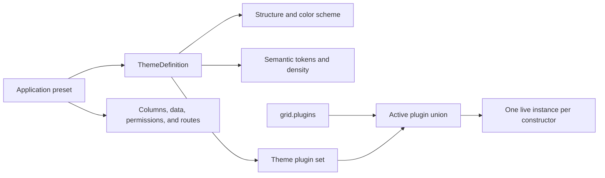

# JavaScript Data Grid Themes: Build Custom Grid Components with Plugins

A data grid theme used to mean colors, borders, and perhaps a compact mode. That is useful, but it is too small a model for the grids inside modern products.

An operations console, a finance workspace, and an executive dashboard can use the same data while requiring different density, visual hierarchy, interaction states, and grid extensions. If every screen assembles those decisions independently, the result is configuration drift: the right plugin is forgotten, a brand token changes in one place but not another, and switching modes becomes a rebuild instead of a state change.

RevoGrid's theme system provides a stronger foundation. A typed `ThemeDefinition` can combine:

-   a structural base;
-   a light or dark color scheme;
-   semantic design tokens;
-   a default row density;
-   and the plugin constructors that belong to the experience.

That makes a theme more than a stylesheet. It becomes the **grid-native part of an application preset**: a reusable description of how a data workspace should look and which grid behavior should be active.

The broader application still owns its routes, data, columns, permissions, and surrounding UI. The theme owns the coherent RevoGrid experience within that shell. This boundary is what makes the pattern practical rather than magical.


## From visual skin to application architecture

Traditional theming usually stops at the last box in this sequence:

```text
product mode -> component configuration -> CSS class -> colors
```

A theme-driven grid architecture moves the reusable grid decisions into one package:



The distinction matters. `ThemeDefinition` is not a general application configuration object, and it does not replace your state manager. It packages the parts RevoGrid can resolve and own consistently: theme inheritance, grid tokens, effective row size, and theme-scoped plugins.

Use an application-level preset around it when a workspace also needs a column schema, toolbar, API endpoint, or permission policy. This keeps public RevoGrid configuration explicit while giving product teams one durable concept to switch.

## What a RevoGrid theme can package

The public theme definition is intentionally compact:

| Concern       | `ThemeDefinition` field | What it controls                                                       |
| ------------- | ----------------------- | ---------------------------------------------------------------------- |
| Identity      | `name`                  | The value selected through `grid.theme`                                |
| Structure     | `extends`               | A built-in or registered custom parent theme                           |
| Scheme        | `colorScheme`           | Light or dark rendering metadata                                       |
| Density       | `defaultRowSize`        | The default virtual row height when `rowSize` is not explicitly set    |
| Design system | `tokens`                | Typed semantic values mapped to RevoGrid CSS custom properties         |
| Behavior      | `plugins`               | Plugin constructors active while the theme or a descendant is selected |

The built-in structural parents are `default`, `material`, `compact`, `darkMaterial`, and `darkCompact`. A custom theme can also extend another custom definition registered on the same grid.

Tokens cover foundations such as background, foreground, typography, borders, selection, header states, filter-panel surfaces, spacing, and buttons. Because they are semantic, a design-system team can express intent—`selectionBorder`, `headerBg`, `buttonDangerBg`—instead of distributing selector overrides throughout an application.

See the complete token reference and inheritance rules in the [RevoGrid theme guide](/guide/theme).

## A theme with an active plugin set

The following Core example creates two workflow plugins and packages one of them with an operations theme. `BasePlugin.addEventListener()` registers the event subscription, and `BasePlugin.destroy()` clears subscriptions when the plugin is released.

```ts
import {
    BasePlugin,
    defineTheme,
    type PluginProviders,
    type ThemeDefinition,
} from '@revolist/revogrid'

class ReviewWorkflowPlugin extends BasePlugin {
    constructor(grid: HTMLRevoGridElement, providers: PluginProviders) {
        super(grid, providers)

        this.addEventListener('afteredit', (event) => {
            console.info('Review workflow received an edit', event.detail)
        })
    }
}

class ProductTelemetryPlugin extends BasePlugin {
    // Application-wide behavior can stay in grid.plugins.
}

const operationsTheme = defineTheme({
    name: 'operations',
    extends: 'darkCompact',
    colorScheme: 'dark',
    defaultRowSize: 34,
    tokens: {
        primary: '#22c55e',
        background: '#111827',
        text: '#f8fafc',
        headerBg: '#1f2937',
        headerColor: '#f8fafc',
        selectionBorder: '#4ade80',
        buttonBg: '#16a34a',
    },
    plugins: [ReviewWorkflowPlugin],
} satisfies ThemeDefinition)

const reportingTheme = defineTheme({
    name: 'reporting',
    extends: 'material',
    defaultRowSize: 40,
    tokens: {
        primary: '#4f46e5',
        headerBg: '#eef2ff',
        selectionBorder: '#6366f1',
    },
} satisfies ThemeDefinition)

const grid = document.querySelector('revo-grid')!

grid.themeDefinitions = [operationsTheme, reportingTheme]
grid.plugins = [ProductTelemetryPlugin]
grid.theme = operationsTheme.name

// Later, switch the grid-native experience at runtime.
grid.theme = reportingTheme.name
```

When `operations` is active, the grid runs both `ProductTelemetryPlugin` and `ReviewWorkflowPlugin`. After the switch to `reporting`, product telemetry remains because the user-level `grid.plugins` set still requests it. The review plugin is destroyed because neither source requests it anymore.

This is standard RevoGrid Core extension behavior. A theme may also reference plugin constructors imported from RevoGrid Pro or another package, but those features retain their own package and licensing requirements.

## The plugin ownership model

Runtime switching is only useful when plugin lifecycle is deterministic. RevoGrid combines two plugin sources:

1. constructors explicitly assigned through `grid.plugins`;
2. constructors resolved from the active theme, including inherited theme plugins.

The active set is their union. User-configured plugins are considered first, followed by theme-only plugins, and duplicate constructors are removed. RevoGrid keeps one live instance for each exact constructor.

An instance remains active until **neither source requests it**. For example:

```ts
grid.theme = 'operations' // theme requests ReviewWorkflowPlugin
grid.plugins = [ReviewWorkflowPlugin] // still one instance
grid.plugins = [] // theme still owns the instance
grid.theme = 'reporting' // now it is released and destroyed
```

This additive ownership model prevents avoidable teardown and recreation when responsibility moves between application configuration and a theme. It also means removing a plugin from `grid.plugins` is not a force-unregister operation if the active theme still contains the same constructor.

Core and persistent plugins registered internally by the grid are not removed by this user/theme synchronization. Application and theme changes only synchronize the configurable plugin set.

For plugin lifecycle, providers, event subscriptions, and extension points, read the [plugin architecture guide](/guide/plugin).

## Theme inheritance creates a design-system hierarchy

Theme inheritance is useful when a product has more than one brand or workflow. Start with a foundation and add narrower variants:

```ts
const productFoundation = defineTheme({
    name: 'productFoundation',
    extends: 'material',
    defaultRowSize: 38,
    tokens: {
        fontFamily: 'Inter, system-ui, sans-serif',
        primary: '#2563eb',
        background: '#ffffff',
        text: '#0f172a',
        headerBg: '#f1f5f9',
    },
})

const approvalsWorkspace = defineTheme({
    name: 'approvalsWorkspace',
    extends: productFoundation.name,
    tokens: {
        primary: '#7c3aed',
        buttonBg: '#7c3aed',
    },
    plugins: [ReviewWorkflowPlugin],
})

grid.themeDefinitions = [productFoundation, approvalsWorkspace]
grid.theme = approvalsWorkspace.name
```

Tokens resolve from root to child, with child values replacing inherited values. Plugins are different: they merge additively through the inheritance chain and are deduplicated by exact constructor.

That makes a parent plugin a deliberate capability commitment for every descendant. If one child must not include a plugin, place the plugin on the relevant children or create a different parent. A child definition does not subtract a parent's plugin.

Definitions are local to each grid instance. Two grids can register the same custom theme name with different definitions without sharing runtime state. This is valuable in multi-workspace pages, embedded tools, and micro-frontend environments where separate surfaces need separate policies.

## Build app-shell presets around themes

A product mode usually needs more than a grid theme. Keep the outer preset in application code and point it to a typed theme:

```ts
type WorkspacePreset<Row> = {
    theme: ThemeDefinition
    columns: Array<{ prop: keyof Row; name: string }>
    readOnly: boolean
    toolbar: 'operations' | 'reporting'
}

type Order = {
    orderId: string
    status: string
    amount: number
}

const operationsPreset: WorkspacePreset<Order> = {
    theme: operationsTheme,
    columns: [
        { prop: 'orderId', name: 'Order' },
        { prop: 'status', name: 'Status' },
        { prop: 'amount', name: 'Amount' },
    ],
    readOnly: false,
    toolbar: 'operations',
}
```

Your application applies the columns, permissions, toolbar, and selected theme together. RevoGrid then owns the theme's resolved structure, tokens, density, and plugin lifecycle.

This pattern works especially well for:

-   **White-label SaaS:** share plugin behavior and density while each tenant supplies brand tokens.
-   **Role-based workspaces:** give reviewers, planners, and analysts distinct grid behavior without maintaining separate grid components.
-   **Operational modes:** switch between editing, review, and reporting experiences while retaining application-wide plugins.
-   **Design systems:** publish approved typed themes from a UI package instead of copying CSS selectors into every product.
-   **Multi-workspace screens:** run independent grids with locally registered definitions and isolated plugin instances.
-   **Accessibility modes:** package stronger contrast and larger density with the relevant workflow plugins, followed by application-specific accessibility testing.

The result is composability. A team can build one high-quality data-grid component boundary, then assemble intentional product experiences from stable presets.

## Runtime switching without configuration drift

Runtime changes can come from a workspace selector, tenant switch, accessibility preference, or saved user view:

```ts
grid.addEventListener('afterthemechanged', (event) => {
    console.log('Active grid theme:', event.detail)
})

grid.theme = 'operations'
grid.theme = 'reporting'
```

Changing `theme` reapplies the resolved theme and synchronizes its plugin set. Changing `themeDefinitions` also reapplies the currently selected definition, which supports live brand configuration and remote design-system updates.

When updating a definition, assign a new array:

```ts
grid.themeDefinitions = [
    {
        ...operationsTheme,
        tokens: {
            ...operationsTheme.tokens,
            primary: '#f97316',
        },
    },
    reportingTheme,
]
```

This works with the change-detection conventions of React, Vue, Angular, and Svelte. `themeDefinitions` and `plugins` contain JavaScript constructors and objects, so pass them as properties or framework bindings rather than serializing them into HTML attributes.

## Migrating from CSS-only themes

RevoGrid keeps CSS-only custom theme names working. Any non-empty `theme` value remains reflected on the element, so an existing selector such as `revo-grid[theme='billing']` does not need to disappear.

Adopt typed themes incrementally:

1. **Keep the current name.** Register a `ThemeDefinition` named `billing` so existing selectors and saved preferences remain valid.
2. **Choose a structural parent.** Extend the built-in theme closest to the current layout: `default`, `material`, `compact`, `darkMaterial`, or `darkCompact`.
3. **Move semantic values first.** Convert frequently reused CSS variables into typed `tokens`; leave specialized selectors in CSS as an escape hatch.
4. **Move density intentionally.** Set `defaultRowSize` only if density belongs to the preset. An explicit positive `grid.rowSize` still takes precedence.
5. **Attach workflow plugins last.** Add constructors only after deciding that every activation of the theme should activate that behavior.
6. **Bind definitions as JavaScript.** Assign `themeDefinitions` on each grid or pass it through the framework wrapper.

CSS and typed definitions are additive, not competing systems. Application-level CSS custom properties can provide shared defaults, while a `ThemeDefinition` gives one grid a portable, type-checked preset.

## Performance and lifecycle considerations

Theme-driven architecture should reduce configuration churn, not create render churn. A few rules keep the boundary efficient:

### Keep constructor identity stable

Plugin deduplication uses the exact constructor. Define plugin classes in modules and reuse them. Do not generate a new class inside a component render function.

### Reuse stable definitions

Keep theme definitions in module-level constants when they do not change. Assign a new `themeDefinitions` array only when you intentionally update definitions, especially the active one.

### Clean up plugin-owned resources

`BasePlugin.destroy()` clears event subscriptions registered through the base helper. If a plugin also owns timers, observers, sockets, or external UI, release them in `destroy()` and call `super.destroy()`.

### Separate color changes from geometry changes

Token-only changes do not need to reset row geometry. A change to the effective row size does update virtual dimensions. Keep density changes meaningful rather than animating or toggling them rapidly.

### Preserve virtualization discipline

A theme does not change the fundamentals of large-data rendering. Keep cell templates small, avoid network work in renderers, leave virtualization enabled for large datasets, and move remote filtering or pagination to the backend when the full dataset should not live in the browser.

For concrete guidance, see [RevoGrid performance and virtualization](/guide/performance).

## Design-system governance for data grids

Once themes include behavior, publishing one becomes a product decision as well as a visual decision. A useful review checklist is:

-   Does the theme extend the right structural parent?
-   Are tokens semantic and accessible in all states, not only in static screenshots?
-   Is its default density appropriate for the workflow and input method?
-   Does every descendant really need the inherited plugin set?
-   Are theme plugins framework-agnostic and cleaned up correctly?
-   Are Pro-only plugins imported and licensed explicitly where used?
-   Does runtime switching preserve unsaved application state?
-   Are columns, permissions, and data contracts still owned outside the theme?

That final question protects the architecture. A theme should make a grid experience coherent, but it should not become an untyped container for unrelated business state.

## The new mental model

Think of a RevoGrid theme at three levels:

1. **Visual system:** structure, scheme, semantic tokens, and density.
2. **Behavioral preset:** a plugin set with deterministic runtime ownership.
3. **Application building block:** the grid-native portion of a larger workspace preset.

This model lets teams switch branded or workflow-specific grid experiences without forking their grid component. It also gives design-system and platform teams a shared unit they can review, version, and distribute.

Start with the [complete theme manager guide](/guide/theme), then build the behavior layer with the [RevoGrid plugin guide](/guide/plugin). Explore the [live data grid demos](/demo/) and the wider [RevoGrid platform](/); for advanced packaged workflows, see [RevoGrid Pro](/pro/).

The opportunity is bigger than making a table match dark mode. It is building reusable data-workspace experiences around one high-performance JavaScript data grid—without losing explicit ownership of your application architecture.
