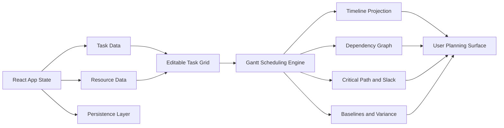

# React Gantt Chart Component: Build vs Buy

::: tip Evaluate RevoGrid Gantt
Compare the full [RevoGrid Gantt product surface](/gantt), then use the focused [React Gantt component guide](/gantt/react-gantt-component) for integration and buying criteria.

:::


React teams usually start the Gantt question with a simple requirement:

> We need a React Gantt chart component.

That sounds straightforward until the first production workflow appears. Users want to drag task bars, resize dates, edit progress, connect dependencies, assign resources, collapse summary tasks, compare baselines, search the task tree, export project data, preserve undo history, and keep the timeline fast when the project grows.

At that point, the real question is no longer **“does it render a Gantt chart?”**

The better question is:

> **Does it behave like a product-grade editable planning surface?**

That distinction matters for React SaaS products, internal planning tools, operations platforms, construction dashboards, professional-services portals, product roadmaps, manufacturing schedules, resource planning systems, and any application where the Gantt chart becomes part of daily work.

This guide compares whether you should build a React Gantt chart yourself or buy a React Gantt chart library, and where [RevoGrid Gantt](/gantt/) fits against popular React-specific options such as Syncfusion React Gantt and SVAR React Gantt.

Last reviewed: July 9, 2026. Vendor pricing, packaging, and feature availability can change. Always verify official vendor pages before procurement.


## Target keywords for this guide

This guide is optimized for those who is searching for:

* React Gantt chart component
* React Gantt chart library
* build React Gantt chart
* editable React Gantt chart
* React Gantt chart with dependencies
* React Gantt chart with resources
* React project planning component
* Syncfusion React Gantt alternative
* SVAR React Gantt alternative
* RevoGrid Gantt

For implementation details after the comparison, explore [RevoGrid Pro](/pro/), the [Gantt product page](/gantt/), the [React data grid guide](/guide/react/), the [comparison hub](/compare/), and the full [RevoGrid Gantt documentation](https://pro.rv-grid.com/guides/gantt/).


## The short verdict

| Decision | Best choice |
| --- | --- |
| You only need a static roadmap image or a read-only timeline | Build a small custom React timeline |
| You need task editing, dependencies, resources, calendars, baselines, and planning logic | Buy a React Gantt chart component |
| You want a broad UI suite with a standalone Gantt control | Consider Syncfusion |
| You want a native React-only Gantt component | Consider SVAR |
| You want Gantt scheduling built on a fast editable grid surface | Choose **RevoGrid Gantt** |

**RevoGrid Gantt is the strongest fit when the Gantt is not a decorative chart, but a data-heavy planning workspace.**

It is built as a RevoGrid Enterprise plugin layered on top of the base grid. The grid foundation owns rendering, virtualization, editing, selection, and keyboard behavior. Gantt adds task timeline projection, dependency links, scheduling rules, resources and assignments, critical path, baselines, and timeline tools.

That architecture is important because most real Gantt products are two interfaces at once:

1. a **task table** where users edit structured project data;
2. a **timeline** where users understand time, dependencies, progress, and risk.

A product-grade React Gantt chart must handle both.


## What a product-grade React Gantt chart actually needs

A simple Gantt demo is easy to underestimate. It often shows a task list, a timeline header, and a few bars. That is not the hard part.

The hard part starts when business users expect the component to behave like planning software.

A serious React Gantt chart component should support:

* task hierarchy and work breakdown structure;
* summary tasks, regular tasks, and milestones;
* collapsible task groups;
* parent-child schedule and cost rollups;
* dependency links such as finish-to-start, start-to-start, finish-to-finish, and start-to-finish;
* lead and lag time;
* validation and diagnostics for invalid task movement;
* auto-scheduling and manual scheduling;
* forward and backward scheduling;
* task constraints;
* deadlines;
* calendar-aware duration calculation;
* split tasks;
* critical path and slack;
* baselines and variance columns;
* percent complete and progress editing;
* resource assignments and workload visibility;
* capacity and over-allocation warnings;
* inline grid editing;
* task bar drag, resize, and progress controls;
* timeline zoom levels;
* today lines, markers, and highlighted ranges;
* search, filtering, selection, keyboard navigation, and clipboard behavior;
* undo and redo;
* import, export, and project snapshot workflows;
* theming and custom rendering.

This is why the build-vs-buy decision is not only about React. It is about whether your team wants to own a scheduling product.


## Build vs buy: the practical decision matrix

| Requirement | Build custom React Gantt | Buy React Gantt chart library | RevoGrid Gantt fit |
| --- | --- | --- | --- |
| Static visual timeline | ✅ Good fit | ✅ Good fit | ✅ Works, but may be more than needed |
| Read-only roadmap | ✅ Good fit | ✅ Good fit | ✅ Works well |
| Inline task-table editing | ⚠️ Expensive to build well | ✅ Expected | ✅ Grid foundation |
| Drag task bars | ⚠️ Medium complexity | ✅ Expected | ✅ Supported |
| Resize task bars | ⚠️ Medium complexity | ✅ Expected | ✅ Supported |
| Progress editing | ⚠️ Medium complexity | ✅ Expected | ✅ Supported |
| Dependency lines | ⚠️ Hard after zoom/scroll | ✅ Expected | ✅ Supported |
| Dependency validation | ❌ Usually expensive | ✅ Expected | ✅ Supported |
| Lead and lag | ❌ Usually expensive | ✅ Expected | ✅ Supported |
| Auto-scheduling | ❌ Hard | ✅ Expected in serious tools | ✅ Supported |
| Manual scheduling | ❌ Hard | ✅ Expected | ✅ Supported |
| Critical path | ❌ Hard | ✅ Expected in enterprise planning | ✅ Supported |
| Baselines | ❌ Hard | ✅ Expected in professional planning | ✅ Supported |
| Resource assignments | ❌ Hard | ✅ Expected | ✅ Supported |
| Resource workload view | ❌ Hard | ✅ Expected in resource planning | ✅ Supported |
| Calendar-aware duration | ❌ Hard | ✅ Expected | ✅ Supported |
| Search/filter/task tree behavior | ⚠️ Easy to start, hard to finish | ✅ Expected | ✅ Grid + Gantt foundation |
| Import/export | ⚠️ Easy for JSON, harder for project workflows | ✅ Expected | ✅ JSON helpers, grid export, Pro export workflows |
| React integration | ✅ Full control | ✅ Expected | ✅ React wrapper over RevoGrid |
| Cross-framework reuse | ❌ React-only unless you rebuild | ⚠️ Vendor-dependent | ✅ Same grid foundation across frameworks |
| Long-term maintenance | ❌ Your team owns everything | ✅ Vendor owns component core | ✅ Vendor-owned Gantt + grid foundation |

The more your requirements move from the top of this table to the bottom, the stronger the buying case becomes.


## Why building a React Gantt chart is deceptively expensive

You can build a basic React Gantt chart quickly. Use CSS grid, map dates to pixels, render bars, and place a timeline header above them.

That is a visualization project.

A product-grade Gantt chart is different. It is a scheduling, editing, validation, and rendering system.

### 1. The task table is not a normal table

A real Gantt has a left-side grid with hierarchical rows, editable task fields, column resizing, column reordering, validation, search, filtering, selection, and keyboard behavior.

The left side often becomes as important as the timeline.

If you build it yourself, you either:

* build a grid from scratch;
* embed another data grid and synchronize it with your timeline;
* accept limited editing and table behavior.

RevoGrid Gantt avoids that split because the Gantt module is built on top of the same RevoGrid data-grid foundation.

### 2. Timeline math gets complicated quickly

A simple date-to-pixel function is fine for a demo. It breaks down when users need:

* working days;
* holidays;
* task calendars;
* resource calendars;
* hour/day/week/month/year zoom modes;
* non-working time shading;
* split tasks;
* deadlines;
* baselines;
* today lines;
* highlighted ranges;
* different scheduling directions.

The timeline is not just SVG or div rendering. It is a projection of a scheduling model.

### 3. Dependencies are not just arrows

Dependency lines look visual, but the product behavior is logical.

A dependency must affect task movement, validation, automatic scheduling, critical path, slack, and diagnostics. It also has to survive drag-and-drop editing, zoom changes, virtual scrolling, filtering, collapsed groups, and task reordering.

RevoGrid Gantt supports the standard dependency relationships used in project planning: finish-to-start, start-to-start, finish-to-finish, and start-to-finish. It also supports lead and lag time, dependency validation, and dependency editing workflows.

### 4. Editing needs a transaction model

Users expect planning changes to feel safe. When they drag a task bar, the app needs to decide:

* which task fields changed;
* whether the change is allowed;
* whether dependent tasks should move;
* whether constraints should warn or block;
* whether resources are over-allocated;
* whether summaries should roll up;
* whether history should record the change;
* whether the backend should persist immediately or after confirmation.

This is why “we can build it with React state” often becomes a multi-month component project.

### 5. Performance is not only about React memoization

Large projects create dense UI surfaces. The task grid, timeline headers, bars, dependency overlays, markers, row heights, and selection layers all compete for rendering budget.

A custom React implementation can perform well if the team is disciplined, but it must solve virtualization, layout caching, pointer interactions, timeline projection, and scroll synchronization. Those are infrastructure problems.

RevoGrid Gantt starts from a virtualized grid foundation, so React does not need to own every visible cell, row, and timeline interaction as application-level component state.


## What RevoGrid Gantt gives React teams

[RevoGrid Gantt](/gantt/) is designed for teams that need a Gantt surface inside a real product, not just a standalone visual widget.

It combines:

* the RevoGrid rendering and editing foundation;
* a Pro Advanced Gantt plugin;
* task timeline projection;
* dependency links;
* scheduling rules;
* resources and assignments;
* critical path analysis;
* baselines;
* timeline tooling;
* React integration through the RevoGrid React wrapper.

### RevoGrid Gantt feature overview

| Feature group | RevoGrid Gantt capability |
| --- | --- |
| Task model | Task tree, WBS codes, summary tasks, regular tasks, milestones, collapsible groups, parent-child rollups |
| Dependencies | Finish-to-start, start-to-start, finish-to-finish, start-to-finish, lead/lag, validation, drag/link editing |
| Scheduling | Auto-scheduling, manual scheduling, forward/backward scheduling, constraints, deadlines, duration/date calculation |
| Critical path | Critical path calculation, highlighting, total slack projection |
| Baselines | Baseline snapshots, baseline bars, start/finish/duration/progress variance fields |
| Progress | Percent complete, progress tracking, actual dates, remaining duration, progress-aware scheduling |
| Calendars | Project calendars, task calendars, resource calendars, working days, holidays, working hours, time zones |
| Resources | Resource assignment, workload view, utilization, capacity display, over-allocation diagnostics |
| Editing | Inline grid editing, task bar drag, task bar resize, progress editing, history snapshots |
| Timeline | Preset and custom zoom levels, timeline markers, today line, project line, highlighted ranges |
| Grid foundation | Virtualized rows and columns, frozen columns, column resizing, column reordering, custom cells, custom renderers, tree data, filtering, selection, clipboard, keyboard navigation, theming |
| Import/export | JSON project snapshot helpers, REST and GraphQL persistence examples, PostgreSQL recipe, CSV export through core grid export, Excel workflows through RevoGrid Pro |
| Product controls | Toolbar helpers, context menu recipes, read-only mode, locked tasks, task editor dialog patterns |

The important point is not that RevoGrid Gantt has a long checklist. The important point is that the checklist sits on a grid surface your users can actually edit.


## React example: RevoGrid Gantt as a planning surface

A RevoGrid Gantt setup in React uses the RevoGrid React wrapper and the Pro Advanced `GanttPlugin`.

```tsx
import React, { useMemo, useRef } from 'react';
import { RevoGrid } from '@revolist/react-datagrid';
import { GanttPlugin } from '@revolist/gantt';

export default function ProjectPlanGantt() {
  const gridRef = useRef<HTMLRevoGridElement>(null);

  const plugins = useMemo(() => [GanttPlugin], []);

  const source = useMemo(() => [
    {
      id: 't1',
      parentId: null,
      name: 'Website Redesign',
      type: 'summary',
      status: 'in-progress',
      startDate: '2026-04-06',
      endDate: '2026-05-15',
      duration: 30,
      percentDone: 40,
      calendarId: 'standard',
      tags: []
    },
    {
      id: 't2',
      parentId: 't1',
      name: 'Design System Updates',
      type: 'task',
      status: 'in-progress',
      startDate: '2026-04-06',
      endDate: '2026-04-17',
      duration: 10,
      percentDone: 70,
      calendarId: 'standard',
      tags: []
    },
    {
      id: 't3',
      parentId: 't1',
      name: 'Frontend Implementation',
      type: 'task',
      status: 'not-started',
      startDate: '2026-04-20',
      endDate: '2026-05-15',
      duration: 20,
      percentDone: 0,
      calendarId: 'standard',
      tags: []
    }
  ], []);

  const columns = useMemo(() => [
    { prop: 'wbs', name: 'WBS', size: 90, readonly: true },
    { prop: 'name', name: 'Task', size: 260 },
    { prop: 'status', name: 'Status', size: 140 },
    { prop: 'startDate', name: 'Start', size: 130 },
    { prop: 'endDate', name: 'Finish', size: 130 },
    { prop: 'percentDone', name: '% Done', size: 110 }
  ], []);

  const gantt = useMemo(() => ({
    id: 'project-web-redesign',
    name: 'Website Redesign',
    version: '1',
    currency: 'USD',
    timeZone: 'UTC',
    primaryCalendarId: 'standard',
    zoomPreset: 'week',
    allowTaskCreate: true,
    taskCreateRow: true,
    visuals: {
      showCriticalPath: true,
      showBaseline: true,
      shadeNonWorkingTime: true
    }
  }), []);

  const calendars = useMemo(() => [
    {
      id: 'standard',
      name: 'Standard',
      timeZone: 'UTC',
      workingDays: [1, 2, 3, 4, 5],
      holidays: [],
      hoursPerDay: 8
    }
  ], []);

  const dependencies = useMemo(() => [
    {
      id: 'd1',
      predecessorTaskId: 't2',
      successorTaskId: 't3',
      type: 'finish-to-start',
      lagDays: 1
    }
  ], []);

  return (
    <RevoGrid
      ref={gridRef}
      theme="compact"
      hideAttribution
      plugins={plugins}
      source={source}
      columns={columns}
      gantt={gantt}
      ganttCalendars={calendars}
      ganttDependencies={dependencies}
    />
  );
}
```

This is the strategic difference between RevoGrid Gantt and a custom timeline. You are not starting from canvas math or div positioning. You are starting from an editable grid foundation and adding scheduling behavior through a Gantt plugin.


## RevoGrid vs building your own React Gantt chart

### Choose custom build when the Gantt is mostly visual

A custom build can make sense when the requirements are intentionally narrow:

* a simple read-only roadmap;
* a portfolio timeline;
* a marketing milestone graphic;
* a small internal dashboard with no editing;
* a visualization that does not need scheduling logic;
* a timeline that is deeply custom and not meant to behave like project software.

In those cases, a React component built with CSS, SVG, Canvas, or a charting layer may be enough.

### Choose RevoGrid Gantt when users will work inside the chart

Buy instead of build when users need to edit the plan.

That means:

* dragging tasks;
* resizing task dates;
* editing progress;
* creating dependencies;
* validating scheduling changes;
* assigning resources;
* using calendars and holidays;
* comparing baseline versus actual progress;
* seeing critical path and slack;
* filtering and searching tasks;
* exporting or persisting project state;
* using the Gantt as part of a wider data-heavy product.

Once users are actively planning inside the component, the Gantt becomes an application surface. That is where RevoGrid Gantt is designed to fit.


## RevoGrid Gantt vs Syncfusion React Gantt

[Syncfusion React Gantt](https://www.syncfusion.com/react-components/react-gantt-chart) is a mature commercial React Gantt chart component inside the broader Syncfusion UI suite. Syncfusion’s messaging focuses on project planning, task scheduling, hierarchy, dependencies, drag-and-drop editing, resource allocation, data binding, exporting, accessibility, touch support, browser support, AI tooling, and broad framework availability.

That makes Syncfusion a natural option for teams that want a large vendor suite.

### Where Syncfusion is strong

Syncfusion is strong when your buying question is:

> Which vendor gives us many enterprise UI components under one commercial umbrella?

Choose Syncfusion when:

* your team already uses Syncfusion components;
* procurement prefers a broad suite vendor;
* your application needs many non-grid controls from the same vendor;
* you want a mature standalone React Gantt control;
* suite-level consistency matters more than a focused grid-first architecture.

### Where RevoGrid is stronger

RevoGrid is stronger when the buying question is:

> Which planning surface keeps our data-heavy product fast, editable, customizable, and maintainable?

RevoGrid Gantt is built from the grid surface upward. That matters when your users treat the Gantt like a spreadsheet-like project workspace rather than a standalone widget.

| Decision point | RevoGrid Gantt | Syncfusion React Gantt |
| --- | --- | --- |
| Product philosophy | Focused grid-first planning surface | Broad commercial UI suite component |
| Core advantage | Editable data-grid foundation plus Gantt scheduling | Mature standalone React Gantt control |
| React support | React wrapper over RevoGrid with GanttPlugin | First-party React package |
| Cross-framework strategy | Same grid foundation across React, Vue, Angular, Svelte, and JavaScript | Separate framework component packages |
| Task table editing | Natural fit because Gantt builds on RevoGrid | Supported inside Syncfusion Gantt |
| Dependencies | FS, SS, FF, SF, lead/lag, validation, editing | Strong dependency and scheduling feature set |
| Resources | Assignments, utilization, workload view, capacity diagnostics | Resource allocation features |
| Baselines and critical path | Supported in RevoGrid Gantt | Supported in Syncfusion Gantt |
| Export workflows | JSON project helpers, grid CSV export, Pro Excel workflows, print/PDF recipes | Excel, CSV, and PDF export |
| Best fit | SaaS products where Gantt is a custom data workspace | Teams standardizing on a broad UI suite |

For a wider vendor comparison, read the [Syncfusion alternative guide](/compare/syncfusion-alternative/).


## RevoGrid Gantt vs SVAR React Gantt

[SVAR React Gantt](https://svar.dev/react/gantt/) positions itself as a native React Gantt chart library: pure React, no JavaScript wrappers, TypeScript support, Vite and Next.js compatibility, backend integration, live demos, and AI-assisted development through an MCP server.

That is a clear React-specific message.

### Where SVAR is strong

SVAR is strong when the primary requirement is:

> We want a React-native Gantt component with a simple React mental model.

Choose SVAR when:

* your product is React-only;
* you prefer a pure React component API;
* your Gantt use case maps well to SVAR’s open-source or PRO packaging;
* you want a focused React Gantt rather than a grid-first data platform;
* native React messaging matters more than cross-framework reuse.

### Where RevoGrid is stronger

RevoGrid is stronger when the Gantt is part of a wider data-grid product architecture.

The difference is not “React versus not React.” RevoGrid works in React. The difference is whether your team wants a React-only component or a planning surface built on the same grid engine that can also support other data-heavy modules and framework integrations.

| Decision point | RevoGrid Gantt | SVAR React Gantt |
| --- | --- | --- |
| Product philosophy | Grid-powered planning platform | Native React Gantt component |
| React story | React wrapper around RevoGrid Web Component and Pro Advanced Gantt plugin | Pure React component with no JavaScript wrappers |
| Best for | Editable planning surfaces in data-heavy products | React-only apps that want a React-first Gantt |
| Open-source story | RevoGrid core is MIT; Gantt is included in Pro Advanced | MIT open-source core plus commercial PRO edition |
| Advanced scheduling | Gantt scheduling engine with dependencies, calendars, constraints, baselines, critical path, resources | Advanced features in PRO edition such as baselines, calendars, auto-scheduling, split tasks, resource planning, and export |
| Cross-framework reuse | Stronger | React-focused |
| Grid editing foundation | Stronger fit for task-table-heavy products | Gantt-specific grid columns and customization |
| Strategic trade-off | More platform-oriented | More React-component-oriented |

SVAR is a credible React-specific Gantt option. RevoGrid is the better fit when the React Gantt chart component must behave like an editable data product, not only a React UI component.


## Architecture: React component or planning surface?

The biggest architectural mistake is treating a Gantt chart as one component.

In a real product, the Gantt is a composition of systems:



React is excellent for application composition, state ownership, routes, panels, dialogs, forms, and business workflows. But a dense planning surface should not force React to rerender every cell, bar, dependency, and timeline overlay through application component state.

RevoGrid’s approach is to let the app own business state and let the grid/Gantt engine own the high-density planning surface.

That separation is useful when you need:

* fast scrolling;
* spreadsheet-like editing;
* task hierarchy;
* timeline projection;
* dependency overlays;
* progress interactions;
* custom cells and renderers;
* repeatable behavior across products.


## What to evaluate before choosing a React Gantt chart library

Use this checklist before committing to any React Gantt chart component.

### 1. Editing model

Ask:

* Can users edit in the task grid?
* Can they drag bars on the timeline?
* Can they resize tasks?
* Can they edit progress?
* Can the app cancel invalid changes?
* Can the app show diagnostics?
* Does the component support read-only and locked-task modes?

A Gantt that only renders dates is not enough for planning software.

### 2. Scheduling model

Ask:

* Does it support auto-scheduling?
* Does it support manual scheduling?
* Does it support all common dependency types?
* Does it support lead and lag?
* Does it support constraints and deadlines?
* Does it support forward and backward scheduling?
* Does it compute critical path and slack?

These features determine whether the chart can preserve project logic after user edits.

### 3. Resource model

Ask:

* Can tasks have resources?
* Can resources have calendars?
* Can multiple resources be assigned to a task?
* Can the user see workload and utilization?
* Can the system warn about over-allocation?

Resource planning is often the feature that separates a visual Gantt from an operational planning tool.

### 4. Data and persistence model

Ask:

* Is the project state serializable?
* Can you load and save project snapshots?
* Can you connect REST or GraphQL?
* Can you export data?
* Can you integrate with your backend ownership model?

The Gantt should not become an isolated black box in your product.

### 5. Grid foundation

Ask:

* Is the left-side task table a real grid?
* Does it support custom columns?
* Does it support resizing and reordering?
* Does it support filtering and search?
* Does it support custom editors and custom renderers?
* Does it work with keyboard navigation?
* Does it remain fast with many rows and columns?

This is where RevoGrid has a natural advantage. It starts from the grid.

### 6. Framework and product strategy

Ask:

* Is your product React-only forever?
* Do you also support Vue, Angular, Svelte, Web Components, or vanilla JavaScript?
* Are you building one product or a platform of products?
* Do you want one data surface that can support grid, pivot, Gantt, and scheduling workflows?

A React-only library can be ideal for a React-only product. A framework-agnostic grid foundation can be better for product portfolios, embedded apps, white-label tools, or teams with mixed frontend stacks.


## Feature comparison: RevoGrid, Syncfusion, SVAR, and custom build

| Capability | RevoGrid Gantt | Syncfusion React Gantt | SVAR React Gantt | Custom React build |
| --- | --- | --- | --- | --- |
| React support | ✅ | ✅ | ✅ | ✅ |
| Task hierarchy | ✅ | ✅ | ✅ | ⚠️ Build yourself |
| Summary tasks | ✅ | ✅ | ✅ | ⚠️ Build yourself |
| Milestones | ✅ | ✅ | ✅ | ⚠️ Build yourself |
| Drag task bars | ✅ | ✅ | ✅ | ⚠️ Build yourself |
| Resize task bars | ✅ | ✅ | ✅ | ⚠️ Build yourself |
| Progress editing | ✅ | ✅ | ✅ | ⚠️ Build yourself |
| Dependency links | ✅ | ✅ | ✅ | ⚠️ Hard to finish well |
| FS/SS/FF/SF dependency model | ✅ | ✅ | ⚠️ Check edition and requirement | ❌ Hard |
| Lead and lag | ✅ | ✅ | ⚠️ Check edition and requirement | ❌ Hard |
| Auto-scheduling | ✅ | ✅ | ✅ PRO | ❌ Hard |
| Manual scheduling | ✅ | ✅ | ⚠️ Check edition and requirement | ❌ Hard |
| Critical path | ✅ | ✅ | ✅ PRO | ❌ Hard |
| Baselines | ✅ | ✅ | ✅ PRO | ❌ Hard |
| Split tasks | ✅ | ✅ | ✅ PRO | ❌ Hard |
| Calendars and holidays | ✅ | ✅ | ✅ PRO | ❌ Hard |
| Resource assignments | ✅ | ✅ | ✅ PRO | ❌ Hard |
| Workload/capacity planning | ✅ | ✅ | ✅ PRO | ❌ Hard |
| Grid-powered task editing | ✅ Strong fit | ✅ Inside Gantt | ✅ Gantt-specific | ⚠️ Requires grid work |
| Cross-framework reuse | ✅ Strong | ✅ Via separate packages | ⚠️ React-focused page | ❌ No |
| Broad UI suite | ❌ Focused data platform | ✅ Strong | ❌ Focused Gantt | ❌ No |
| Native React-only mental model | ⚠️ React wrapper over Web Component | ✅ React package | ✅ Strong | ✅ Strong |
| Best strategic fit | Product-grade editable planning surface | Suite-driven enterprise apps | React-only Gantt projects | Simple or highly custom timelines |

Legend: ✅ supported or strong fit; ⚠️ depends on edition, implementation, or project scope; ❌ not practical without significant engineering investment.


## When building your own React Gantt chart is the right decision

Building is reasonable when the Gantt is not the product surface.

Build your own when:

* the chart is read-only;
* the project size is small;
* no one edits tasks inside the timeline;
* dependencies are decorative rather than scheduling rules;
* resource planning is out of scope;
* exports are unnecessary;
* the visualization is unusual enough that existing Gantt libraries fight the design;
* your team is comfortable owning the entire interaction model.

A custom React Gantt can be a good fit for a lightweight roadmap, sprint timeline, launch plan, or product marketing visualization.

It is not usually a good fit for an editable project-planning system.


## When buying a React Gantt chart component is the right decision

Buy when the Gantt becomes part of the user’s workflow.

That usually means:

* users edit task data every day;
* users depend on scheduling correctness;
* dependency behavior affects dates;
* resources and capacity matter;
* managers compare baseline plans with live progress;
* deadlines and constraints matter;
* users expect keyboard and grid-like behavior;
* the component has to work in a production SaaS product;
* your engineering team should focus on domain logic, not rebuilding planning infrastructure.

A good React Gantt chart library is not just a UI shortcut. It is a way to avoid owning years of scheduling and interaction edge cases.


## Where RevoGrid Gantt wins

### 1. The Gantt is built on a real data grid

Many Gantt tools start from the timeline. RevoGrid starts from a high-performance grid foundation.

That matters because planning users spend a lot of time in the task table:

* editing names, dates, statuses, estimates, progress, and owners;
* scanning WBS structures;
* filtering tasks;
* selecting rows;
* resizing columns;
* copying values;
* comparing baseline variance;
* navigating with the keyboard.

RevoGrid Gantt is a better fit when the task table is not an afterthought.

### 2. Scheduling behavior is part of the product surface

RevoGrid Gantt supports the planning concepts teams expect from professional project management tools: dependencies, lead/lag, constraints, calendars, deadlines, critical path, slack, baselines, progress tracking, resources, workload, and capacity diagnostics.

That gives developers a stronger starting point than a visual-only Gantt chart.

### 3. React integration without React-only lock-in

React support is essential for this article, but long-term product teams often care about more than one framework.

RevoGrid is useful when:

* your main app is React;
* your internal tooling includes Vue or Angular;
* your embedded components need Web Component portability;
* your company maintains multiple frontend stacks;
* you want one grid/Gantt mental model across products.

SVAR’s pure React story is attractive for React-only products. RevoGrid’s advantage is broader product reuse.

### 4. RevoGrid Pro modules share the same data-surface philosophy

RevoGrid Pro is not only about Gantt. It also covers advanced data workflows such as pivot, scheduling, formulas, export, validation, and enterprise grid behavior.

That is valuable when your application has multiple related data surfaces:

* a data grid for tasks;
* a Gantt chart for scheduling;
* a pivot view for reporting;
* a scheduler for resources;
* export and import workflows;
* custom editing and validation.

Instead of stitching together unrelated widgets, you can build around one grid-first foundation.

### 5. It fits SaaS product teams

SaaS products need predictable architecture. A Gantt should not become a separate mini-application with its own incompatible data model, editing rules, styling conventions, and lifecycle assumptions.

RevoGrid Gantt is strongest when you want the planning surface to feel like part of your product, not a heavy third-party project management app embedded inside it.


## Where another option may be better

A fair build-vs-buy comparison should admit when another choice is better.

### Choose Syncfusion when you need the wider UI suite

Syncfusion may be the right choice when your organization wants one commercial vendor for many enterprise UI components: charts, schedulers, document tools, PDF viewers, spreadsheet controls, diagramming, forms, and Gantt.

If the Gantt is only one component in a suite-wide procurement decision, Syncfusion is a strong contender.

### Choose SVAR when you want a native React-only Gantt

SVAR may be the right choice when your team strongly prefers a pure React Gantt component and your product is unlikely to need cross-framework reuse.

The native React story is clean and easy to understand, especially for React-only teams.

### Choose custom build when your timeline is simple or highly specialized

A custom build may be best when you need a small, branded, read-only timeline or a very unusual visualization that does not behave like standard Gantt software.

### Choose RevoGrid when the Gantt is a data-heavy planning workspace

Choose RevoGrid when your application needs a Gantt, task grid, scheduling engine, and editable data surface to work together.

That is the core RevoGrid advantage.


## Recommended positioning for React teams

Use this positioning internally when evaluating the options:

> **Do not choose a React Gantt chart component only because it renders bars on a timeline. Choose the one that can become the editable planning surface your product needs.**

For simple visuals, build.

For suite procurement, evaluate Syncfusion.

For a React-only Gantt component, evaluate SVAR.

For a product-grade editable planning surface connected to a high-performance grid foundation, choose RevoGrid Gantt.


## Migration map: from custom or competitor Gantt to RevoGrid Gantt

| Existing concept | RevoGrid Gantt direction |
| --- | --- |
| Custom React task array | RevoGrid Gantt task rows with typed task fields |
| Custom parent/child nesting | Task tree with `parentId` and WBS projection |
| Custom SVG bars | Gantt timeline projection and task bar rendering |
| Custom dependency arrows | `ganttDependencies` with typed dependency relationships |
| Manual date math | Calendar-aware scheduling and duration calculation |
| Custom drag handlers | Built-in drag, resize, and progress editing |
| Custom baseline data | Baseline snapshots and variance columns |
| Custom resource labels | Resource entities and assignments |
| Custom export JSON | Project snapshot helpers and export recipes |
| Separate React table | RevoGrid-powered task table |
| Separate state validation | Gantt validation, diagnostics, and application hooks |
| Read-only mode | `gantt.readOnly` and locked task patterns |
| Toolbar buttons | Gantt toolbar helper and product-specific commands |

This is the main migration advantage: you can replace scattered custom timeline code with a planning model that already understands grid editing, scheduling, and project state.


## FAQ

### What is the best React Gantt chart component for product teams?

RevoGrid Gantt is a strong choice for product teams that need more than a visual timeline. It is designed for editable planning surfaces with task hierarchy, dependencies, scheduling logic, resources, baselines, critical path, grid editing, and React integration.

### What is the difference between a React Gantt chart component and a React Gantt chart library?

The terms are often used interchangeably. A React Gantt chart component usually refers to the UI component you render in a React app. A React Gantt chart library usually implies the broader package: data model, scheduling logic, editing APIs, exports, styling, and integration utilities.

For production planning tools, evaluate the full library, not only the rendered component.

### Should I build a React Gantt chart from scratch?

Build a React Gantt chart from scratch only when your requirements are simple, mostly read-only, or highly specialized. If users need editing, dependencies, resources, baselines, calendars, critical path, exports, validation, undo behavior, or long-term maintainability, buying a component is usually the better engineering decision.

### Is RevoGrid Gantt a Syncfusion React Gantt alternative?

Yes. RevoGrid Gantt is a Syncfusion React Gantt alternative for teams that want Gantt and scheduling workflows connected to a fast grid-first data surface instead of adopting a broad UI component suite. Syncfusion is still a good choice when suite breadth is the main buying requirement.

### Is RevoGrid Gantt an SVAR React Gantt alternative?

Yes. RevoGrid Gantt is an SVAR React Gantt alternative for teams that want a product-grade planning surface built on a grid foundation. SVAR is attractive for React-only teams that prefer a pure React Gantt component. RevoGrid is stronger when grid editing, cross-framework reuse, and wider data-surface architecture matter.

### Does RevoGrid Gantt support dependencies?

Yes. RevoGrid Gantt supports standard dependency relationships such as finish-to-start, start-to-start, finish-to-finish, and start-to-finish. It also supports lead and lag time, dependency validation, and dependency editing workflows.

### Does RevoGrid Gantt support baselines and critical path?

Yes. RevoGrid Gantt supports baseline snapshots and baseline bars for comparing planned versus live schedules. It also supports critical path calculation, critical path highlighting, and total slack projection.

### Does RevoGrid Gantt support resource planning?

Yes. RevoGrid Gantt includes resource entities, assignments, workload view, utilization and capacity display, resource calendars, and over-allocation diagnostics.

### Does RevoGrid Gantt work in React?

Yes. RevoGrid Gantt can be used in React through the RevoGrid React wrapper with the Pro Advanced `GanttPlugin`. It also follows the broader RevoGrid architecture, which supports React, Vue, Angular, Svelte, TypeScript, and plain JavaScript usage through the same grid foundation.

### Can I export data from RevoGrid Gantt?

Yes. RevoGrid Gantt provides JSON project snapshot helpers and integration recipes for persistence workflows. RevoGrid core supports CSV export, and RevoGrid Pro supports Excel import/export workflows. Print-oriented PDF recipes can be wired for reporting use cases.

### Is RevoGrid Gantt open source?

RevoGrid core is MIT-licensed. Gantt is a Pro Advanced workflow. That means teams can start with the open grid foundation and move into Pro modules when they need production planning features such as Gantt, pivot, scheduler, advanced export, formulas, validation, and enterprise workflows.

### When is a custom React Gantt chart better than RevoGrid Gantt?

A custom React Gantt chart can be better when you only need a small visual timeline, a read-only roadmap, or a specialized visualization that does not require standard planning behavior. RevoGrid Gantt is better when users need to edit and manage real project schedules.


## Final recommendation

A React Gantt chart component should not be evaluated only by how quickly it renders the first timeline.

The real production questions are:

* Can users edit the plan?
* Can the component preserve scheduling logic?
* Can it handle task hierarchy and dependencies?
* Can it show baselines, critical path, resources, and progress?
* Can it stay fast as the project grows?
* Can your team customize it without rebuilding the component?
* Can it fit the rest of your data-heavy product architecture?

If your Gantt is simple, build it.

If your company wants a broad UI suite, compare Syncfusion.

If your team wants a native React-only component, compare SVAR.

If your product needs a **React Gantt chart component that behaves like a product-grade editable planning surface**, start with **RevoGrid Gantt**.

Explore [RevoGrid Gantt](/gantt/), review [RevoGrid Pro](/pro/), compare broader vendors in the [Syncfusion alternative guide](/compare/syncfusion-alternative/), or go directly to the [RevoGrid Gantt documentation](https://pro.rv-grid.com/guides/gantt/).
