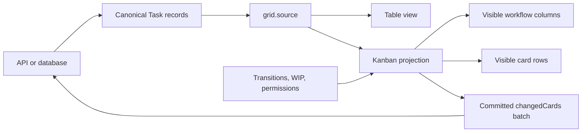

# Virtualized Kanban Board: How to Handle 50,000 Tasks in JavaScript


Most Kanban tutorials stop after three columns and twenty cards.

That is enough to explain drag and drop. It is not enough to build an operational product.

A **large Kanban board** has a different set of problems. It may need tens of thousands of tasks, several workflow stages, team swimlanes, multi-card operations, WIP policies, keyboard access, editing, table views, and reliable server persistence. A board that simply creates one DOM tree per column eventually spends more time mounting, measuring, styling, and reconciling cards than helping the user manage work.

The solution is not a faster drag-and-drop library. It is a different rendering and data architecture.

[RevoGrid Kanban](/kanban) treats the board as a virtualized projection of canonical application records. The same task objects can power a data grid and a Kanban view. Workflow columns become native RevoGrid columns, card positions become virtualized rows, and every projected cell contains at most one card.

The result is a **high-performance Kanban board** whose rendered DOM remains bounded even when the source contains 50,000 tasks.

You can see that architecture running in the [50K-task Kanban performance demo](/demo/kanban-performance): 50,000 source-backed records, ten workflow columns, and two collapsible swimlanes.

## The architecture in one diagram



This separation is the key:

- your application owns task records, business rules, authorization, and persistence;
- RevoGrid owns board projection, viewport rendering, focus, movement, and local provider updates;
- the browser renders the visible board, not 50,000 complete card components.

That is what makes a virtualized Kanban different from a visually similar Trello clone.

## What normally breaks when a Kanban board grows?

A small board can hide architectural problems for a long time. Those problems become visible when the dataset, workflow, or interaction model expands.

| Failure mode | What users experience | Architectural cause |
| --- | --- | --- |
| DOM explosion | Slow startup, scroll jank, delayed clicks | Every card is mounted whether visible or not |
| Nested column scrollers | Awkward horizontal and vertical navigation | Each column owns an independent list and scroll state |
| Duplicated board state | Edits disappear or views drift apart | Table records and board cards are separate models |
| Full-dataset persistence | Large requests after every move | The app saves all tasks instead of changed records |
| Fragile reordering | Duplicate or unstable positions | Array indexes are treated as durable server order |
| Partial bulk moves | Some selected cards move and others fail | Validation runs card by card rather than on the batch |
| Expensive templates | Scrolling degrades as cards become richer | Rendering performs repeated calculations or side effects |
| Filter-based policy bugs | Hidden work bypasses WIP limits | Rules count only visible cards instead of canonical tasks |

A production **enterprise Kanban component** has to address all of these together. Virtualization alone is important, but virtualization without a stable data model and mutation contract still leaves the application difficult to maintain.

## 1. Keep the DOM bounded

The browser does not need 50,000 task records represented by 50,000 mounted cards.

It needs enough DOM for the current viewport and a small rendering buffer. As the user scrolls, the virtualized view reuses the rendering surface for different logical rows and columns.

RevoGrid Kanban projects workflow data into a two-dimensional grid:

- workflow stages are RevoGrid columns;
- cards are projected into rows inside a workflow column and optional swimlane;
- one projected cell contains at most one card;
- RevoGrid virtualizes both the horizontal column axis and vertical card-row axis.

This avoids building a separate virtual list inside every Kanban column. Focus ownership, drop targets, row dimensions, and viewport state stay inside the same provider model.

### Why one card per projected cell matters

Many boards begin as a horizontal flex container containing several independently scrolling vertical lists. That structure is intuitive, but every list then needs its own virtualization, measurement, drag targeting, overscan, and focus coordination.

RevoGrid uses the grid itself as the board layout engine. The card is not an arbitrary child inside a nested list. It has a stable projected cell, while the underlying task identity and rank remain independent of the rendered row index.

That gives the board one coordinated scrolling and rendering system instead of several competing ones.

### Reserve a predictable card-row height

Virtualization works best when card geometry is intentional. Set `cardRowHeight` to fit the complete card template:

```ts
const kanban = {
  columns: workflowColumns,
  cardRowHeight: 190,
  customization: {
    cardContent,
  },
};
```

Do not rely on a card overflowing into the next projected row. When a custom template gains another metadata band, increase the row height or simplify the content.

Uniform projected rows reduce measurement work and make drop targets deterministic.

## 2. Use one canonical data model for grid and Kanban

A common product mistake is to create a table dataset and then transform it into a separate nested structure such as this:

```ts
{
  backlog: [/* copied cards */],
  development: [/* copied cards */],
  done: [/* copied cards */],
}
```

That looks convenient until a user edits a task in the table, moves it in the board, receives an update over WebSocket, or switches views. The application now has to synchronize two representations of the same records.

RevoGrid avoids that duplication.

Canonical tasks stay in `grid.source`. The table schema stays in `grid.columns`. The Kanban configuration describes how those same records should be projected into workflow columns and swimlanes.

```ts
import type { ColumnRegular, DataType } from '@revolist/revogrid';
import {
  KanbanCardEditorDialogPlugin,
  KanbanPlugin,
  type KanbanConfig,
} from '@revolist/revogrid-enterprise';

type WorkflowStatus =
  | 'backlog'
  | 'triage'
  | 'ready'
  | 'design'
  | 'development'
  | 'testing'
  | 'review'
  | 'blocked'
  | 'release'
  | 'done';

type Task = DataType & {
  id: string;
  title: string;
  description: string;
  status: WorkflowStatus;
  team: 'Product' | 'Platform';
  owner: string;
  priority: 'High' | 'Medium' | 'Low';
  points: number;
  order: number;
  tags: string[];
  assignees: string[];
  locked?: boolean;
  archived?: boolean;
  requiresApproval?: boolean;
  version?: number;
};

const tableColumns: ColumnRegular[] = [
  { prop: 'id', name: 'ID', size: 110 },
  { prop: 'title', name: 'Title', size: 280 },
  { prop: 'status', name: 'Status', size: 130 },
  { prop: 'team', name: 'Team', size: 120 },
  { prop: 'owner', name: 'Owner', size: 120 },
  { prop: 'priority', name: 'Priority', size: 110 },
  { prop: 'points', name: 'Points', size: 90 },
];

const kanban: KanbanConfig<Task> = {
  columns: [
    { prop: 'backlog', name: 'Backlog', size: 270 },
    { prop: 'triage', name: 'Triage', size: 270 },
    { prop: 'ready', name: 'Ready', size: 270 },
    { prop: 'design', name: 'Design', size: 270 },
    { prop: 'development', name: 'Development', size: 270 },
    { prop: 'testing', name: 'Testing', size: 270 },
    { prop: 'review', name: 'Review', size: 270 },
    { prop: 'blocked', name: 'Blocked', size: 270 },
    { prop: 'release', name: 'Release', size: 270 },
    { prop: 'done', name: 'Done', size: 270 },
  ],
  idField: 'id',
  columnField: 'status',
  orderField: 'order',
  swimlaneField: 'team',
  cardRowHeight: 190,
  card: {
    titleField: 'title',
    descriptionField: 'description',
    priorityField: 'priority',
    tagsField: 'tags',
    assigneeField: 'assignees',
  },
};

const grid = document.querySelector<HTMLRevoGridElement>('#work-grid')!;

grid.plugins = [KanbanPlugin, KanbanCardEditorDialogPlugin];
grid.columns = tableColumns;
grid.source = tasks;
grid.kanbanCardEditorDialog = {};
```

There is no copied `columns -> cards[]` state tree. A task remains an ordinary record with stable fields.

### Switch between table and board without converting data

The host application controls the view:

```ts
function setView(view: 'table' | 'kanban') {
  grid.kanban = view === 'kanban' ? kanban : false;
}
```

Setting `grid.kanban` to a configuration activates the board. Setting it to `false` restores the latest canonical source and table columns.

That makes table-to-board switching a presentation decision rather than a data migration. It is particularly useful for operational products where users need both:

- a board for workflow movement;
- a dense table for filtering, editing, comparison, and reporting.

The [multi-view planning demo](/demo/planning) applies the same idea across Grid, Kanban, Gantt, and Scheduler views.

## 3. Generate 50,000 stable task records

The public performance demo uses ten workflow columns and two team swimlanes. Its generator gives every task a stable primitive ID and a finite numeric rank.

A simplified generator looks like this:

```ts
const statuses = [
  'backlog',
  'triage',
  'ready',
  'design',
  'development',
  'testing',
  'review',
  'blocked',
  'release',
  'done',
] as const;

const owners = ['Maya', 'Jon', 'Ari', 'Nora', 'Theo', 'Iris'] as const;
const priorities = ['High', 'Medium', 'Low'] as const;

function createTasks(count = 50_000): Task[] {
  return Array.from({ length: count }, (_, index) => {
    const workflowIndex = index % statuses.length;
    const cycle = Math.floor(index / statuses.length);
    const team: Task['team'] = cycle % 2 === 0 ? 'Product' : 'Platform';

    return {
      id: `KAN-${index + 101}`,
      title: `Operational task ${index + 1}`,
      description: 'Source-backed work item for the virtualized Kanban board.',
      status: statuses[workflowIndex],
      team,
      owner: owners[(index + cycle) % owners.length],
      priority: priorities[index % priorities.length],
      points: [2, 3, 5, 8][index % 4],
      order: (Math.floor(cycle / 2) + 1) * 1_000,
      tags: ['Kanban', team],
      assignees: [owners[(index + cycle) % owners.length]],
    };
  });
}

const tasks = createTasks();
grid.source = tasks;
```

The important parts are not the synthetic titles. They are the identity and ordering rules:

- IDs are stable and unique;
- workflow values match configured column props;
- swimlane values are primitive and predictable;
- order values are finite numbers with room between neighbors.

Those properties let the board move records without treating a volatile rendered row index as durable task identity.

## 4. Use fractional ranking instead of rewriting whole columns

Dragging a card changes its logical position. The naive persistence strategy is to renumber every task in the destination column after every move.

That is expensive on a large board and creates unnecessary write conflicts.

RevoGrid uses numeric ranks. A normal move assigns a rank between neighboring cards. When the available numeric gap becomes unsafe, Kanban rebalances only the destination bucket and reports every affected record in the committed event.

This matters because a move can change more than the card the user touched. The persistence payload may include:

- the moved cards;
- records whose status or swimlane changed;
- destination records whose ranks were rebalanced.

Your server should persist the complete `changedCards` batch atomically.

## 5. Split the board with virtualized swimlanes

Swimlanes are often treated as decorative group headings. In an enterprise workflow they are part of the projection and policy model.

Use them to split every workflow stage by team, product area, release, class of service, assignee group, or another task field.

```ts
const swimlaneKanban: KanbanConfig<Task> = {
  ...kanban,
  swimlaneField: 'team',
  swimlanes: [
    {
      id: 'Product',
      title: 'Product team',
      collapsible: true,
    },
    {
      id: 'Platform',
      title: 'Platform team',
      collapsible: true,
      wipLimits: {
        review: 260,
      },
    },
  ],
  swimlaneColumn: {
    title: 'Teams',
    width: 210,
    collapsedWidth: 52,
    collapsible: true,
  },
};
```

A lane can be derived from first appearance or explicitly configured when title, order, height, collapse state, styling, or lane-specific WIP limits matter.

Collapsing a lane reduces its projected row area without creating a second hidden board model. The canonical tasks remain the same.

## 6. Move several cards as one validated operation

A large operational board needs more than one-card drag and drop.

RevoGrid supports toggle selection, range selection, and selections that span columns and swimlanes. Dragging a selected card moves the complete selection while preserving its prior board reading order.

Programmatic workflows use the same movement path:

```ts
const plugins = await grid.getPlugins();
const kanbanPlugin = plugins.find(
  (plugin) => plugin instanceof KanbanPlugin,
);

await kanbanPlugin?.moveCards(
  ['KAN-112', 'KAN-219', 'KAN-441'],
  {
    columnProp: 'review',
    swimlaneId: 'Platform',
    index: 0,
  },
  { reason: 'api' },
);
```

Pointer, keyboard, context-menu, and API movement all pass through the same validation, ranking, provider update, history, and persistence contract.

That consistency is important. An automated bulk action should not be able to bypass the rules applied to a pointer drag.

## 7. Validate WIP and transitions against the final batch

WIP limits are not only a red number in the column header. They are part of the move transaction.

```ts
const policyKanban: KanbanConfig<Task> = {
  ...kanban,
  columns: [
    { prop: 'backlog', name: 'Backlog' },
    {
      prop: 'development',
      name: 'Development',
      wipLimit: 40,
      allowedFrom: ['ready', 'development'],
    },
    {
      prop: 'review',
      name: 'Review',
      wipLimit: 15,
      allowedFrom: ['development', 'review'],
    },
    { prop: 'done', name: 'Done', allowedFrom: ['review', 'done'] },
  ],
  wipBehavior: 'block',
  rules: {
    canDrag: (card) =>
      card.locked ? 'This task is locked by another user.' : true,
    canSelect: (card) => !card.archived,
    canDrop: ({ cards, targetColumn }) =>
      cards.some((card) => card.requiresApproval) &&
      targetColumn.prop === 'done'
        ? 'Approval is required before completion.'
        : true,
  },
};
```

RevoGrid supports two WIP behaviors:

- `warn` permits the move and exposes the over-limit state;
- `block` rejects the complete proposed move.

For a multi-card operation, validation uses the final batch count. It does not move cards one by one until the column becomes full. If one capacity, permission, or transition check fails, the whole move is rejected.

WIP counts use the canonical bucket total, not only cards currently visible after filtering. A user cannot hide tasks with a search term and then accidentally overfill the workflow stage.

## 8. Persist changed records, not 50,000 tasks

Virtualized rendering solves the DOM problem. Efficient mutation events solve the network and database problem.

Listen to the cancelable proposal when local authorization or product policy may reject a move. Then persist the committed changed-card batch:

```ts
import {
  BEFORE_KANBAN_CARD_MOVE_EVENT,
  KANBAN_CARD_MOVE_EVENT,
  type KanbanBeforeCardMoveDetail,
  type KanbanCardMoveDetail,
} from '@revolist/revogrid-enterprise';

grid.addEventListener(
  BEFORE_KANBAN_CARD_MOVE_EVENT,
  (event: CustomEvent<KanbanBeforeCardMoveDetail>) => {
    if (!permissions.canMove(event.detail.cardIds, event.detail.target)) {
      event.preventDefault();
    }
  },
);

grid.addEventListener(
  KANBAN_CARD_MOVE_EVENT,
  async (event: CustomEvent<KanbanCardMoveDetail>) => {
    const response = await fetch('/api/kanban/cards/batch', {
      method: 'PATCH',
      headers: {
        'content-type': 'application/json',
      },
      body: JSON.stringify({
        cards: event.detail.changedCards,
        target: event.detail.target,
        reason: event.detail.reason,
        rebalancedCardIds: event.detail.rebalancedCardIds,
      }),
    });

    if (!response.ok) {
      await reloadCanonicalTasks();
      throw new Error('Kanban persistence failed; source was reconciled.');
    }
  },
);
```

The critical field is `event.detail.changedCards`. It gives the server the exact canonical records affected by movement and any local rank rebalance.

Do not send the full 50,000-record source after every drag.

### Keep authorization local during the gesture

The before-move decision is synchronous. A drag interaction should not pause while the browser asks the server whether the user may drop a card.

Resolve remote authorization into local policy state before movement begins. After a committed local move, persist the mutation asynchronously. If the server rejects because of a version conflict or a newer remote state, reload or reconcile the canonical records.

For collaborative products, include your own version, ETag, or revision field in each task and let the batch endpoint enforce optimistic concurrency.

### A suitable server contract

A practical endpoint can accept a compact transaction:

```json
{
  "cards": [
    {
      "id": "KAN-112",
      "status": "review",
      "team": "Platform",
      "order": 1500,
      "version": 18
    }
  ],
  "rebalancedCardIds": ["KAN-221", "KAN-305"],
  "clientMutationId": "f46b9fcb-8447-4fd1-b34e-c9115f478a77"
}
```

The database transaction should validate versions and update all included records together. The response can return authoritative tasks, new versions, and any server-calculated fields.

## 9. Keep custom cards cheap to render

Virtualization reduces the number of mounted cards. It does not make expensive card templates free.

A good card renderer should be a pure projection of task data. Avoid doing any of the following inside the template:

- network requests;
- timers;
- global event listeners;
- repeated date parsing for values that can be normalized once;
- expensive aggregation over the complete dataset;
- creating large new configuration objects on every render;
- measuring arbitrary content when a fixed row height will work.

Put expensive derived fields on the task record or memoize them outside the renderer.

```ts
const preparedTasks = rawTasks.map((task) => ({
  ...task,
  dueLabel: formatDueDate(task.dueDate),
  isOverdue: isTaskOverdue(task),
  searchText: `${task.id} ${task.title} ${task.owner}`.toLowerCase(),
}));
```

The card can then render `dueLabel` and `isOverdue` directly instead of recomputing them during scrolling.

## 10. Understand what virtualization does—and does not—solve

Two concepts are often mixed together:

| Concern | What it controls |
| --- | --- |
| UI virtualization | How many columns, rows, and cards are mounted in the DOM |
| Remote pagination or data virtualization | How many records are loaded into browser memory |

RevoGrid Kanban currently keeps the canonical Kanban dataset locally in `grid.source`. The 50,000-task demo proves that the board can project a large local collection while keeping rendered card DOM bounded.

That does not mean every conceivable dataset should be downloaded into the browser. If your workflow contains millions of records, first define the operational slice a person can reasonably act on: a workspace, team, date range, portfolio, queue, or server-side query. Then assign that result to `grid.source` and let UI virtualization control rendering inside the selected slice.

Use filtering to help users focus. Do not treat a client-side filter as a replacement for a remote loading strategy.

## RevoGrid architecture versus a basic board component

| Capability | Basic Kanban implementation | RevoGrid Kanban |
| --- | --- | --- |
| Large-board rendering | Mount every card or virtualize each list separately | Native horizontal and vertical grid virtualization |
| Card placement | Nested arrays by column | Projection from canonical `grid.source` rows |
| Table-to-board switch | Convert and synchronize separate models | Set `grid.kanban` to config or `false` |
| Scroll ownership | Independent column scrollers | Coordinated RevoGrid viewport |
| Multi-card movement | Usually custom application logic | Toggle/range selection and atomic movement |
| WIP limits | Visual count or per-card rejection | Warn/block behavior against final batch count |
| Swimlanes | Additional nested lists | Explicit or derived projected lanes with collapse controls |
| Ordering | Array index or full-column renumbering | Stable numeric rank with destination-bucket rebalance |
| Persistence | Save whole board state | Persist exact `changedCards` batches |
| Interaction paths | Pointer drag only | Pointer, touch, keyboard, context menu, and API |
| Alternate product views | Separate component state | One record model for Grid, Kanban, and other views |

This is why RevoGrid is positioned as an **enterprise Kanban component**, not only a task-board widget.

## A practical performance checklist

Before shipping a large board, test the complete product path rather than only a synthetic scroll benchmark.

### Data and identity

- Use stable primitive IDs.
- Use finite numeric ranks.
- Keep workflow and swimlane values predictable.
- Detect duplicate IDs and invalid configuration during development.

### Rendering

- Set a deliberate `cardRowHeight`.
- Keep render hooks pure.
- Precompute expensive derived fields.
- Avoid deep reactive wrappers around a 50,000-item source when the framework does not need them.
- Test production builds, not only development mode.

### Interaction

- Scroll horizontally across all workflow columns.
- Scroll vertically through large buckets and collapsed lanes.
- Move one card, a range, and a cross-lane selection.
- Verify pointer, touch, keyboard, context-menu, and API movement.
- Check invalid drop feedback and order-preserving no-op drops.

### Policy

- Test WIP `warn` and `block` behavior.
- Verify filtered cards still count toward WIP.
- Test local permissions and transition restrictions.
- Confirm one invalid card rejects an atomic multi-card move.

### Persistence

- Inspect the committed `changedCards` payload.
- Test destination-bucket rank rebalancing.
- Persist the batch in one transaction.
- Add optimistic concurrency for collaborative products.
- Reconcile the canonical source after server rejection.

### Accessibility

- Move cards without a pointer.
- Verify focus survives virtual scrolling.
- Test at 200% and 400% zoom.
- Check reduced-motion and high-contrast modes.
- Test custom card controls so they do not accidentally initiate movement.

## When should you use a virtualized Kanban?

A **virtualized Kanban** is valuable when the board is embedded in a data-heavy product rather than used as a small standalone checklist.

Typical use cases include:

- support and incident queues;
- product delivery across many teams;
- CRM and onboarding pipelines;
- manufacturing and quality workflows;
- content production and approval;
- compliance and procurement processes;
- operations platforms where users alternate between workflow and table views.

The strongest fit is a product where tasks already have rich fields, permissions, reports, server state, and alternate views. In that environment, a separate board-only data model quickly becomes technical debt.

## Final takeaway

Handling 50,000 tasks is not mainly a drag-and-drop problem.

It is a rendering, identity, policy, ordering, and persistence problem.

A scalable architecture should:

- keep task records canonical;
- render a bounded viewport instead of every card;
- virtualize workflow columns and card rows together;
- switch between table and board without duplicating state;
- validate multi-card movement atomically;
- enforce WIP and transition rules against canonical counts;
- persist only records changed by the committed operation;
- keep custom templates lightweight.

That is the architecture behind RevoGrid's [live 50,000-task Kanban demo](/demo/kanban-performance).

Explore the [RevoGrid Kanban product page](/kanban), open the [complete interactive Kanban demo](/demo/kanban), read the [Enterprise Kanban documentation](https://pro.rv-grid.com/guides/kanban/), or [request a Pro Advanced trial](/trial) to validate the board with your own task model, policies, templates, and persistence layer.

## Frequently asked questions

### Can a JavaScript Kanban board really handle 50,000 tasks?

Yes, provided the component does not mount all 50,000 cards. RevoGrid's performance demo loads 50,000 source-backed tasks across ten workflow columns and two swimlanes while native row and column virtualization keep the rendered board bounded. Actual capacity depends on browser, hardware, task-record size, card template complexity, and surrounding application work.

### Does RevoGrid render every Kanban card?

No. The logical records remain available in `grid.source`, but RevoGrid renders the workflow columns and card rows required for the current viewport plus its rendering buffer.

### Can the same records be shown in a table and Kanban board?

Yes. The table uses `grid.columns` and the board uses `grid.kanban` to project the same `grid.source` records. Set `grid.kanban` to `false` to return to the latest table source and columns.

### How are drag-and-drop changes saved to a server?

Listen for `kanbancardmove` and persist `event.detail.changedCards`. That batch includes moved records and any additional records affected by destination-rank rebalancing. Avoid sending the complete board after each operation.

### Can WIP limits reject a multi-card move?

Yes. With `wipBehavior: 'block'`, the board validates the final proposed batch count and rejects the entire move when the destination would exceed capacity or another policy check fails.

### Is 50,000 the maximum number of tasks?

No fixed product limit is implied by the demo. Practical limits depend on the user's hardware, browser memory, record size, card rendering cost, and the rest of the application. The important property is that rendered DOM remains bounded as the logical dataset grows.

## Related Kanban resources

- [RevoGrid Kanban overview](/kanban)
- [50K-task Kanban performance demo](/demo/kanban-performance)
- [Complete Kanban walkthrough](/demo/kanban)
- [Kanban data model guide](https://pro.rv-grid.com/guides/kanban/data-model/)
- [Swimlanes, WIP, and rules](https://pro.rv-grid.com/guides/kanban/swimlanes-wip-rules/)
- [Drag, drop, and multi-selection](https://pro.rv-grid.com/guides/kanban/interaction/)
- [Events, methods, and persistence](https://pro.rv-grid.com/guides/kanban/events-methods/)
- [Accessibility and performance](https://pro.rv-grid.com/guides/kanban/accessibility-performance/)
- [Kanban showcase source on GitHub](https://github.com/revolist/kanban)
