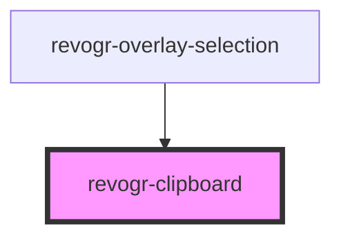

<!-- Auto Generated Below -->

## Overview

This Clipboard provides functionality for handling clipboard events in a web application.

## Properties

| Property   | Attribute  | Description                             | Type      | Default     |
| ---------- | ---------- | --------------------------------------- | --------- | ----------- |
| `readonly` | `readonly` | If readonly mode - disabled Paste event | `boolean` | `undefined` |

## Events

| Event              | Description                                                                                                               | Type                                                                                      |
| ------------------ | ------------------------------------------------------------------------------------------------------------------------- | ----------------------------------------------------------------------------------------- |
| `afterpasteapply`  | Paste 4. Fired after paste applied to the grid defaultPrevented - if true, paste will be canceled                         | `CustomEvent<{ raw: string; parsed: string[][]; event: ClipboardEvent; }>`                |
| `beforecopy`       | Copy 1. Fired before copy triggered defaultPrevented - if true, copy will be canceled                                     | `CustomEvent<{ event: ClipboardEvent; }>`                                                 |
| `beforecopyapply`  | Copy Method 1. Fired before copy applied to the clipboard from outside. defaultPrevented - if true, copy will be canceled | `CustomEvent<{ event: DataTransfer; data?: string[][] \| undefined; }>`                   |
| `beforecut`        | Cut 1. Fired before cut triggered defaultPrevented - if true, cut will be canceled                                        | `CustomEvent<{ event: ClipboardEvent; }>`                                                 |
| `beforepaste`      | Paste 1. Fired before paste applied to the grid defaultPrevented - if true, paste will be canceled                        | `CustomEvent<{ raw: string; isHTML: boolean; event: ClipboardEvent; dataText: string; }>` |
| `beforepasteapply` | Paste 2. Fired before paste applied to the grid and after data parsed                                                     | `CustomEvent<{ raw: string; parsed: string[][]; event: ClipboardEvent; }>`                |
| `clearregion`      | Cut 2. Clears region when cut is done                                                                                     | `CustomEvent<DataTransfer>`                                                               |
| `copyregion`       | Copy 2. Fired when region copied defaultPrevented - if true, copy will be canceled                                        | `CustomEvent<DataTransfer>`                                                               |
| `pasteregion`      | Paste 3. Internal method. When data region is ready pass it to the top.                                                   | `CustomEvent<string[][]>`                                                                 |

## Methods

### `doCopy(e: DataTransfer, data?: DataFormat[][]) => Promise<void>`

#### Parameters

| Name   | Type                   | Description |
| ------ | ---------------------- | ----------- |
| `e`    | `DataTransfer`         |             |
| `data` | `any[][] \| undefined` |             |

#### Returns

Type: `Promise<void>`

## Dependencies

### Used by

 - [revogr-overlay-selection](./overlay)

### Graph

----------------------------------------------

*Built with ❤️ by Revolist OU*
