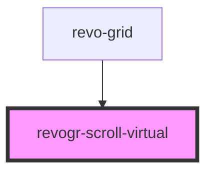

<!-- Auto Generated Below -->

## Overview

Virtual scroll component

## Properties

| Property                   | Attribute      | Description                                       | Type                 | Default     |
| -------------------------- | -------------- | ------------------------------------------------- | -------------------- | ----------- |
| `clientSize` _(required)_  | `client-size`  | Client size                                       | `number`             | `undefined` |
| `dimension`                | `dimension`    | Scroll dimension (`X` - `rgCol` or `Y` - `rgRow`) | `"rgCol" \| "rgRow"` | `'rgRow'`   |
| `realSize` _(required)_    | `real-size`    | Dimensions                                        | `number`             | `undefined` |
| `virtualSize` _(required)_ | `virtual-size` | Virtual size                                      | `number`             | `undefined` |

## Events

| Event           | Description  | Type                                                                                                                          |
| --------------- | ------------ | ----------------------------------------------------------------------------------------------------------------------------- |
| `scrollvirtual` | Scroll event | `CustomEvent<{ dimension: DimensionType; coordinate: number; delta?: number \| undefined; outside?: boolean \| undefined; }>` |

## Methods

### `changeScroll(e: ViewPortScrollEvent) => Promise<ViewPortScrollEvent>`

Update if `delta` exists in case we don't know current position or if it's external change

#### Parameters

| Name | Type                                                                                                             | Description |
| ---- | ---------------------------------------------------------------------------------------------------------------- | ----------- |
| `e`  | `{ dimension: DimensionType; coordinate: number; delta?: number \| undefined; outside?: boolean \| undefined; }` |             |

#### Returns

Type: `Promise<ViewPortScrollEvent>`

### `setScroll(e: ViewPortScrollEvent) => Promise<void>`

#### Parameters

| Name | Type                                                                                                             | Description |
| ---- | ---------------------------------------------------------------------------------------------------------------- | ----------- |
| `e`  | `{ dimension: DimensionType; coordinate: number; delta?: number \| undefined; outside?: boolean \| undefined; }` |             |

#### Returns

Type: `Promise<void>`

## Dependencies

### Used by

 - [revo-grid](../revoGrid)

### Graph

----------------------------------------------

*Built with ❤️ by Revolist OU*
