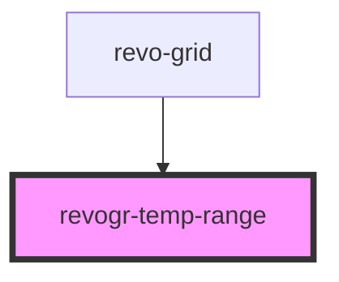

<!-- Auto Generated Below -->

## Overview

Temporary range selection component. Shows temporary range selection.

## Properties

| Property         | Attribute | Description                                        | Type                                                                                                                                                                                            | Default     |
| ---------------- | --------- | -------------------------------------------------- | ----------------------------------------------------------------------------------------------------------------------------------------------------------------------------------------------- | ----------- |
| `dimensionCol`   | --        | Dimension column store                             | `DimensionSettingsState`                                                                                                                                                                        | `undefined` |
| `dimensionRow`   | --        | Dimension row store                                | `DimensionSettingsState`                                                                                                                                                                        | `undefined` |
| `selectionStore` | --        | Selection store, shows current selection and focus | `{ range: RangeArea \| null; tempRange: RangeArea \| null; tempRangeType: string \| null; focus: Cell \| null; edit: EditCellStore \| null; lastCell: Cell \| null; nextFocus: Cell \| null; }` | `undefined` |

## Dependencies

### Used by

 - [revo-grid](../revoGrid)

### Graph

----------------------------------------------

*Built with ❤️ by Revolist OU*
