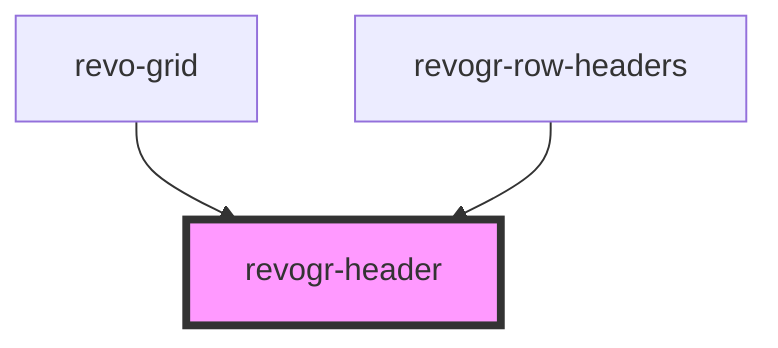

<!-- Auto Generated Below -->

## Properties

| Property            | Attribute         | Description                                                                                     | Type                                                           | Default     |
| ------------------- | ----------------- | ----------------------------------------------------------------------------------------------- | -------------------------------------------------------------- | ----------- |
| `additionalData`    | `additional-data` | Extra properties to pass into header renderer, such as vue or react components to handle parent | `any`                                                          | `{}`        |
| `canResize`         | `can-resize`      | If columns can be resized                                                                       | `boolean`                                                      | `undefined` |
| `colData`           | --                | Columns - defines an array of grid columns.                                                     | `ColumnRegular[]`                                              | `undefined` |
| `columnFilter`      | `column-filter`   | Column filter                                                                                   | `boolean`                                                      | `undefined` |
| `dimensionCol`      | --                | Dimension settings X                                                                            | `ObservableMap<DimensionSettingsState>`                        | `undefined` |
| `groupingDepth`     | `grouping-depth`  | Grouping depth, how many levels of grouping                                                     | `number`                                                       | `0`         |
| `groups`            | --                | Column groups                                                                                   | `{ [x: string]: any; }`                                        | `undefined` |
| `readonly`          | `readonly`        | Readonly mode                                                                                   | `boolean`                                                      | `undefined` |
| `resizeHandler`     | --                | Defines resize position                                                                         | `("r" \| "b" \| "rt" \| "lt" \| "rb" \| "lb" \| "l" \| "t")[]` | `undefined` |
| `selectionStore`    | --                | Selection, range, focus                                                                         | `ObservableMap<SelectionStoreState>`                           | `undefined` |
| `type` _(required)_ | `type`            | Column type                                                                                     | `"colPinEnd" \| "colPinStart" \| "rgCol" \| "rowHeaders"`      | `undefined` |
| `viewportCol`       | --                | Viewport X                                                                                      | `ObservableMap<ViewportState>`                                 | `undefined` |

## Events

| Event                | Description                                                                 | Type                                                                                                                                                                                                                                                                                                                                                                      |
| -------------------- | --------------------------------------------------------------------------- | ------------------------------------------------------------------------------------------------------------------------------------------------------------------------------------------------------------------------------------------------------------------------------------------------------------------------------------------------------------------------- |
| `afterheaderrender`  | After all header cells rendered. Finalizes cell rendering.                  | `CustomEvent<{ type: DimensionCols \| "rowHeaders"; readonly: boolean; data: ColumnRegular[] \| Observable<DataSourceState<any, any>>; viewport: Observable<ViewportState>; dimension: Observable<DimensionSettingsState>; selection: Observable<SelectionStoreState>; }>`                                                                                                |
| `beforeheaderclick`  | On initial header click                                                     | `CustomEvent<{ index: number; originalEvent: MouseEvent; column: ColumnRegular; providers: Providers<DimensionCols \| "rowHeaders">; }>`                                                                                                                                                                                                                                  |
| `beforeheaderrender` | Before each header cell render function. Allows to override cell properties | `CustomEvent<{ column: VirtualPositionItem; additionalData: any; data: ColumnTemplateProp; range?: RangeArea \| null \| undefined; canResize?: boolean \| undefined; canFilter?: boolean \| undefined; onResize?(e: ResizeEvent): void; onClick?(data: InitialHeaderClick): void; onDblClick?(data: InitialHeaderClick): void; } & Partial<Pick<ResizeProps, "active">>>` |
| `beforeheaderresize` | On before header resize                                                     | `CustomEvent<ColumnRegular[]>`                                                                                                                                                                                                                                                                                                                                            |
| `headerdblclick`     | On header double click                                                      | `CustomEvent<{ index: number; originalEvent: MouseEvent; column: ColumnRegular; providers: Providers<DimensionCols \| "rowHeaders">; }>`                                                                                                                                                                                                                                  |
| `headerresize`       | On header resize                                                            | `CustomEvent<{ [x: string]: number; }>`                                                                                                                                                                                                                                                                                                                                   |

## Dependencies

### Used by

 - [revo-grid](./revoGrid)
 - [revogr-row-headers](./rowHeaders)

### Graph

----------------------------------------------

*Built with ❤️ by Revolist OU*
