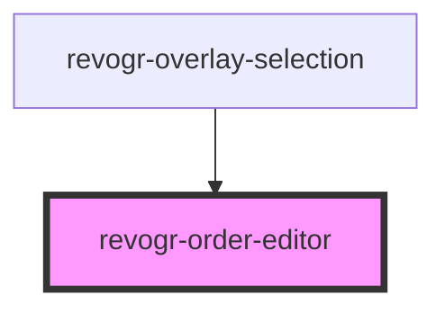

<!-- Auto Generated Below -->

## Overview

Component for handling row order editor.

## Properties

| Property       | Attribute       | Description                                                     | Type                                                   | Default     |
| -------------- | --------------- | --------------------------------------------------------------- | ------------------------------------------------------ | ----------- |
| `dataStore`    | `data-store`    | Static stores, not expected to change during component lifetime | `ObservableMap<DSourceState<DataType, DimensionRows>>` | `undefined` |
| `dimensionCol` | `dimension-col` | Dimension settings X                                            | `ObservableMap<DimensionSettingsState>`                | `undefined` |
| `dimensionRow` | `dimension-row` | Dimension settings Y                                            | `ObservableMap<DimensionSettingsState>`                | `undefined` |
| `parent`       | `parent`        | Parent element                                                  | `HTMLElement`                                          | `undefined` |
| `rowType`      | `row-type`      |                                                                 | `"rgRow" \| "rowPinEnd" \| "rowPinStart"`              | `undefined` |

## Events

| Event              | Description                                 | Type                                                                                                                   |
| ------------------ | ------------------------------------------- | ---------------------------------------------------------------------------------------------------------------------- |
| `rowdragendinit`   | Row drag ended started                      | `CustomEvent<{ rowType: DimensionRows; }>`                                                                             |
| `rowdragmousemove` | Row mouse move started                      | `CustomEvent<Cell & { rowType: DimensionRows; }>`                                                                      |
| `rowdragmoveinit`  | Row move started                            | `CustomEvent<PositionItem & { rowType: DimensionRows; }>`                                                              |
| `rowdragstartinit` | Row drag started                            | `CustomEvent<{ cell: Cell; text: string; pos: PositionItem; event: MouseEvent; rowType: DimensionRows; model: any; }>` |
| `rowdropinit`      | Row dragged, new range ready to be applied  | `CustomEvent<{ from: number; to: number; rowType: DimensionRows; }>`                                                   |
| `roworderchange`   | Row drag ended finished. Time to apply data | `CustomEvent<{ from: number; to: number; rowType: DimensionRows; }>`                                                   |

## Methods

### `clearOrder() => Promise<void>`

#### Returns

Type: `Promise<void>`

### `dragStart(e: DragStartEvent) => Promise<void>`

#### Parameters

| Name | Type             | Description |
| ---- | ---------------- | ----------- |
| `e`  | `DragStartEvent` |             |

#### Returns

Type: `Promise<void>`

### `endOrder(e: MouseEvent) => Promise<void>`

#### Parameters

| Name | Type         | Description |
| ---- | ------------ | ----------- |
| `e`  | `MouseEvent` |             |

#### Returns

Type: `Promise<void>`

## Dependencies

### Used by

 - [revogr-overlay-selection](../overlay)

### Graph

----------------------------------------------

*Built with ❤️ by Revolist OU*
