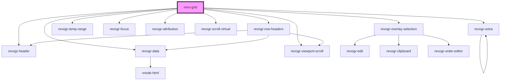

<!-- Auto Generated Below -->

## Overview

Revogrid - High-performance, customizable grid library for managing large datasets.
### Events guide

For a comprehensive events guide, check the [Events API Page](./events.md).
All events propagate to the root level of the grid. [Dependency tree](#Dependencies).

### Type definitions

Read [type definition file](https://github.com/revolist/revogrid/blob/master/src/interfaces.d.ts) for the full interface information.

All complex property types such as `ColumnRegular`, `ColumnProp`, `ColumnDataSchemaModel` can be found there.

### HTMLRevoGridElement

## Properties

| Property             | Attribute           | Description                                                                                                                                                                                                                                                                                                     | Type                                                                                                                                                                                                                                                                                                                                                                                              | Default     |
| -------------------- | ------------------- | --------------------------------------------------------------------------------------------------------------------------------------------------------------------------------------------------------------------------------------------------------------------------------------------------------------- | ------------------------------------------------------------------------------------------------------------------------------------------------------------------------------------------------------------------------------------------------------------------------------------------------------------------------------------------------------------------------------------------------- | ----------- |
| `accessible`         | `accessible`        | Enable accessibility. If disabled, the grid will not be accessible.                                                                                                                                                                                                                                             | `boolean`                                                                                                                                                                                                                                                                                                                                                                                         | `true`      |
| `additionalData`     | `additional-data`   | Additional data to be passed to plugins, renders or editors. For example if you need to pass Vue component instance.                                                                                                                                                                                            | `any`                                                                                                                                                                                                                                                                                                                                                                                             | `{}`        |
| `applyOnClose`       | `apply-on-close`    | Apply changes in editor when closed except 'Escape' cases. If custom editor in use method getValue required. Check interfaces.d.ts `EditorBase` for more info.                                                                                                                                                  | `boolean`                                                                                                                                                                                                                                                                                                                                                                                         | `false`     |
| `autoSizeColumn`     | `auto-size-column`  | Autosize config. Enables columns autoSize. For more details check `autoSizeColumn` plugin. By default disabled, hence operation is not performance efficient. `true` to enable with default params (double header separator click for autosize). Or define config. See `AutoSizeColumnConfig` for more details. | `boolean \| { mode?: ColumnAutoSizeMode \| undefined; allColumns?: boolean \| undefined; letterBlockSize?: number \| undefined; preciseSize?: boolean \| undefined; }`                                                                                                                                                                                                                            | `false`     |
| `canFocus`           | `can-focus`         | When true cell focus appear.                                                                                                                                                                                                                                                                                    | `boolean`                                                                                                                                                                                                                                                                                                                                                                                         | `true`      |
| `canMoveColumns`     | `can-move-columns`  | Enable column move plugin.                                                                                                                                                                                                                                                                                      | `boolean`                                                                                                                                                                                                                                                                                                                                                                                         | `false`     |
| `colSize`            | `col-size`          | Indicates default column size.                                                                                                                                                                                                                                                                                  | `number`                                                                                                                                                                                                                                                                                                                                                                                          | `100`       |
| `columnTypes`        | --                  | Column Types Format. Every type represent multiple column properties. Types will be merged but can be replaced with column properties. Types were made as separate objects to be reusable per multiple columns.                                                                                                 | `{ [name: string]: ColumnType; }`                                                                                                                                                                                                                                                                                                                                                                 | `{}`        |
| `columns`            | --                  | Columns - defines an array of grid columns. Can be column or grouped column.                                                                                                                                                                                                                                    | `(ColumnRegular \| ColumnGrouping)[]`                                                                                                                                                                                                                                                                                                                                                             | `[]`        |
| `disableVirtualX`    | `disable-virtual-x` | Disable lazy rendering mode for the `X axis`. Use when not many columns present and you don't need rerenader cells during scroll. Can be used for initial rendering performance improvement.                                                                                                                    | `boolean`                                                                                                                                                                                                                                                                                                                                                                                         | `false`     |
| `disableVirtualY`    | `disable-virtual-y` | Disable lazy rendering mode for the `Y axis`. Use when not many rows present and you don't need rerenader cells during scroll. Can be used for initial rendering performance improvement.                                                                                                                       | `boolean`                                                                                                                                                                                                                                                                                                                                                                                         | `false`     |
| `editors`            | --                  | Custom editors register.                                                                                                                                                                                                                                                                                        | `{ [name: string]: EditorCtr; }`                                                                                                                                                                                                                                                                                                                                                                  | `{}`        |
| `exporting`          | `exporting`         | Enable export plugin.                                                                                                                                                                                                                                                                                           | `boolean`                                                                                                                                                                                                                                                                                                                                                                                         | `false`     |
| `filter`             | `filter`            | Enables filter plugin. Can be boolean. Or can be filter collection See `FilterCollection` for more info.                                                                                                                                                                                                        | `boolean \| { collection?: Record<ColumnProp, FilterCollectionItem> \| undefined; include?: string[] \| undefined; customFilters?: Record<string, CustomFilter<any, LogicFunctionExtraParam>> \| undefined; filterProp?: string \| undefined; localization?: FilterLocalization \| undefined; multiFilterItems?: MultiFilterItem \| undefined; disableDynamicFiltering?: boolean \| undefined; }` | `false`     |
| `focusTemplate`      | --                  | Apply changes typed in editor on editor close except Escape cases. If custom editor in use method `getValue` required. Check `interfaces.d.ts` `EditorBase` for more info.                                                                                                                                      | `(createElement: HyperFunc<VNode>, detail: FocusRenderEvent) => any`                                                                                                                                                                                                                                                                                                                              | `undefined` |
| `frameSize`          | `frame-size`        | Defines how many rows/columns should be rendered outside visible area.                                                                                                                                                                                                                                          | `number`                                                                                                                                                                                                                                                                                                                                                                                          | `1`         |
| `grouping`           | --                  | Group rows based on this property. Define properties to be groped by grouping plugin See `GroupingOptions`.                                                                                                                                                                                                     | `{ props?: ColumnProp[] \| undefined; prevExpanded?: Record<string, boolean> \| undefined; expandedAll?: boolean \| undefined; preserveGroupingOnUpdate?: boolean \| undefined; groupLabelTemplate?: GroupLabelTemplateFunc \| undefined; } & ExpandedOptions`                                                                                                                                    | `undefined` |
| `hideAttribution`    | `hide-attribution`  | Please only hide the attribution if you are subscribed to Pro version                                                                                                                                                                                                                                           | `boolean`                                                                                                                                                                                                                                                                                                                                                                                         | `false`     |
| `jobsBeforeRender`   | --                  | Prevent rendering until job is done. Can be used for initial rendering performance improvement. When several plugins require initial rendering this will prevent double initial rendering.                                                                                                                      | `Promise<any>[]`                                                                                                                                                                                                                                                                                                                                                                                  | `[]`        |
| `pinnedBottomSource` | --                  | Pinned bottom Source: {[T in ColumnProp]: any} - defines pinned bottom rows data source.                                                                                                                                                                                                                        | `DataType[]`                                                                                                                                                                                                                                                                                                                                                                                      | `[]`        |
| `pinnedTopSource`    | --                  | Pinned top Source: {[T in ColumnProp]: any} - defines pinned top rows data source.                                                                                                                                                                                                                              | `DataType[]`                                                                                                                                                                                                                                                                                                                                                                                      | `[]`        |
| `plugins`            | --                  | Custom grid plugins. Can be added or removed at runtime. Every plugin should be inherited from BasePlugin class.  For more details check [Plugin guide](https://rv-grid.com/guide/plugin/)                                                                                                                      | `(typeof BasePlugin)[]`                                                                                                                                                                                                                                                                                                                                                                           | `[]`        |
| `range`              | `range`             | When true, user can range selection.                                                                                                                                                                                                                                                                            | `boolean`                                                                                                                                                                                                                                                                                                                                                                                         | `false`     |
| `readonly`           | `readonly`          | When true, grid in read only mode.                                                                                                                                                                                                                                                                              | `boolean`                                                                                                                                                                                                                                                                                                                                                                                         | `false`     |
| `registerVNode`      | --                  | Register new virtual node inside of grid. Used for additional items creation such as plugin elements. Should be set before grid render inside of plugins. Can return VNode result of h() function or a function that returns VNode. Function can be used for performance improvement and additional renders.    | `(VNode \| ((c: ExtraNodeFuncConfig) => VNode))[]`                                                                                                                                                                                                                                                                                                                                                | `[]`        |
| `resize`             | `resize`            | When true, columns are resizable.                                                                                                                                                                                                                                                                               | `boolean`                                                                                                                                                                                                                                                                                                                                                                                         | `false`     |
| `rowClass`           | `row-class`         | Row class property mapping. Map custom classes to rows from row object data. Define this property in rgRow object and this will be mapped as rgRow class.                                                                                                                                                       | `string`                                                                                                                                                                                                                                                                                                                                                                                          | `''`        |
| `rowDefinitions`     | --                  | Custom row properies to be applied. See `RowDefinition` for more info.                                                                                                                                                                                                                                          | `RowDefinition[]`                                                                                                                                                                                                                                                                                                                                                                                 | `[]`        |
| `rowHeaders`         | `row-headers`       | Excel like functionality. Show row numbers. Also can be used for custom row header render if object provided.                                                                                                                                                                                                   | `RowHeaders \| boolean`                                                                                                                                                                                                                                                                                                                                                                           | `undefined` |
| `rowSize`            | `row-size`          | Indicates default rgRow size. By default 0, means theme package size will be applied  Alternatively you can use `rowSize` to reset viewport                                                                                                                                                                     | `number`                                                                                                                                                                                                                                                                                                                                                                                          | `0`         |
| `sorting`            | --                  | Alternative way to set sorting. `{columns: [{prop: 'name', order: 'asc'}]}`                                                                                                                                                                                                                                     | `undefined \| { columns?: { prop: ColumnProp; order: Order; cellCompare?: CellCompareFunc \| undefined; }[] \| undefined; }`                                                                                                                                                                                                                                                                      | `undefined` |
| `source`             | --                  | Source - defines main data source. Can be an Object or 2 dimensional array([][]); Keys/indexes referenced from columns Prop.                                                                                                                                                                                    | `DataType[]`                                                                                                                                                                                                                                                                                                                                                                                      | `[]`        |
| `stretch`            | `stretch`           | Stretch strategy for columns by `StretchColumn` plugin. For example if there are more space on the right last column size would be increased.                                                                                                                                                                   | `boolean \| string`                                                                                                                                                                                                                                                                                                                                                                               | `false`     |
| `theme`              | `theme`             | Theme name.                                                                                                                                                                                                                                                                                                     | `string`                                                                                                                                                                                                                                                                                                                                                                                          | `'default'` |
| `trimmedRows`        | --                  | Trimmed rows. Functionality which allows to hide rows from main data set. `trimmedRows` are physical `rgRow` indexes to hide.                                                                                                                                                                                   | `{ [x: number]: boolean; }`                                                                                                                                                                                                                                                                                                                                                                       | `{}`        |
| `useClipboard`       | `use-clipboard`     | When true enable clipboard.                                                                                                                                                                                                                                                                                     | `boolean`                                                                                                                                                                                                                                                                                                                                                                                         | `true`      |

## Events

| Event                      | Description                                                                                                                                                                                                                                                                                                     | Type                                                                                                                                                                                                                        |
| -------------------------- | --------------------------------------------------------------------------------------------------------------------------------------------------------------------------------------------------------------------------------------------------------------------------------------------------------------- | --------------------------------------------------------------------------------------------------------------------------------------------------------------------------------------------------------------------------- |
| `additionaldatachanged`    | Emmited after the additional data is changed                                                                                                                                                                                                                                                                    | `CustomEvent<any>`                                                                                                                                                                                                          |
| `afteranysource`           | Emitted after each source update, whether from the pinned or main viewport. Useful for tracking all changes originating from sources in both the pinned and main viewports.                                                                                                                                     | `CustomEvent<{ type: DimensionRows; source: DataType[]; }>`                                                                                                                                                                 |
| `aftercolumnresize`        | Emitted after column resizing. Useful for retrieving the resized columns.                                                                                                                                                                                                                                       | `CustomEvent<{ [index: number]: ColumnRegular; }>`                                                                                                                                                                          |
| `aftercolumnsset`          | Column updated                                                                                                                                                                                                                                                                                                  | `CustomEvent<{ columns: ColumnCollection; order: Record<ColumnProp, "asc" \| "desc" \| undefined>; }>`                                                                                                                      |
| `afteredit`                | After data applied or range changed.                                                                                                                                                                                                                                                                            | `CustomEvent<BeforeSaveDataDetails \| { data: DataLookup; models: Partial<DataLookup>; type: DimensionRows; newRange: RangeArea \| null; oldRange: RangeArea \| null; }>`                                                   |
| `afterfocus`               | After focus render finished. Can be used to access a focus element through `event.target`. This is just a duplicate of `afterfocus` from `revogr-focus.tsx`.                                                                                                                                                    | `CustomEvent<FocusAfterRenderEvent>`                                                                                                                                                                                        |
| `aftergridinit`            | Emmited after the grid is initialized. Connected to the DOM.                                                                                                                                                                                                                                                    | `CustomEvent<any>`                                                                                                                                                                                                          |
| `aftergridrender`          | Emmited after the grid is rendered.                                                                                                                                                                                                                                                                             | `CustomEvent<any>`                                                                                                                                                                                                          |
| `aftersourceset`           | After main source/rows updated                                                                                                                                                                                                                                                                                  | `CustomEvent<{ type: DimensionRows; source: DataType[]; }>`                                                                                                                                                                 |
| `afterthemechanged`        | Emmited after the theme is changed                                                                                                                                                                                                                                                                              | `CustomEvent<string>`                                                                                                                                                                                                       |
| `aftertrimmed`             | Emitted after trimmed values have been applied. Useful for notifying when trimming of values has taken place.                                                                                                                                                                                                   | `CustomEvent<any>`                                                                                                                                                                                                          |
| `beforeanysource`          | Before data apply on any source type. Can be source from pinned and main viewport. You can override data source here                                                                                                                                                                                            | `CustomEvent<{ type: DimensionRows; source: DataType[]; }>`                                                                                                                                                                 |
| `beforeautofill`           | Before autofill is applied. To prevent the default behavior of applying the edit data, you can call `e.preventDefault()`.                                                                                                                                                                                       | `CustomEvent<{ type: DimensionRows; colType: DimensionCols; newRange: RangeArea; oldRange: RangeArea; mapping: OldNewRangeMapping; newData: { [newRowIndex: number]: DataType; }; }>`                                       |
| `beforecellfocus`          | Before the cell focus is changed. To prevent the default behavior of changing the cell focus, you can call `e.preventDefault()`.                                                                                                                                                                                | `CustomEvent<BeforeSaveDataDetails>`                                                                                                                                                                                        |
| `beforecolumnapplied`      | Emitted before a column update is applied, after the column set is gathered and the viewport is updated. Useful for performing actions or modifications before the final application of the column update.                                                                                                      | `CustomEvent<{ columns: Record<DimensionCols, ColumnRegular[]>; columnByProp: Record<ColumnProp, ColumnRegular[]>; columnGrouping: ColumnGroupingCollection; maxLevel: number; sort: Record<ColumnProp, ColumnRegular>; }>` |
| `beforecolumnsset`         | Emitted before a column update is applied. Listeners can use this event to perform any necessary actions or modifications before the column update is finalized.                                                                                                                                                | `CustomEvent<{ columns: Record<DimensionCols, ColumnRegular[]>; columnByProp: Record<ColumnProp, ColumnRegular[]>; columnGrouping: ColumnGroupingCollection; maxLevel: number; sort: Record<ColumnProp, ColumnRegular>; }>` |
| `beforeedit`               | Before the data is edited. To prevent the default behavior of editing data and use your own implementation, call `e.preventDefault()`. To override the edit result with your own value, set the `e.val` property to your desired value.                                                                         | `CustomEvent<BeforeSaveDataDetails>`                                                                                                                                                                                        |
| `beforeeditstart`          | Emitted before editing starts. Use e.preventDefault() to prevent the default edit behavior.                                                                                                                                                                                                                     | `CustomEvent<BeforeSaveDataDetails>`                                                                                                                                                                                        |
| `beforeexport`             | Before export Use e.preventDefault() to prevent export Replace data in Event in case you want to modify it in export                                                                                                                                                                                            | `CustomEvent<{ data: DataType[]; } & ColSource>`                                                                                                                                                                            |
| `beforefilterapply`        | Emitted before applying a filter to the data source. Use e.preventDefault() to prevent cell focus change. Modify if you need to change filters.                                                                                                                                                                 | `CustomEvent<{ collection: Record<ColumnProp, FilterCollectionItem>; }>`                                                                                                                                                    |
| `beforefiltertrimmed`      | Emitted before applying a filter to the data source. Use e.preventDefault() to prevent the default behavior of trimming values and applying the filter. Modify the `collection` property if you want to change the filters. Modify the `itemsToFilter` property if you want to filter the indexes for trimming. | `CustomEvent<{ collection: Record<ColumnProp, FilterCollectionItem>; itemsToFilter: Record<number, boolean>; }>`                                                                                                            |
| `beforefocuslost`          | Before the grid focus is lost. To prevent the default behavior of changing the cell focus, you can call `e.preventDefault()`.                                                                                                                                                                                   | `CustomEvent<null \| { model: any; cell: Cell; colType: DimensionCols; rowType: DimensionRows; column?: ColumnRegular \| undefined; }>`                                                                                     |
| `beforegridrender`         | Emmited before the grid is rendered.                                                                                                                                                                                                                                                                            | `CustomEvent<any>`                                                                                                                                                                                                          |
| `beforerange`              | Before autofill is applied. Runs before beforeautofill event. Use e.preventDefault() to prevent range.                                                                                                                                                                                                          | `CustomEvent<{ type: DimensionRows; colType: DimensionCols; newRange: RangeArea; oldRange: RangeArea; mapping: OldNewRangeMapping; newData: { [newRowIndex: number]: DataType; }; }>`                                       |
| `beforerangeedit`          | Before applying range data, specifically when a range selection occurs. To customize the data and prevent the default edit data from being set, you can call `e.preventDefault()`.                                                                                                                              | `CustomEvent<{ data: DataLookup; models: Partial<DataLookup>; type: DimensionRows; newRange: RangeArea \| null; oldRange: RangeArea \| null; }>`                                                                            |
| `beforerowdefinition`      | Emitted before the row definition is applied. Useful for modifying or preventing the default row definition behavior.                                                                                                                                                                                           | `CustomEvent<{ vals: any; oldVals: any; }>`                                                                                                                                                                                 |
| `beforesorting`            | By `sorting.plugin.ts`  Triggered immediately after header click.  First in sorting event sequence. Ff this event stops no other event called.  Use `e.preventDefault()` to prevent sorting.                                                                                                           | `CustomEvent<{ column: ColumnRegular; order: "asc" \| "desc"; additive: boolean; }>`                                                                                                                                        |
| `beforesortingapply`       | By `sorting.plugin.ts`   After `beforesorting`  Triggered after column data updated with new sorting order.  Use `e.preventDefault()` to prevent sorting data change.                                                                                                                                  | `CustomEvent<{ column: ColumnRegular; order: "asc" \| "desc"; additive: boolean; }>`                                                                                                                                        |
| `beforesourceset`          | Before main source/rows data apply. You can override data source here                                                                                                                                                                                                                                           | `CustomEvent<{ type: DimensionRows; source: DataType[]; }>`                                                                                                                                                                 |
| `beforesourcesortingapply` | By `sorting.plugin.ts`  Same as `beforesorting` but triggered after `beforeanysource` (when source is changed).  Use `e.preventDefault()` to prevent sorting data change.                                                                                                                                 | `CustomEvent<{ type: DimensionRows; sorting?: SortingOrder \| undefined; }>`                                                                                                                                                |
| `beforetrimmed`            | Emitted before trimming values. Use e.preventDefault() to prevent the default behavior of trimming values. Modify the `trimmed` property if you want to filter the indexes for trimming.                                                                                                                        | `CustomEvent<{ trimmed: Record<number, boolean>; trimmedType: string; type: string; }>`                                                                                                                                     |
| `contentsizechanged`       | New content size has been applied. The size excludes the header. Currently, the event responsible for applying the new content size does not provide the actual size. To retrieve the actual content size, you can utilize the `getContentSize` function after the event has been triggered.                    | `CustomEvent<"colPinEnd" \| "colPinStart" \| "rgCol" \| "rgRow" \| "rowPinEnd" \| "rowPinStart">`                                                                                                                           |
| `created`                  | Emmited after grid created                                                                                                                                                                                                                                                                                      | `CustomEvent<any>`                                                                                                                                                                                                          |
| `filterconfigchanged`      | Emitted when the filter configuration is changed                                                                                                                                                                                                                                                                | `CustomEvent<any>`                                                                                                                                                                                                          |
| `headerclick`              | On header click.                                                                                                                                                                                                                                                                                                | `CustomEvent<ColumnRegular>`                                                                                                                                                                                                |
| `rowdragstart`             | This event is triggered when the row order change is started. To prevent the default behavior of changing the row order, you can call `e.preventDefault()`. To change the item name at the start of the row order change, you can set `e.text` to the desired new name.                                         | `CustomEvent<{ cell: Cell; text: string; pos: PositionItem; event: MouseEvent; rowType: DimensionRows; model: any; }>`                                                                                                      |
| `rowheaderschanged`        | Emmited when the row headers are changed.                                                                                                                                                                                                                                                                       | `CustomEvent<any>`                                                                                                                                                                                                          |
| `roworderchanged`          | Before the order of `rgRow` is applied. To prevent the default behavior of changing the order of `rgRow`, you can call `e.preventDefault()`.                                                                                                                                                                    | `CustomEvent<{ from: number; to: number; }>`                                                                                                                                                                                |
| `sortingconfigchanged`     | Emitted when the sorting configuration is changed                                                                                                                                                                                                                                                               | `CustomEvent<{ columns?: { prop: ColumnProp; order: Order; cellCompare?: CellCompareFunc \| undefined; }[] \| undefined; }>`                                                                                                |
| `viewportscroll`           | Emitted when the viewport is scrolled. Useful for tracking viewport scrolling events.                                                                                                                                                                                                                           | `CustomEvent<{ dimension: DimensionType; coordinate: number; delta?: number \| undefined; outside?: boolean \| undefined; }>`                                                                                               |

## Methods

### `addTrimmed(trimmed: Record<number, boolean>, trimmedType?: string, type?: DimensionRows) => Promise<CustomEvent<{ trimmed: Record<number, boolean>; trimmedType: string; type: string; }>>`

Add trimmed by type

#### Parameters

| Name          | Type                         | Description |
| ------------- | ---------------------------- | ----------- |
| `trimmed`     | `{ [x: number]: boolean; }`  |             |
| `trimmedType` | `string`                     |             |
| `type`        | `DimensionRowPin \| "rgRow"` |             |

#### Returns

Type: `Promise<CustomEvent<{ trimmed: Record<number, boolean>; trimmedType: string; type: string; }>>`

### `clearFocus() => Promise<void>`

Clear current grid focus. Grid has no longer focus on it.

#### Returns

Type: `Promise<void>`

### `clearSorting() => Promise<void>`

Clears column sorting

#### Returns

Type: `Promise<void>`

### `getColumnStore(type?: DimensionCols) => Promise<Observable<DSourceState<ColumnRegular, DimensionCols>>>`

Provides access to column internal store observer
Can be used for plugin support

#### Parameters

| Name   | Type                         | Description      |
| ------ | ---------------------------- | ---------------- |
| `type` | `DimensionColPin \| "rgCol"` | - type of column |

#### Returns

Type: `Promise<Observable<DSourceState<ColumnRegular, DimensionCols>>>`

### `getColumns() => Promise<ColumnRegular[]>`

Receive all columns in data source

#### Returns

Type: `Promise<ColumnRegular[]>`

### `getContentSize() => Promise<Cell>`

Get size of content
Including all pinned data

#### Returns

Type: `Promise<Cell>`

### `getFocused() => Promise<FocusedData | null>`

Get the currently focused cell.

#### Returns

Type: `Promise<FocusedData | null>`

### `getPlugins() => Promise<PluginBaseComponent[]>`

Get all active plugins instances

#### Returns

Type: `Promise<PluginBaseComponent[]>`

### `getSelectedRange() => Promise<RangeArea | null>`

Get the currently selected Range.

#### Returns

Type: `Promise<RangeArea | null>`

### `getSource(type?: DimensionRows) => Promise<DataType[]>`

Get data from source

#### Parameters

| Name   | Type                         | Description |
| ------ | ---------------------------- | ----------- |
| `type` | `DimensionRowPin \| "rgRow"` |             |

#### Returns

Type: `Promise<DataType[]>`

### `getSourceStore(type?: DimensionRows) => Promise<Observable<DSourceState<DataType, DimensionRows>>>`

Provides access to rows internal store observer
Can be used for plugin support

#### Parameters

| Name   | Type                         | Description      |
| ------ | ---------------------------- | ---------------- |
| `type` | `DimensionRowPin \| "rgRow"` | - type of source |

#### Returns

Type: `Promise<Observable<DSourceState<DataType, DimensionRows>>>`

### `getVisibleSource(type?: DimensionRows) => Promise<any[]>`

Get data from visible part of source
Trimmed/filtered rows will be excluded

#### Parameters

| Name   | Type                         | Description      |
| ------ | ---------------------------- | ---------------- |
| `type` | `DimensionRowPin \| "rgRow"` | - type of source |

#### Returns

Type: `Promise<any[]>`

### `refresh(type?: DimensionRows | "all") => Promise<void>`

Refreshes data viewport.
Can be specific part as rgRow or pinned rgRow or 'all' by default.

#### Parameters

| Name   | Type                     | Description |
| ------ | ------------------------ | ----------- |
| `type` | `DimensionRows \| "all"` |             |

#### Returns

Type: `Promise<void>`

### `refreshExtraElements() => Promise<void>`

Refresh extra elements. Triggers re-rendering of extra elements and functions.
Part of extraElements and registerVNode methods.
Useful for plugins.

#### Returns

Type: `Promise<void>`

### `scrollToColumnIndex(coordinate?: number) => Promise<void>`

Scrolls viewport to specified column by index.

#### Parameters

| Name         | Type     | Description |
| ------------ | -------- | ----------- |
| `coordinate` | `number` |             |

#### Returns

Type: `Promise<void>`

### `scrollToColumnProp(prop: ColumnProp, dimension?: DimensionTypeCol) => Promise<void>`

Scrolls viewport to specified column by prop

#### Parameters

| Name        | Type               | Description |
| ----------- | ------------------ | ----------- |
| `prop`      | `string \| number` |             |
| `dimension` | `"rgCol"`          |             |

#### Returns

Type: `Promise<void>`

### `scrollToCoordinate(cell: Partial<Cell>) => Promise<void>`

Scrolls view port to coordinate

#### Parameters

| Name   | Type                                                    | Description |
| ------ | ------------------------------------------------------- | ----------- |
| `cell` | `{ x?: number \| undefined; y?: number \| undefined; }` |             |

#### Returns

Type: `Promise<void>`

### `scrollToRow(coordinate?: number) => Promise<void>`

Scrolls viewport to specified row by index.

#### Parameters

| Name         | Type     | Description |
| ------------ | -------- | ----------- |
| `coordinate` | `number` |             |

#### Returns

Type: `Promise<void>`

### `setCellEdit(rgRow: number, prop: ColumnProp, rowSource?: DimensionRows) => Promise<void>`

Open editor for cell.

#### Parameters

| Name        | Type                         | Description |
| ----------- | ---------------------------- | ----------- |
| `rgRow`     | `number`                     |             |
| `prop`      | `string \| number`           |             |
| `rowSource` | `DimensionRowPin \| "rgRow"` |             |

#### Returns

Type: `Promise<void>`

### `setCellsFocus(cellStart?: Cell, cellEnd?: Cell, colType?: string, rowType?: string) => Promise<void>`

Set focus range.

#### Parameters

| Name        | Type     | Description |
| ----------- | -------- | ----------- |
| `cellStart` | `Cell`   |             |
| `cellEnd`   | `Cell`   |             |
| `colType`   | `string` |             |
| `rowType`   | `string` |             |

#### Returns

Type: `Promise<void>`

### `setDataAt({ row, col, colType, rowType, val, skipDataUpdate }: { row: number; col: number; val?: any; skipDataUpdate?: boolean; } & AllDimensionType) => Promise<void | undefined>`

Refreshes data at specified cell.
Useful for performance optimization.
No viewport update will be triggered.

#### Parameters

| Name  | Type                                                                                                 | Description |
| ----- | ---------------------------------------------------------------------------------------------------- | ----------- |
| `__0` | `{ row: number; col: number; val?: any; skipDataUpdate?: boolean \| undefined; } & AllDimensionType` |             |

#### Returns

Type: `Promise<void | undefined>`

### `updateColumnSorting(column: ColumnRegular, index: number, order: "asc" | "desc" | undefined, additive: boolean) => Promise<ColumnRegular>`

Update column sorting

#### Parameters

| Name       | Type                           | Description                           |
| ---------- | ------------------------------ | ------------------------------------- |
| `column`   | `ColumnRegular`                | - full column details to update       |
| `index`    | `number`                       | - virtual column index                |
| `order`    | `"asc" \| "desc" \| undefined` | - order to apply                      |
| `additive` | `boolean`                      | - if false will replace current order |

#### Returns

Type: `Promise<ColumnRegular>`

### `updateColumns(cols: ColumnRegular[]) => Promise<void>`

Update columns

#### Parameters

| Name   | Type              | Description |
| ------ | ----------------- | ----------- |
| `cols` | `ColumnRegular[]` |             |

#### Returns

Type: `Promise<void>`

## Slots

| Slot                                | Description    |
| ----------------------------------- | -------------- |
| `"data-{column-type}-{row-type}."`  |                |
| `"focus-{column-type}-{row-type}."` |                |
| `"footer"`                          | Footer slot.   |
| `"header"`                          | Header slot.   |
| `"viewport"`                        | Viewport slot. |

## Dependencies

### Depends on

- [revogr-row-headers](../rowHeaders)
- [revogr-header](../header)
- [revogr-overlay-selection](../overlay)
- [revogr-data](../data)
- [revogr-temp-range](../selectionTempRange)
- [revogr-focus](../selectionFocus)
- [revogr-viewport-scroll](../scroll)
- revogr-attribution
- [revogr-scroll-virtual](../scrollable)
- revogr-extra

### Graph

----------------------------------------------

*Built with  by Revolist OU*
