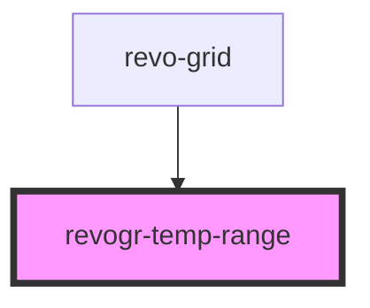

<!-- Auto Generated Below -->

## Overview

Temporary range selection component. Shows temporary range selection.

## Properties

| Property         | Attribute         | Description                                        | Type                                    | Default     |
| ---------------- | ----------------- | -------------------------------------------------- | --------------------------------------- | ----------- |
| `dimensionCol`   | `dimension-col`   | Dimension column store                             | `ObservableMap<DimensionSettingsState>` | `undefined` |
| `dimensionRow`   | `dimension-row`   | Dimension row store                                | `ObservableMap<DimensionSettingsState>` | `undefined` |
| `selectionStore` | `selection-store` | Selection store, shows current selection and focus | `ObservableMap<SelectionStoreState>`    | `undefined` |

## Dependencies

### Used by

 - [revo-grid](../revoGrid)

### Graph

----------------------------------------------

*Built with ❤️ by Revolist OU*
