# RevoGrid Event Patterns and Lifecycles

This page maps the event graph from the current source, not from assumptions.

Source priority used for this guide:

- [`src/components/revoGrid/revo-grid.tsx`](/Users/maks/Projects/revogrid-pro-advance/revogrid/src/components/revoGrid/revo-grid.tsx)
- [`src/components/overlay/revogr-overlay-selection.tsx`](/Users/maks/Projects/revogrid-pro-advance/revogrid/src/components/overlay/revogr-overlay-selection.tsx)
- [`src/components/clipboard/revogr-clipboard.tsx`](/Users/maks/Projects/revogrid-pro-advance/revogrid/src/components/clipboard/revogr-clipboard.tsx)
- [`src/plugins/sorting/sorting.plugin.ts`](/Users/maks/Projects/revogrid-pro-advance/revogrid/src/plugins/sorting/sorting.plugin.ts)
- [`src/plugins/filter/filter.plugin.tsx`](/Users/maks/Projects/revogrid-pro-advance/revogrid/src/plugins/filter/filter.plugin.tsx)
- [`src/components/header/revogr-header.tsx`](/Users/maks/Projects/revogrid-pro-advance/revogrid/src/components/header/revogr-header.tsx)
- [`src/components/selectionFocus/revogr-focus.tsx`](/Users/maks/Projects/revogrid-pro-advance/revogrid/src/components/selectionFocus/revogr-focus.tsx)
- [`src/components/editors/revogr-edit.tsx`](/Users/maks/Projects/revogrid-pro-advance/revogrid/src/components/editors/revogr-edit.tsx)
- [`src/components/order/revogr-order-editor.tsx`](/Users/maks/Projects/revogrid-pro-advance/revogrid/src/components/order/revogr-order-editor.tsx)
- [`src/components/data/revogr-data.tsx`](/Users/maks/Projects/revogrid-pro-advance/revogrid/src/components/data/revogr-data.tsx)
- [`src/components/scroll/revogr-viewport-scroll.tsx`](/Users/maks/Projects/revogrid-pro-advance/revogrid/src/components/scroll/revogr-viewport-scroll.tsx)
- [`src/types/events.ts`](/Users/maks/Projects/revogrid-pro-advance/revogrid/src/types/events.ts)

## How to read these diagrams

- `revo-grid` events are the public root lifecycle most app code listens to.
- Child-component events are often the trigger layer that `revo-grid` listens to and translates.
- Some plugin events are real but not part of the typed root `RevogridEvents` union.
- If a `before*` event is cancelable, the branch stops at that point.

## Event Layers

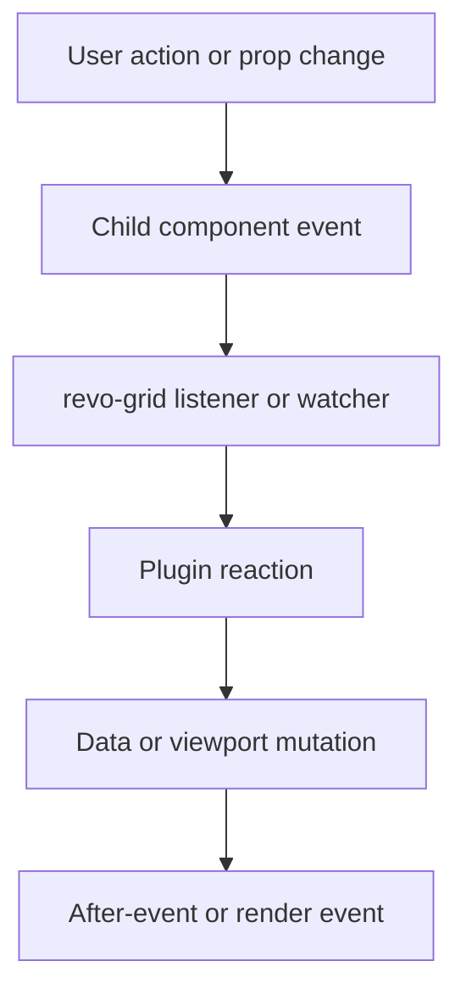

## Root Grid Lifecycle

This is the outer lifecycle created by `componentWillLoad`, watchers, and render hooks.

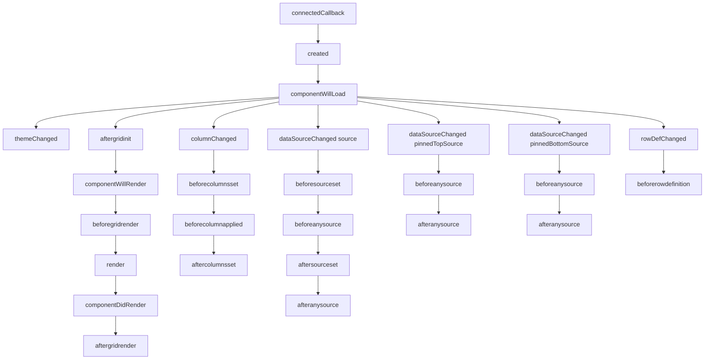

## Focus, Selection, and Edit Lifecycle

This flow starts in [`revogr-overlay-selection.tsx`](/Users/maks/Projects/revogrid-pro-advance/revogrid/src/components/overlay/revogr-overlay-selection.tsx) and is completed by `revo-grid` plus [`revogr-focus.tsx`](/Users/maks/Projects/revogrid-pro-advance/revogrid/src/components/selectionFocus/revogr-focus.tsx).

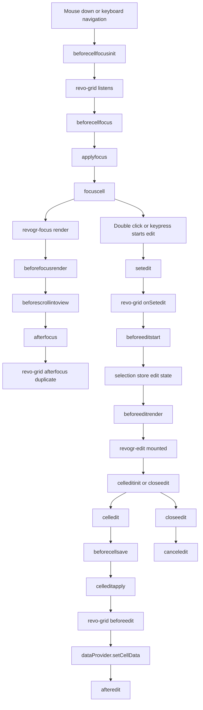

### Edit commit notes

- `beforeeditstart` blocks opening the editor.
- `beforecellsave` blocks the overlay from forwarding the save.
- `beforeedit` blocks the root data write.
- `afteredit` fires after single-cell and range writes.

## Range, Autofill, and Clipboard Lifecycle

The range flow is handled in the overlay and clipboard components, then translated into root edit events by `revo-grid`.

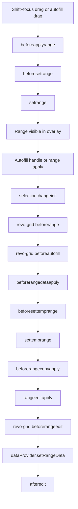

### Clipboard copy/cut

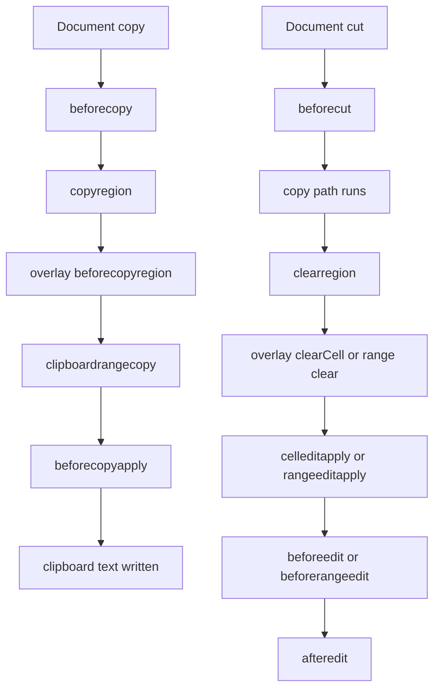

### Clipboard paste

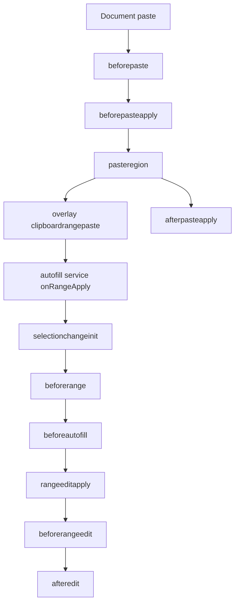

## Header, Sorting, and Filtering Lifecycle

Header events start in [`revogr-header.tsx`](/Users/maks/Projects/revogrid-pro-advance/revogrid/src/components/header/revogr-header.tsx). Sorting and filtering then hook into those events.

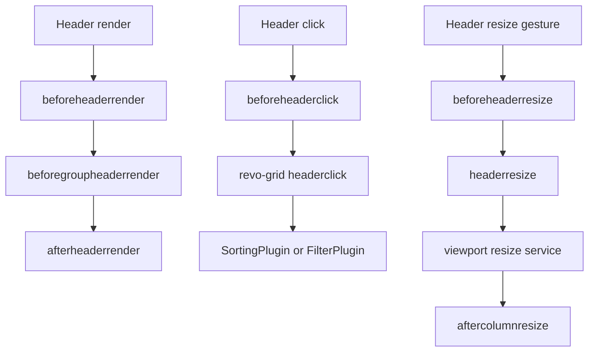

### Sorting

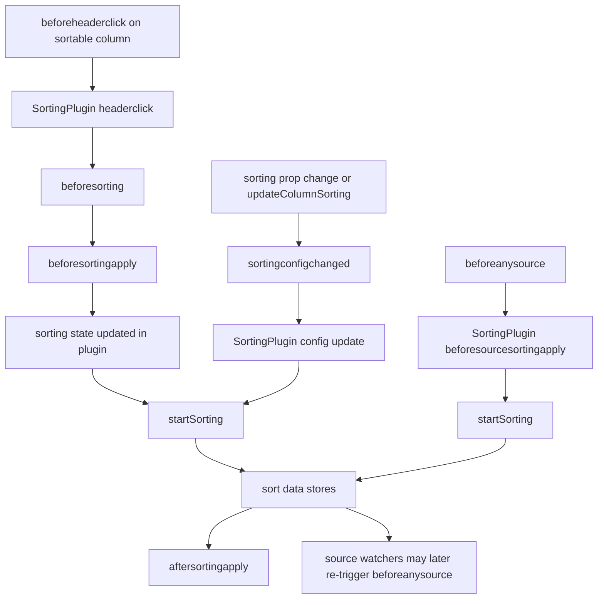

### Filtering

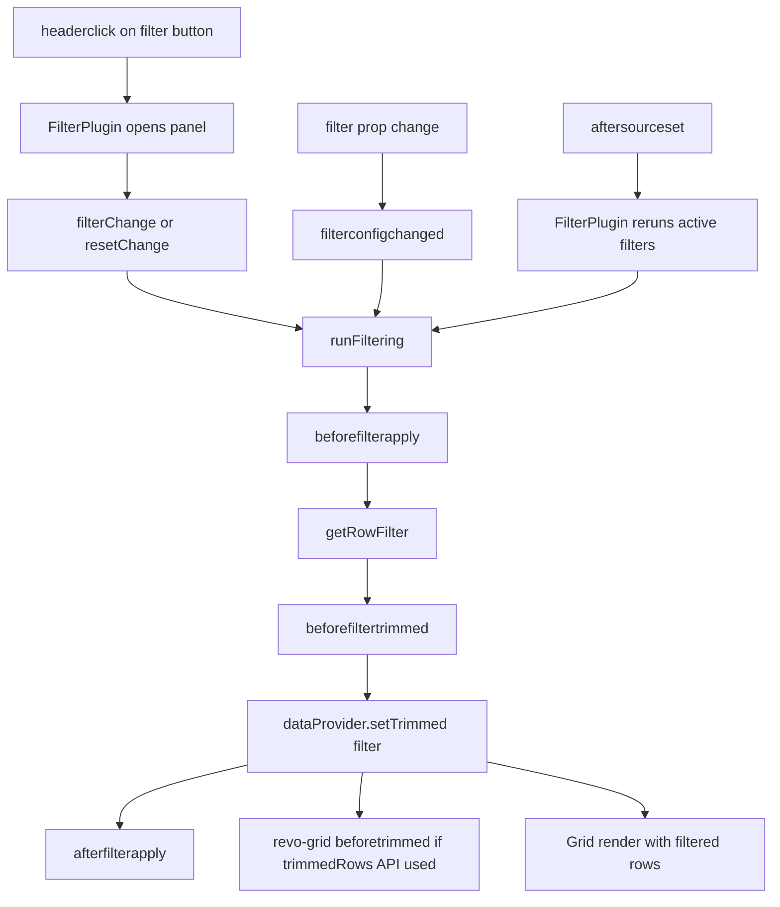

## Row Ordering Lifecycle

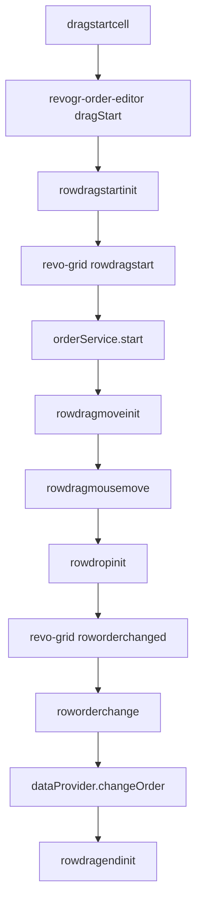

## Scroll and Data Render Lifecycle

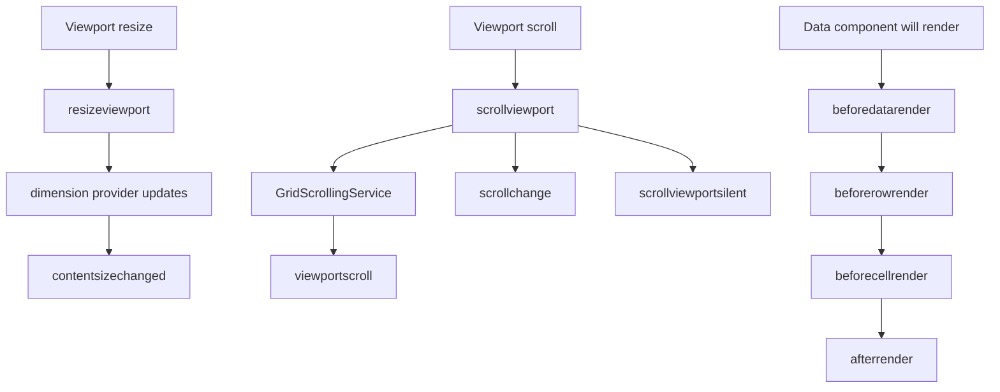

## Source and Config Watchers

These are not user gestures. They are reactive lifecycle edges triggered by prop updates.

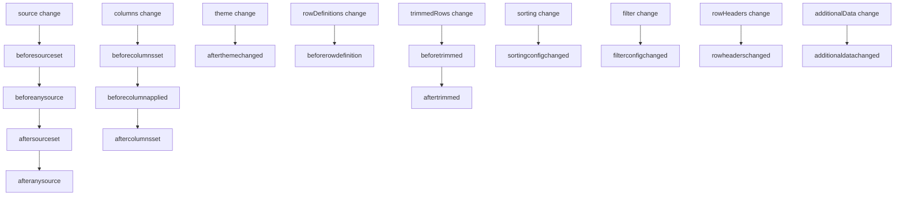

## Public vs Internal Event Surface

Use [`src/types/events.ts`](/Users/maks/Projects/revogrid-pro-advance/revogrid/src/types/events.ts) as the typed public event catalog.

Most application integrations should anchor on:

- `created`, `aftergridinit`, `beforegridrender`, `aftergridrender`
- `beforesourceset`, `beforeanysource`, `aftersourceset`, `afteranysource`
- `beforecolumnsset`, `beforecolumnapplied`, `aftercolumnsset`
- `beforeeditstart`, `beforeedit`, `beforerangeedit`, `afteredit`
- `beforecellfocus`, `beforefocuslost`, `afterfocus`
- `beforerange`, `beforeautofill`
- `beforesorting`, `beforesortingapply`, `beforesourcesortingapply`, `sortingconfigchanged`
- `beforefilterapply`, `beforefiltertrimmed`, `beforetrimmed`, `aftertrimmed`
- `rowdragstart`, `roworderchanged`
- `viewportscroll`, `contentsizechanged`, `aftercolumnresize`

Useful internal or plugin-only events that also appear in flows:

- `beforeapplyrange`, `beforesetrange`, `setrange`
- `beforepaste`, `beforepasteapply`, `pasteregion`, `afterpasteapply`
- `beforecopyregion`, `clipboardrangecopy`, `clipboardrangepaste`
- `beforefocusrender`, `beforescrollintoview`
- `beforeheaderclick`, `beforeheaderrender`, `beforegroupheaderrender`
- `aftersortingapply`, `afterfilterapply`, `newRows`, `rtlstatechanged`

## Recommended Hooks by Use Case

### Validate edits before commit

- `beforeedit`
- `beforerangeedit`
- `beforecellsave` if you need to stop the overlay before the root write

### Persist changes after commit

- `afteredit`
- `aftersourceset` if you replace source externally

### Drive custom navigation

- `beforecellfocus`
- `beforefocuslost`
- `beforenextvpfocus`
- `afterfocus`

### Observe filter and sorting transitions

- `beforefilterapply`
- `beforefiltertrimmed`
- `beforesorting`
- `beforesortingapply`
- `beforesourcesortingapply`
- `sortingconfigchanged`

### Track render and viewport changes

- `beforegridrender`
- `aftergridrender`
- `beforedatarender`
- `afterrender`
- `viewportscroll`
- `contentsizechanged`

## Related guides

- [Editing](/guide/editing)
- [Filtering](/guide/filters)
- [Sorting](/guide/sorting)
- [Programmatic Grid Control](/guide/programmatic-control)
- [API: Events](/guide/api/events)
